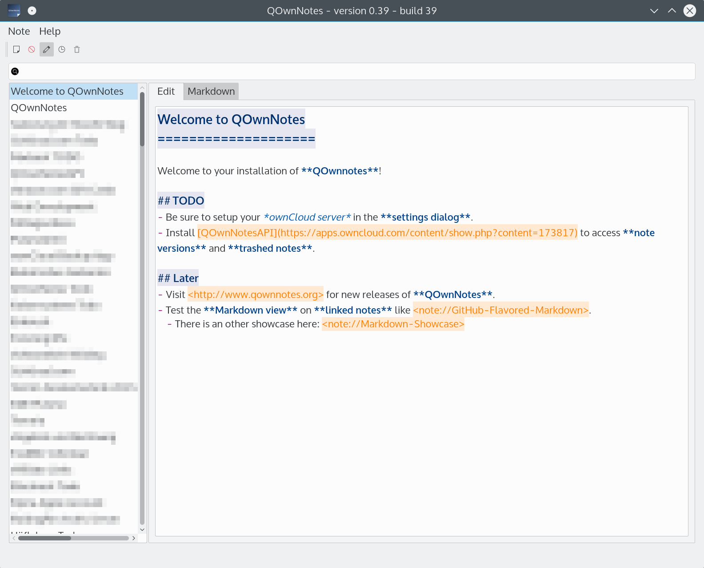

# QOwnNotes

[](https://travis-ci.org/pbek/QOwnNotes)
[](https://ci.gitlab.com/projects/5070)
[](https://ci.appveyor.com/project/pbek/qownnotes)

[QOwnNotes](http://www.qownnotes.org) is the **open source notepad**  for **GNU/Linux**, **Mac OS X** and **Windows**, that works together with the default **notes application** of [**ownCloud**](http://owncloud.org/).

So you are able to **write down** your **thoughts** with **QOwnNotes** and **edit or search** for them later from your **mobile device** (like with [CloudNotes](http://peterandlinda.com/cloudnotes/) or the **ownCloud web-service**.

The notes are stored as **plain text files** and are **synced with ownCloud's file sync** functionality. Of course other software, like [Dropbox](https://www.dropbox.com) can be used too.

I like the concept of having notes accessible in plain text files, like it is done in the **ownCloud notes app**, to gain a maximum of **freedom**, but I was not able to find a decent desktop note taking tool or a text editor, that handles them well. Out of this need **QOwnNotes** was born.

Visit the project page here: [QOwnNotes project page](http://www.qownnotes.org)

## Screenshot


You can visit the [QOwnNotes project page](http://www.qownnotes.org) for more **screenshots**.

## Features
- one or many notes folders can be chosen
- notes can be created, edited, viewed and removed
- list of notes is shown
- older versions of your notes can be restored from your ownCloud server
- sub-string searching of notes is possible and search results are highlighted in the notes
- application can be operated with keyboard shortcuts.
- external changes of note files are watched (notes or note list are reloaded)
- differences between current note and externally changed note are showed in a dialog
- markdown highlighting of notes and a markdown preview mode
- notes are getting their name from the first line of the note text (just like in the ownCloud notes web-application) and the note text files are automatically renamed, if the the first line changes

## Building QOwnNotes
To get the most current features you can build the application from the source code. Download the latest source here: [QOwnNotes Source on GitHub as ZIP](https://github.com/pbek/QOwnNotes/archive/develop.zip)

Alternatively you can also checkout the code directly from the git repository:

```shell
git clone https://github.com/pbek/QOwnNotes.git -b develop
```

Then download [Qt Creator](http://www.qt.io/download-open-source), open the project file `src/QOwnNotes.pro` and clicking on *Build / Build Project QOwnNotes*.

Or you can build it at the command line:

```shell
cd QOwnNotes/src
qmake QOwnNotes.pro -r
make
```

Please feel free to contribute source code to this project, make suggestions or report troubles on the [QOwnNotes issues page](https://github.com/pbek/QOwnNotes/issues)!

You can also visit [QOwnNotes on GitHub](https://github.com/pbek/QOwnNotes).

## Minimum software requirements
- A desktop operating system, that supports [QT](http://www.qt.io/)
- QT 5.3+
- gcc 4.8+

## Binaries
Currently there are deb packages for **GNU/Linux**, DMGs for **Mac OS X** and ZIP-files for **Windows**. You can get them on the [QOwnNotes project page](http://www.qownnotes.org) or on the [QOwnNotes releases page](https://github.com/pbek/QOwnNotes/releases).

## Disclaimer
This SOFTWARE PRODUCT is provided by THE PROVIDER "as is" and "with all faults." THE PROVIDER makes no representations or warranties of any kind concerning the safety, suitability, lack of viruses, inaccuracies, typographical errors, or other harmful components of this SOFTWARE PRODUCT. 

There are inherent dangers in the use of any software, and you are solely responsible for determining whether this SOFTWARE PRODUCT is compatible with your equipment and other software installed on your equipment. You are also solely responsible for the protection of your equipment and backup of your data, and THE PROVIDER will not be liable for any damages you may suffer in connection with using, modifying, or distributing this SOFTWARE PRODUCT.
