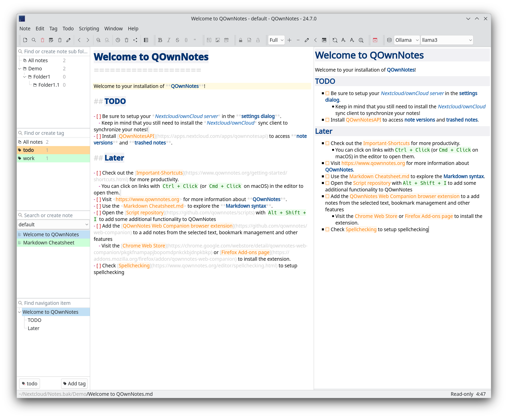

# [QOwnNotes](https://www.qownnotes.org "QOwnNotes Official Site")

[Installation](https://www.qownnotes.org/installation) |
[Changelog](https://www.qownnotes.org/changelog.html) |
[Issues](https://github.com/pbek/QOwnNotes/issues) |
[Shortcuts](https://www.qownnotes.org/getting-started/shortcuts.html) |
[Documentation](https://www.qownnotes.org/getting-started/concept.html) |
[Privacy Policy](./PRIVACY.md) |
[Screenshots](https://www.qownnotes.org/getting-started/overview.html) |
[Nextcloud API](https://apps.nextcloud.com/apps/qownnotesapi) |
[Nextcloud App Page](https://apps.nextcloud.com/apps/qownnotes) |
[ownCloud API](https://marketplace.owncloud.com/apps/qownnotesapi) |
[Telegram Group](https://t.me/QOwnNotes) |
[IRC Chat](https://web.libera.chat/#qownnotes) |
[Gitter Chat](https://gitter.im/qownnotes/qownnotes) |
[Mastodon](https://social.qownnotes.org/@qownnotes) |
[Twitter](https://twitter.com/QOwnNotes) |
[Facebook](https://www.facebook.com/QOwnNotes) |
[QOwnNotes Web Companion Firefox extension](https://addons.mozilla.org/en-US/firefox/addon/qownnotes-web-companion/) |
[QOwnNotes Web Companion Chrome extension](https://chrome.google.com/webstore/detail/qownnotes-web-companion/pkgkfnampapjbopomdpnkckbjdnpkbkp) |
[QOwnNotes Web App](https://app.qownnotes.org/) |
[QOwnNotes Tor Hidden Service](http://qownnotn3bknenanjs5u4nf3f2law2tzmqklux3c5e2xbvzcksmxm6yd.onion/)

[](https://github.com/pbek/QOwnNotes/actions/workflows/build-test.yml)
[](https://ci.appveyor.com/project/pbek/qownnotes)
[](https://snapcraft.io/qownnotes)
[](https://coveralls.io/github/pbek/QOwnNotes?branch=main)
[](http://isitmaintained.com/project/pbek/QOwnNotes "Percentage of issues still open")
[](https://crowdin.com/project/qownnotes)
[](https://gitter.im/qownnotes/qownnotes)

[QOwnNotes](https://www.qownnotes.org) is the **open source notepad** with
[**Markdown support**](https://github.com/pbek/QOwnNotes/blob/main/src/demonotes/Markdown%20Cheatsheet.md)
and **todo list manager** for **GNU/Linux**, **macOS** and **Windows**,
that works together with [**Nextcloud Notes**](https://github.com/Nextcloud/notes)
and [**ownCloud Notes**](https://github.com/owncloud/notes).

You are able to **write down** your **thoughts** with **QOwnNotes** and
**edit or search** for them later from your **mobile device**, like with
[Nextcloud Notes for Android](https://play.google.com/store/apps/details?id=it.niedermann.owncloud.notes)
or the **Nextcloud / ownCloud web-service**.

The notes are stored as **plain text markdown files** and are
**synced with Nextcloud's/ownCloud's file sync** functionality.
Of course other software, like [Syncthing](https://syncthing.net) or
[Dropbox](https://www.dropbox.com) can be used too.

If you like the concept of having notes accessible in plain text files, like it
is done in the Nextcloud / ownCloud notes apps to gain a maximum of **freedom**
then QOwnNotes is for you.

Visit the project page here: [QOwnNotes project page](https://www.qownnotes.org)

To manage your **todo lists** in the web and on your mobile devices, you need to
install the Tasks backend on [Nextcloud](https://apps.nextcloud.com/apps/tasks)
or [ownCloud](https://marketplace.owncloud.com/apps/tasks).

To get more on-line features for your notes, like **versioning** and **trash** access,
you might also want to install the [QOwnNotesAPI](https://github.com/pbek/qownnotesapi)
app on your server.

To access your ownCloud notes from your **mobile device** you may want to get one of these:

- For Android and OwnCloud: [MyOwnNotes](https://f-droid.org/app/org.aykit.MyOwnNotes)
- For Android and Nextcloud: [Notes](https://f-droid.org/packages/it.niedermann.owncloud.notes)
- For iOS: [CloudNotes](https://itunes.apple.com/app/cloudnotes-owncloud-notes/id813973264)

On Android you could also use any sync-tool like _Synchronize Ultimate_ or _FolderSync_
to sync your note files and use software like _neutriNotes_ or
[**Markor**](https://f-droid.org/packages/net.gsantner.markor/) to edit your notes.

On iOS [Notebooks](https://itunes.apple.com/us/app/notebooks-write-and-organize/id780438662)
may also work well (syncing notes via WebDAV).

## Screenshot



You can visit the [QOwnNotes project page](https://www.qownnotes.org) for more **screenshots**.

## Features

- written in C++ and optimized for **low resource consumption** (no CPU and memory-hungry Electron app)
- **multiple note folders** can be used
- you can **use your existing text or markdown files**, no need for an import most of the time
- older **versions of your notes** can be restored from your Nextcloud / ownCloud server
  (install [QOwnNotesAPI](https://github.com/pbek/qownnotesapi) on your server)
- **trashed notes** can be restored from your Nextcloud / ownCloud server
  (install [QOwnNotesAPI](https://github.com/pbek/qownnotesapi) on your server)
  - there also is a local trash
- sub-string searching of notes is possible and search results are highlighted in the notes
- application can be operated with **customizable keyboard shortcuts**
- external changes of note files are watched (notes or note list are reloaded)
- differences between current note and externally changed note are shown in a dialog
- **markdown highlighting** of notes and a markdown **preview**
- **[spellchecking](https://www.qownnotes.org/editor/spellchecking.html)** support
- **tabbing support** for editing notes
- scripting support and an online [script repository](https://github.com/qownnotes/scripts)
  where you can install scripts inside the application
- implementation of the **[OpenAI completion API](https://www.qownnotes.org/blog/2024-05-17-AI-support-was-added-to-QOwnNotes.html)** to be used in scripts
- [QOwnNotes Web Companion browser extension](https://github.com/qownnotes/web-companion)
  to a add notes from the selected text and other features
  - visit the [Chrome Web Store](https://chrome.google.com/webstore/detail/qownnotes-web-companion/pkgkfnampapjbopomdpnkckbjdnpkbkp)
    page to install the app on Google Chrome
  - visit the [Firefox Add-ons](https://addons.mozilla.org/firefox/addon/qownnotes-web-companion)
    page to install the app on Mozilla Firefox
- notes are getting their name from the first line of the note text (just like
  in the Nextcloud / ownCloud notes web-application) and the note text files are
  automatically renamed, if the first line changes
  - this feature can also be turned off, and you can use any filename you like
- manage your Nextcloud / ownCloud todo lists (ownCloud tasks or Tasks Plus / Calendar Plus)
- create [Nextcloud Deck](https://apps.nextcloud.com/apps/deck) cards and link to them in your notes
- **encryption of notes** (AES-256 is built in, or you can use custom encryption methods like
  **[Keybase.io](https://keybase.io)** ([encryption-keybase.qml](https://github.com/pbek/QOwnNotes/blob/main/docs/scripting/examples/encryption-keybase.qml)) or
  **PGP** ([encryption-pgp.qml](https://github.com/pbek/QOwnNotes/blob/main/docs/scripting/examples/encryption-pgp.qml)))
- **dark mode** theme support
- all **panels can be placed wherever you want**, they can even float or stack (fully dockable)
- **toolbars** are **fully customizable**
- support for **freedesktop theme icons**, so you can use QOwnNotes with your
  native desktop icons and with your favorite dark desktop theme
  QOwnNotes supports Freedesktop icon themes
- support for hierarchical **note tagging** and **note subfolders**
- support for **sharing notes** on your Nextcloud / ownCloud server
- **portable mode** for carrying QOwnNotes around on USB sticks
- **Vim mode**
- **distraction free mode**, **full-screen mode**, **typewriter mode**
- Evernote (now with large files) and Joplin import
- QOwnNotes is **available in over 60 different languages** like English, German,
  French, Polish, Chinese, Japanese, Russian, Portuguese, Hungarian, Dutch and Spanish
  - [Your help](https://www.qownnotes.org/contributing/translation.html) is
    very much appreciated to improve these translations or to translate
    QOwnNotes in more languages
  - Join the fun at **[Crowdin](https://crowdin.com/project/qownnotes)**
    to **help** with the **translations**

## Installation

[](https://repology.org/project/qownnotes/versions)

Please visit [Installation](https://www.qownnotes.org/installation) for all the ways to install QOwnNotes.

## Building QOwnNotes

To get the most current features you can build the application from the source
code. Download the latest source here:
[QOwnNotes Source on GitHub as ZIP](https://github.com/pbek/QOwnNotes/archive/main.zip)

Alternatively you can also check out the code directly from the git repository:

```shell
git clone https://github.com/pbek/QOwnNotes.git -b release --depth=1
cd QOwnNotes
git submodule update --init
```

Then download [Qt Creator](https://www.qt.io/download-open-source), you will also
need the packages `qtwebsockets` to build QOwnNotes with Qt6
(only `qtwebsockets` for Qt5). If you build under Windows, you want to stick to
_MinGw 64-bit_.

Afterward open the project file `src/QOwnNotes.pro` and click on
**Build** / **Build Project QOwnNotes**.

Or you can build it directly in your terminal:

```shell
cd src

# build binary translation files if you want another language than English
lrelease QOwnNotes.pro

# prepare build process and build the application
qmake
make -j4
```

### Building QOwnNotes For Development

If you are going to work with the code, then you can do the following instead of the above:

```shell
cd src
qmake CONFIG+=DEV_MODE CONFIG+=debug ..
make -j4
```

The `DEV_MODE` variable enabled higher warning levels + precompiled headers.

Please feel free to contribute source code to this project, make suggestions or
report troubles on the [QOwnNotes issues page](https://github.com/pbek/QOwnNotes/issues)!

You can also visit [QOwnNotes on GitHub](https://github.com/pbek/QOwnNotes).

## Minimum software requirements

- A desktop operating system, that supports [Qt](https://www.qt.io)
- Qt 5.5+ / Qt 6.0+
- gcc 4.8+

## Disclaimer

This SOFTWARE PRODUCT is provided by THE PROVIDER "as is" and "with all faults."
THE PROVIDER makes no representations or warranties of any kind concerning the
safety, suitability, lack of viruses, inaccuracies, typographical errors, or
other harmful components of this SOFTWARE PRODUCT.

There are inherent dangers in the use of any software, and you are solely
responsible for determining whether this SOFTWARE PRODUCT is compatible with
your equipment and other software installed on your equipment. You are also
solely responsible for the protection of your equipment and backup of your data,
and THE PROVIDER will not be liable for any damages you may suffer in connection
with using, modifying, or distributing this SOFTWARE PRODUCT.

[](https://www.qownnotes.org)
