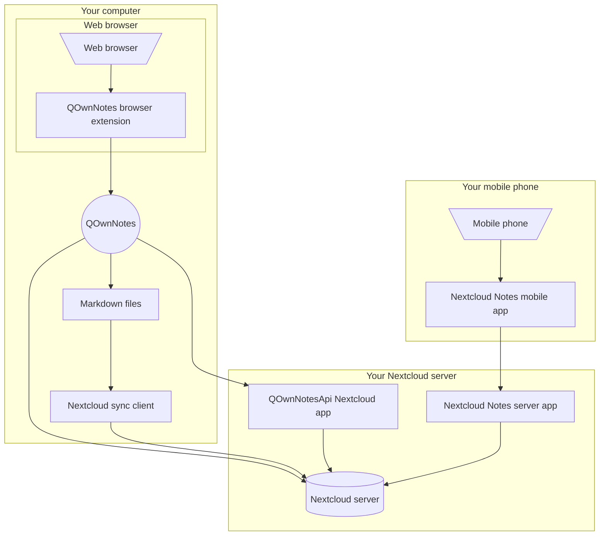

# Concept

## Mermaid

- <https://mermaid-js.github.io/mermaid/#/flowchart>
- <https://mermaid-js.github.io/mermaid-live-editor/>

```mermaid
graph TB
    qon-comp-->qon
    qon-->qon-api
    qon-->ncs
    nc-notes-mob-->nc-notes-app
    sync-->ncs

    subgraph Your computer
        qon((QOwnNotes))-->md["Markdown files"]
        md-->sync["Nextcloud sync client"]

        subgraph Web browser
            browser[\Web browser/]-->qon-comp["QOwnNotes browser extension"]
        end
    end
    subgraph Your Nextcloud server
        qon-api["QOwnNotesApi Nextcloud app"]-->ncs[("Nextcloud server")]
        nc-notes-app["Nextcloud Notes server app"]-->ncs
    end
    subgraph Your mobile phone
        mob[\Mobile phone/]-->nc-notes-mob["Nextcloud Notes mobile app"]
    end
```
