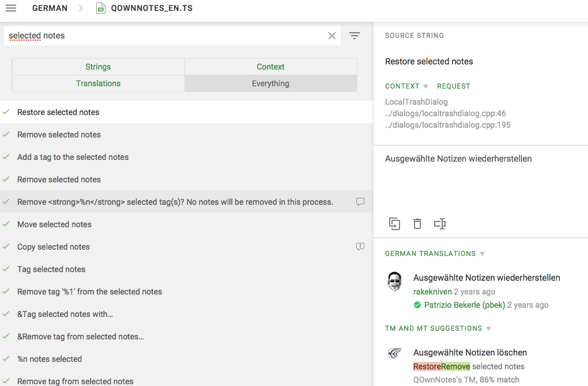
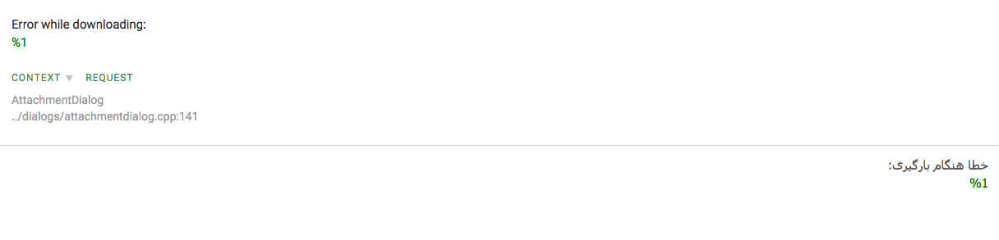
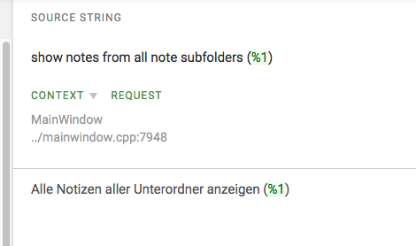

# Translation

How can I help to translate QOwnNotes? 
{: .subtitle }

Thank you for helping out! 

## Join us on Crowdin to translate QOwnNotes

**Crowdin** is a popular Localization Management Platform for mobile apps, web,
desktop software and related assets.

You can sign up at [Crowdin](https://crowdin.com/project/qownnotes/invite) and
**translate** **QOwnNotes** to your language with easy tools.

**[QOwnNotes on Crowdin](https://crowdin.com/project/qownnotes/invite)**

Just drop me a message on Crowdin or as a [GitHub issue](https://github.com/pbek/QOwnNotes/issues)
if you want to translate QOwnNotes to a new language.

If you want to add new translations to existing languages you can do so right away.

### Proofreading

If you are a very good speaker of an already translated language that has not be proofread yet, we are grateful for your help making the QOwnNotes experience more reliable and convenient.

Click here to see if your language is among the translated ones! 

[QOwnNotes on Crowdin](https://crowdin.com/project/qownnotes)

Once you’ve contacted the project owner [GitHub issue](https://github.com/pbek/QOwnNotes/issues) and received permission to proofread in your language, you’re ready to go!

Please consider a few things while working on the project:

1) Maximal accuracy will create the best user experience.

2) Use your choice of style creatively once your translation met the requirement of picking the most identical match.

3) It makes sense for the translation to be similarly concise and following the same formalities as the original.

4) Let's always use the same translations on identical source expressions:

   If `trashed notes` is `gelöschte Dateien` in German, you would always translate it using this expression.
   Exception would be when you grammatically are bound to use an alternative, but keep it simple.

   

   In order to find all the identical expressions, search Crowdin and see all the occurences of one term

   Standardize all occurrences as good as you can, so that identical terms get identical translations.

   `Note` should definitely always have just one translation.

5) For plural please add the appropriate translation each in the corresponding block.

   

6) The `%1` tags need to be written without a space, in LTR languages you can either insert the tags
    from the original or write them into your translation.

   

   

   

7) Use `&` in front of any letter that should be used in a shortcut, can be the same as in original but does not have to.

   

Thanks a lot for your help!
