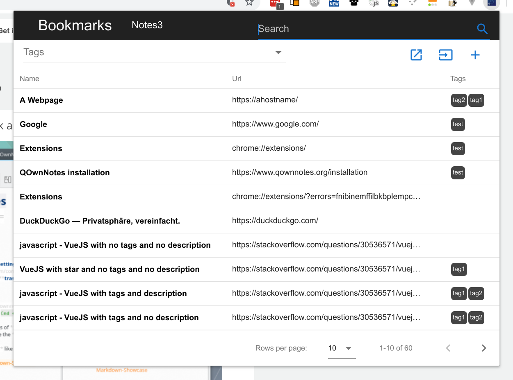

# QOwnNotes Web Companion browser extension



Visit the [Chrome Web Store](https://chrome.google.com/webstore/detail/qownnotes-web-companion/pkgkfnampapjbopomdpnkckbjdnpkbkp) or the [Firefox Add-ons page](https://addons.mozilla.org/firefox/addon/qownnotes-web-companion) to install the [**QOwnNotes Web Companion browser extension**](https://github.com/qownnotes/web-companion/).

## Web clipper

Right-click on a webpage or selected text to use the **web-clipper** functionality. There you can also create a new with a **screenshot** of the current webpage.

## Bookmarks

By default the browser extension will show all **links of the current note** in a popup when you click the QOwnNotes icon in your browser. These links will get a tag `current`.

You can also **manage your bookmarks in notes** with the note tag `bookmarks` (changeable in the settings). These links can also have tags and a description that will be shown in the browser extension.

### Syntax of bookmark links

```markdown
- [Webpage name](https://www.example.com)
- [Webpage name](https://www.example.com) #tag1 #tag2
- [Webpage name](https://www.example.com) some description only
- [Webpage name](https://www.example.com) #tag1 #tag2 some description and tags
* [Webpage name](https://www.example.com) the alternative list character also works
```

You are able to search for name, url tags or description in the browser extension.
