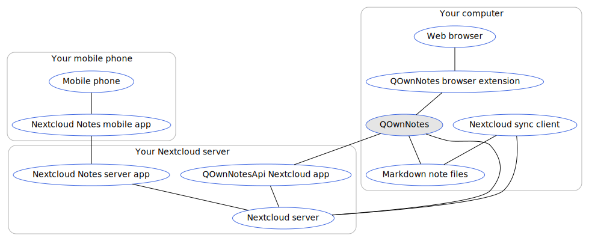

# Concept

- You **own** your own notes! All notes are stored as **plain-text Markdown files** on your desktop computer
- **Sync** them over devices (desktop & mobile) with your [Nextcloud](https://nextcloud.com/) or [ownCloud](https://owncloud.org/) sync client to your server
    - Of course other software, like **Dropbox**, **Syncthing**, **Seafile** or BitTorrent Sync can be used too to sync your note files
- Use [**Nextcloud Notes**](https://github.com/nextcloud/notes) to edit your notes in the **web**
- To access your Nextcloud / ownCloud notes from your **mobile device** you may want to get one of these apps
    - [Nextcloud Notes for Android](https://play.google.com/store/apps/details?id=it.niedermann.owncloud.notes) (3rd party)
        - On Android you could also use any sync-tool like *Synchronize Ultimate* or *FolderSync* to sync your note files
          and use software like *neutriNotes* to edit your notes
    - [CloudNotes for iOS](https://itunes.apple.com/de/app/cloudnotes-owncloud-notes/id813973264?mt=8) (3rd party)
        - On iOS you can also use [Notebooks](https://itunes.apple.com/us/app/notebooks-write-and-organize/id780438662)
          and sync your notes via WebDAV, there is a good tutorial at [Taking Notes with Nextcloud, QOwnNotes, and Notebooks](https://lifemeetscode.com/blog/taking-notes-with-nextcloud-qownnotes-and-notebooks)
