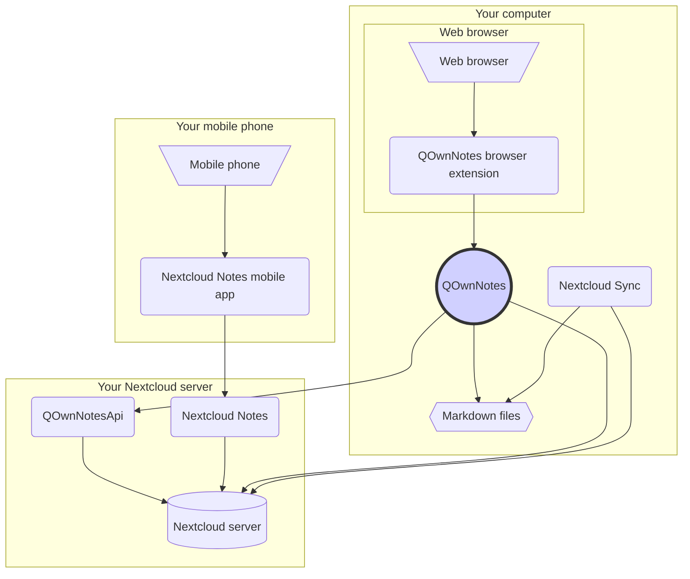

# Concept

## QOwnNotes
- QOwnNotes **stores notes** directly to your **note folder as markdown files**
- It can talk directly to your Nextcloud / ownCloud server to share notes
- You can also access your note history and trash on your Nextcloud / ownCloud server
  via the [QOwnNotesApi Nextcloud app](#qownnotesapi-nextcloud-app)
- Todo lists on your Nextcloud / ownCloud server can be accessed from within QOwnNotes
- QOwnNotes **does not sync** your note files

## Markdown note files
- You **own** all your notes!
- Yours notes are stored as **plain-text Markdown files** on your desktop computer
- You can use any text editor you like to view or edit your note files
- **Sync your notes** with other devices (desktop & mobile) with your [Nextcloud](https://nextcloud.com/)
  or [ownCloud](https://owncloud.org/) sync client to your server

## QOwnNotes browser extension
- You can also manage your **browser bookmarks** with QOwnNotes or use it as a **web clipper**
- Please visit [QOwnNotes Web Companion browser extension](browser-extension.md) for more information

## Nextcloud desktop sync client
- **Sync your notes** with other devices (desktop & mobile) with your [Nextcloud](https://nextcloud.com/)
  or [ownCloud](https://owncloud.org/) sync client to your server
- Of course other software, like **Dropbox**, **Syncthing**, **Seafile** or BitTorrent Sync can be used
  too to sync your note files

## Nextcloud server
- To work with your notes online you can use servers like [Nextcloud](https://nextcloud.com/)
  or [ownCloud](https://owncloud.org/)
- You can host your own server or use hosted solutions
- Of course other software, like **Dropbox**, **Syncthing**, **Seafile** or BitTorrent Sync can be used
  too to sync your note files

## QOwnNotesAPI Nextcloud app
- [**QOwnNotesAPI**](https://github.com/pbek/qownnotesapi) lets you access your
  server-side **trashed notes** and **note versions**
- Please visit [QOwnNotesAPI Nextcloud App](qownnotesapi.md) for more information

## Nextcloud Notes server app
- Use [**Nextcloud Notes**](https://github.com/nextcloud/notes) to edit your notes in the **web**

## Nextcloud Notes mobile app
- To access your Nextcloud / ownCloud notes from your **mobile device** you can use different apps
- [Nextcloud Notes for Android](https://play.google.com/store/apps/details?id=it.niedermann.owncloud.notes) (3rd party)
    - On Android you could also use any sync-tool like *Synchronize Ultimate* or *FolderSync* to sync your note files
      and use software like *neutriNotes* to edit your notes
- [CloudNotes for iOS](https://itunes.apple.com/de/app/cloudnotes-owncloud-notes/id813973264?mt=8) (3rd party)
    - On iOS you can also use [Notebooks](https://itunes.apple.com/us/app/notebooks-write-and-organize/id780438662)
      and sync your notes via WebDAV, there is a good tutorial at [Taking Notes with Nextcloud, QOwnNotes, and Notebooks](https://lifemeetscode.com/blog/taking-notes-with-nextcloud-qownnotes-and-notebooks)
