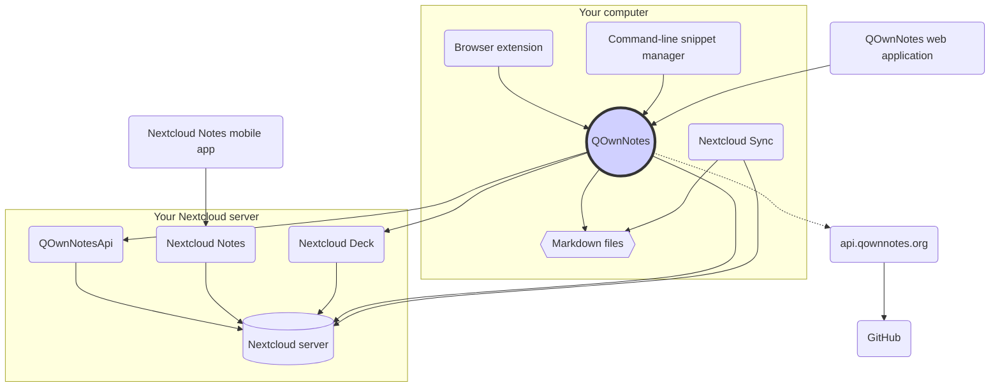

# المفاهيم

## QOwnNotes

- QOwnNotes **يخزن الملاحظات** في **مجلد ملاحظاتك كملفات ماركداون (Markdown)**
- يستطيع التواصل مع خادم Nextcloud أو ownCloud الخاص بك **حتى يشارك ملاحظاتك علنًا** مع الناس الآخرين
- تستطيع أيضا **الوصول إلى تاريخ ملاحظاتك وملاحظاتك المهملة** على خادم Nextcloud أو ownCloud الخاص بك عبر [QOwnNotesApi Nextcloud app](#qownnotesapi-nextcloud-app)
- يمكن الوصول إلى قوائم مهامك على خادم Nextcloud أو ownCloud من داخل QOwnNotes
- **QOwnNotes لا يزامن ملاحظاتك** ولا ملفات الوسائط أو المرفقات!
  - مزامنة الملفات هي مَسعًى معقد، ويوجد بالفعل حلول مزامنة ملفات عظيمة (انظر [عميل مزامنة Nextcloud الحاسوبي](#nextcloud-desktop-sync-client))

## ملفات ملاحظات ماركداون

- أنت **تملك** جميع ملاحظاتك وملفات وسائطك ومرفقاتك!
- يتم تخزين ملاحظاتك **كملفات نصية مجردة بصيغة ماركداون** على حاسوبك
- تستطيع استخدام أي محرر نصوص تريده بجانب QOwnNotes لعرض أو تعديل ملفات ملاحظاتك
- **زامن ملاحظاتك** مع الأجهزة الأخرى (الحاسوب والمحمول) باستخدام عميل مزامنة [Nextcloud](https://nextcloud.com/) أو [ownCloud](https://owncloud.org/) مع&nbsp;خادمك

## إضافة متصفح QOwnNotes

يمكنك استخدام QOwnNotes لإدارة **إشارات المتصفح المرجعية** أو كـ**مقص ويب**.

::: tip
إضافة المتصفح تعمل **بدون اتصال بالإنترنت**. برجاء زيارة [إضافة المتصفح رفيقة ويب QOwnNotes](browser-extension.md) للمزيد من المعلومات.
:::

## مدير قصاصات سطر أوامر QOwnNotes

يمكنك إدارة **قصاصات الأوامر** الخاصة بك باستخدام QOwnNotes وتنفيذها في سطر الأوامر.

::: tip
برجاء زيارة [مدير قصاصات سطر أوامر QOwnNotes](command-line-snippet-manager.md) لمزيد من المعلومات.
:::

## عميل مزامنة Nextcloud الحاسوبي

**زامن ملاحظاتك** مع الأجهزة الأخرى (الحاسوب والمحمول) باستخدام عميل مزامنة [Nextcloud](https://nextcloud.com/) أو [ownCloud](https://owncloud.org/) مع&nbsp;خادمك.

::: tip
بالطبع يمكن استخدام حلول أخرى، مثل **Dropbox** أو **Syncthing** أو **Seafile** أو BitTorrent Sync، لمزامنة ملاحظاتك والملفات الأخرى.

يمكنك أيضا استخدام **git** للمزامنة باستخدام أدوات مثل [gitomatic](https://github.com/muesli/gitomatic/).
:::

## خادم Nextcloud

حتى تعمل مع ملاحظاتك على الإنترنت، يمكنك استخدام خوادم مثل [Nextcloud](https://nextcloud.com/) أو [ownCloud](https://owncloud.org/).

يمكنك استضافة خادمك الخاص أو استخدام الحلول المستضافة.

يتعهد المجتمع [قائمة بمزوّدي Nextcloud](https://github.com/nextcloud/providers#providers)، بالإضافة إلى [قائمة أجهزة بـ&nbsp;Nextcloud](https://nextcloud.com/devices/).

يقال إن [Portknox](https://portknox.net) لديهم [QOwnNotesAPI مثبتًا](https://portknox.net/en/app_listing).

::: tip
بالطبع يمكن استخدام حلول أخرى، مثل **Dropbox** أو **Syncthing** أو **Seafile** أو BitTorrent Sync، لاستضافة ملاحظاتك والملفات الأخرى.
:::

## QOwnNotesAPI Nextcloud app

يتيح لك [**QOwnNotesAPI**](https://github.com/pbek/qownnotesapi) الوصول إلى **ملاحظاتك المهملة** و**نسخ ملاحظاتك** الموجودة على الخادم.

::: tip
برجاء زيارة [QOwnNotesAPI Nextcloud App](qownnotesapi.md) للمزيد من المعلومات.
:::

## تطبيق خادم Nextcloud Notes

استخدم [**Nextcloud Notes**](https://github.com/nextcloud/notes) لتحرير ملاحظاتك على **الويب**.

::: warning
تذكر أن Nextcloud Notes حاليا يدعم مستوى واحد من المجلدات الفرعية كحد أقصى.
:::

## تطبيق خادم Nextcloud Deck

يمكنك استخدام QOwnNotes لإنشاء **بطاقات** في [**Nextcloud Deck**](https://github.com/nextcloud/deck) بسرعة.

## تطبيق محمول Nextcloud Notes

للوصول إلى ملاحظاتك على Nextcloud أو ownCloud من **جهازك المحمول**، يمكنك استخدام تطبيقات مختلفة.

### أندرويد

- [Nextcloud Notes لأندرويد](https://play.google.com/store/apps/details?id=it.niedermann.owncloud.notes) (من طرف ثالث)

::: tip
You could also use any sync-tool like _Synchronize Ultimate_ or _FolderSync_ to sync your note files and use software like _neutriNotes_ or [**Markor**](https://f-droid.org/packages/net.gsantner.markor/) to edit your notes.
:::

### آي أو إس

- [CloudNotes لآي أو إس](https://itunes.apple.com/de/app/cloudnotes-owncloud-notes/id813973264?mt=8) (من طرف ثالث)

::: tip
يمكنك أيضا استخدام [Notebooks](https://itunes.apple.com/us/app/notebooks-write-and-organize/id780438662) ومزامنة ملاحظاتك عبر WebDAV؛ هذا درس جيد (بالإنجليزية): [Taking Notes with Nextcloud, QOwnNotes, and Notebooks](https://lifemeetscode.com/blog/taking-notes-with-nextcloud-qownnotes-and-notebooks)
:::

## api.qownnotes.org

هذه خدمة شبكية يقدمها QOwnNotes للتحقق من وجود إصدارات جديدة من التطبيق.

إنها تسأل GitHub عن آخر إصدار، وتحصل على رابط تنزيل مناسب، وتُجمّع التغييرات من سجل التغييرات بالمقارنة مع نسخة QOwnNotes التي تستخدمها حاليا، وتجعلها في صيغة HTML لعرضها لك في حوار التحديث.

بالإضافة إلى ذلك فإنها أيضا توفر [موجز RSS للإصدارات](http://api.qownnotes.org/rss/app-releases)، ونسخة من واجهة API القديمة الخاصة بالتحديث لنسخ QOwnNotes القديمة.

::: tip
يمكنك الوصول إلى كود مصدر [api.qownnotes.org](https://api.qownnotes.org) على [GitHub](https://github.com/qownnotes/api).
:::

## تطبيق ويب QOwnNotes

يمكنك إضافة صور من هاتفك المحمول إلى الملاحظة الحالية في QOwnNotes على حاسوبك عبر **تطبيق الويب** على [app.qownnotes.org](https://app.qownnotes.org/).

::: tip
برجاء زيارة [تطبيق ويب QOwnNotes](web-app.md) للمزيد من المعلومات.
:::
