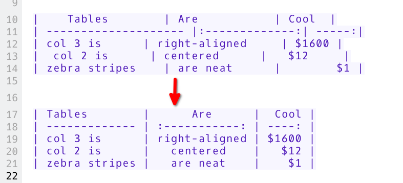

# Auto-format Markdown tables

<BlogDate v-bind:fm="$frontmatter" />

Did you know you can auto-format Markdown tables with the simple shortcut <kbd>Ctrl</kbd> + <kbd>Space</kbd> while the cursor in inside the table?

```markdown
| Tables        |      Are      |  Cool |
| ------------- | :-----------: | ----: |
| col 3 is      | right-aligned | $1600 |
| col 2 is      |   centered    |   $12 |
| zebra stripes |   are neat    |    $1 |
```

becomes...

```markdown
| Tables        |      Are      |  Cool |
| ------------- | :-----------: | ----: |
| col 3 is      | right-aligned | $1600 |
| col 2 is      |   centered    |   $12 |
| zebra stripes |   are neat    |    $1 |
```

Right, center and left column alignments will automatically applied to the text.


