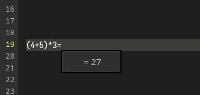

# Solve simple equations in the note editor

<BlogDate v-bind:fm="$frontmatter" />

Did you know you can solve equations like `(4+5)*3=` in the current line in front of the cursor with the simple shortcut <kbd>Ctrl</kbd> + <kbd>Space</kbd>?

