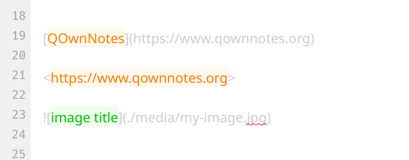

# Open links in the note editor

<BlogDate v-bind:fm="$frontmatter" />

Did you know you can open links like `[QOwnNotes](https://www.qownnotes.org)` or `<https://www.qownnotes.org>` directly in the note editor by pressing <kbd>Ctrl</kbd> + <kbd>Space</kbd> or clicking <kbd>Ctrl</kbd> + <kbd>Left click</kbd>?

Note links or links to media files like `` can be opened the same way.

