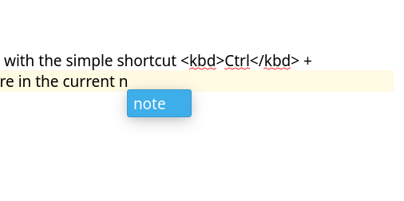

# Auto-complete text in note editor

<BlogDate v-bind:fm="$frontmatter" />

Did you know you can auto-complete text in the note editor with the simple shortcut <kbd>Ctrl</kbd> + <kbd>Space</kbd>, if you have already entered a word before in the current note?

