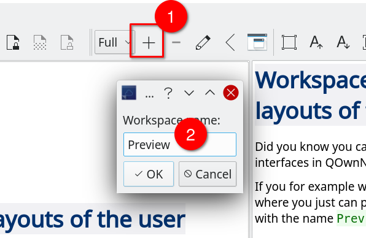
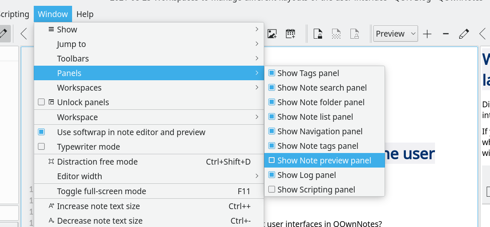
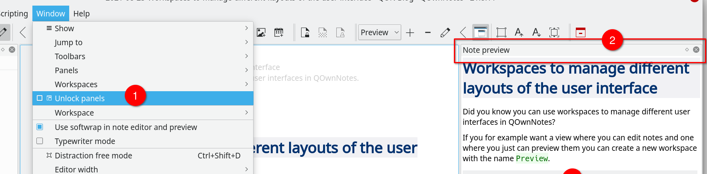
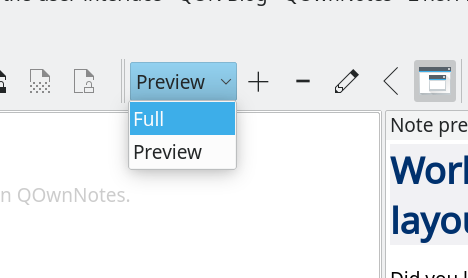

# Use workspaces to manage different layouts of the user interface

<BlogDate v-bind:fm="$frontmatter" />

Did you know you can use workspaces to **manage different user interfaces** in QOwnNotes?

If you for example want a view where you can edit notes and one where you just can preview them you can **create a new workspace** with the name `Preview`.

Then you can **turn off the panels you don't want** in the _Window / Panels_ menu.

You can also **drag panels around** by enabling _Unlock panels_ in the _Window_ menu.

Afterward you can switch between the workspaces in the **workspaces dropdown**.

All changes you make to the user interface (enabling and disabling panels, moving panels) are done to the **current workspace**. Switch to another workspace if you want to edit it.
