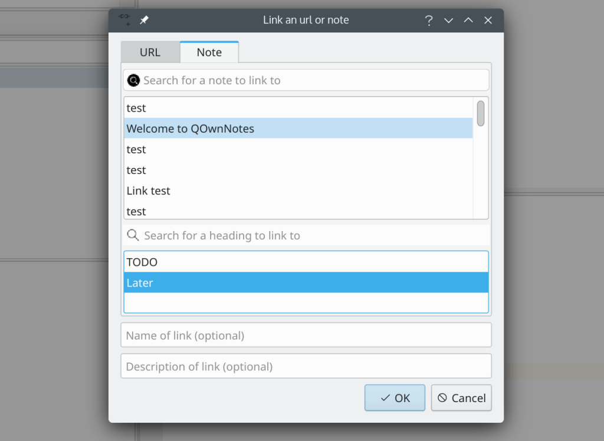

# Linking of note headings

<BlogDate v-bind:fm="$frontmatter" />

Since version 21.10.10 of QOwnNotes you can add an **url-encoded heading** to a note link as url fragment to
attempt to **jump to that heading in the linked note when clicking the link**.

In this example a note link `[Welcome to QOwnNotes - Later](Welcome%20to%20QOwnNotes.md#Later)` will be inserted into the note.

If you click the link you will jump to the heading `Later` of the `Welcome to QOwnNotes` note.

You will find more information in feature request [#1977](https://github.com/pbek/QOwnNotes/issues/1977).
