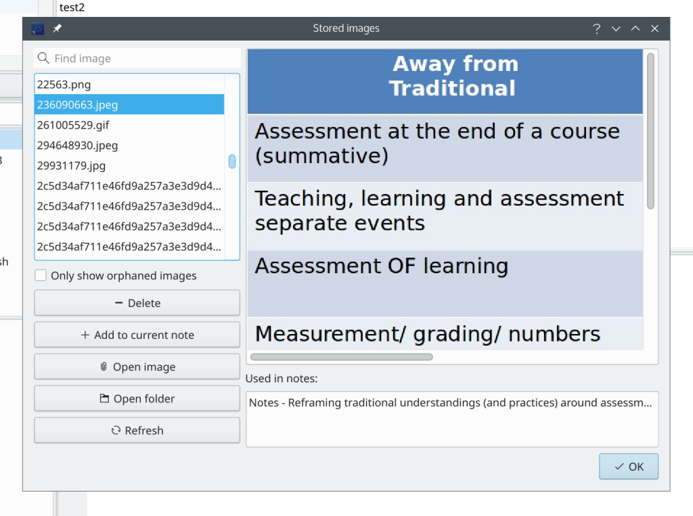

# Manage orphaned image files and attachments

<BlogDate v-bind:fm="$frontmatter" />

Did you know there are **dialogs for managing images and attachments** in the _Edit menu_?

There you can **open the image or attachment**, **open their parent folders**, **delete** an image or an attachment file or **add it to the current note**. You can also only **show orphaned images or attachments** to re-add them to notes or remove them entirely.

