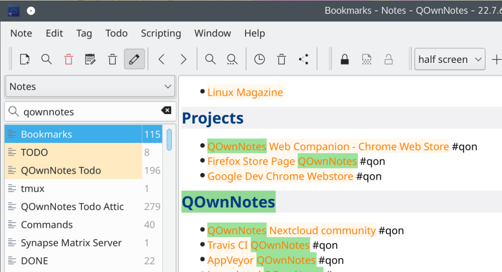

# Working with multiple notes

<BlogDate v-bind:fm="$frontmatter" />

I usually just **search for a relevant string** in the note search. Most of the time I have that string even **in the name of the file**. I just use the search. I **hardly ever use tags**, and if, then just for **coloring** the notes in the list.

If I need a reference to another note I just do a **note link to that note** on the top of the note. I most of the times add a **back-link** in those notes too.

If a _really_ need to have a 2nd note open, then I **open the the note in a different window read-only** (right click on the note in the note list).

If I quickly need to navigate between points in notes I use **"bookmark" shortcuts** (e.g. `Ctrl + Shift + 1`) and jump between passages that way (e.g. back with `Ctrl + 1`).

I **don't use different instances** of QOwnNotes.

This is a follow-up to a [question on GitHub on my workflow with notes](https://github.com/pbek/QOwnNotes/issues/2565#issuecomment-1197881078).

