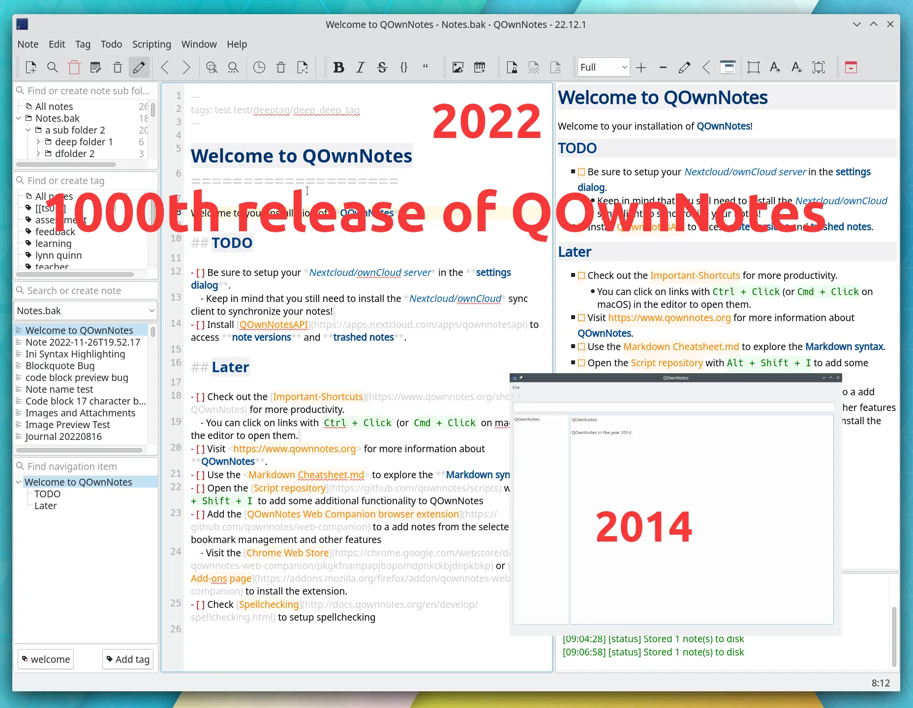

# Happy 1000th release of QOwnNotes

<BlogDate v-bind:fm="$frontmatter" />

The first release of QOwnNotes was in 2014. The current release now in 2022 was the 1000th release of QOwnNotes. A lot was achieved from 2014 to now.

But still, even with the first release QOwnNotes did almost) everything I needed, being able to quickly create plain text file notes, the filename is generated from the first line of the note, notes are saved automatically.

