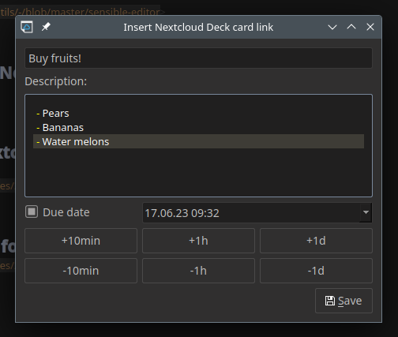

# Nextcloud Deck integration in QOwnNotes

<BlogDate v-bind:fm="$frontmatter" />

Since QOwnNotes 23.6.0 to 23.6.4 you can now quickly create **[Nextcloud Deck](https://apps.nextcloud.com/apps/deck) cards**
and link to them in your notes. When you click them, the card will open in your web-browser.

Those cards are created in the stack you selected in the _Nextcloud / ownCloud settings_.

