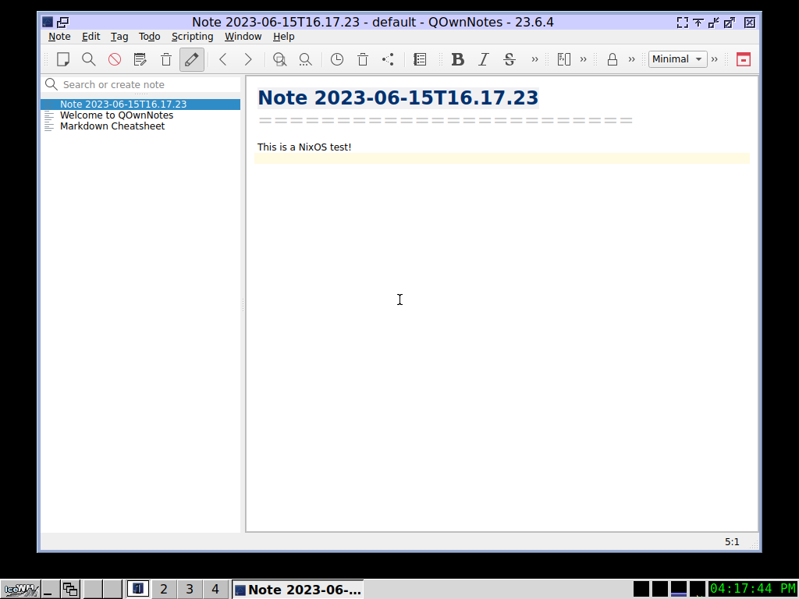

# QOwnNotes UI End2End Tests with the help of NixOS

<BlogDate v-bind:fm="$frontmatter" />

There are now basic End2End tests for QOwnNotes with the help of the [NixOS](https://nixos.org/) Test System.

The tests will be run automatically when the QOwnNotes packages is updated in the [Nix Store](https://search.nixos.org/).

You can look or contribute to the tests at [qownnotes.nix](https://github.com/NixOS/nixpkgs/blob/master/nixos/tests/qownnotes.nix).

With the [nixpkgs repository](https://github.com/NixOS/nixpkgs/) checked out you can run
the tests easily isolated in a QEMU VM with the help of [nix](https://nixos.org):

```bash
nix-build . -A nixosTests.qownnotes
```

Text is read via OCR from the screen and tested for validity.


