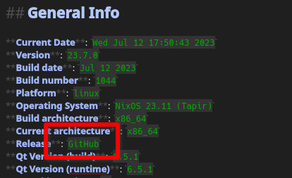

# Source Archive switched from TuxFamily to GitHub Releases

<BlogDate v-bind:fm="$frontmatter" />

Since the [TuxFamily](https://www.tuxfamily.org/) upload server has been very
unreliable and down for several days, we have now switched to GitHub releases
as hosting service for the source archive (see issue [#2799](https://github.com/pbek/QOwnNotes/issues/2799)).

The format of the source archive URL now looks like:
`https://github.com/pbek/QOwnNotes/releases/download/v23.7.0/qownnotes-23.7.0.tar.xz`

