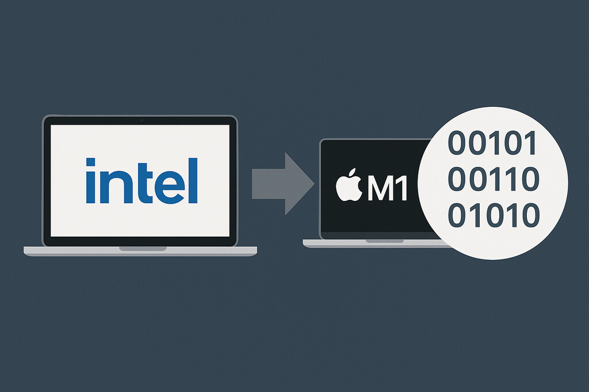

# Universal binary for macOS

<BlogDate v-bind:fm="$frontmatter" />

After a huge amount of work over many weeks, there now is a **universal binary**
for **macOS**, built with **Qt6** that works natively on **Intel and Apple Silicon Macs**.

The universal binary is available in the [releases on GitHub](https://github.com/pbek/QOwnNotes/releases) as `QOwnNotes.dmg` and is replacing the previous Intel Qt5 build.

You need at least macOS 13 (Ventura) to run the new universal binary,
the Qt5 legacy version will still be available as `QOwnNotesQt5.dmg`.

A known issue with Qt6 on Intel Macs is that the application might crash on
exit when the logging panel was turned on.

Please visit the [macOS installation page](../installation/macos.html) for more information.

