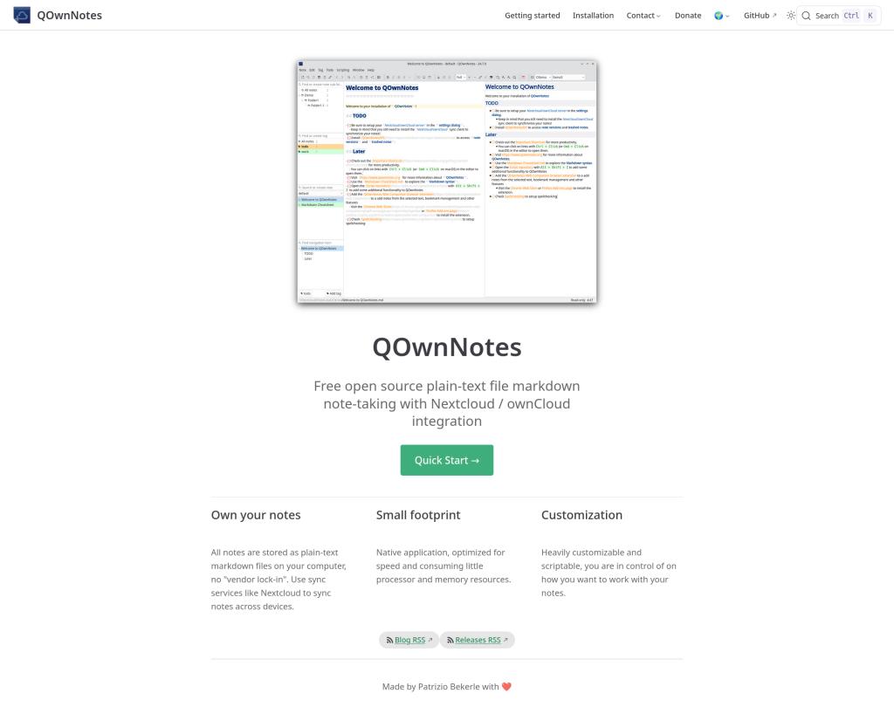

# QOwnNotes Webpage Relaunch with VuePress 2, Vue.js 3, and Vuetify 3

<BlogDate v-bind:fm="$frontmatter" />

I'm excited to announce the **complete relaunch** of the QOwnNotes webpage,
now powered by the latest generation of web technologies: **VuePress 2**, **Vue.js 3**, and **Vuetify 3**!



## Why the Relaunch?

The QOwnNotes webpage has served our community well for years, but as web technologies have evolved.
**VuePress 1 has reached end of life** and is no longer maintained,
making this migration both necessary and timely.

## What's New?

### VuePress 2: The Next Generation

We've migrated from VuePress 1 to **VuePress 2**, which brings:

- **Vite-powered bundling** for lightning-fast build times and hot module replacement during development
- **Improved plugin system** with better extensibility and maintainability
- **Enhanced markdown support** with better syntax highlighting and extended features
- **Better TypeScript support** for more robust code
- **Optimized production builds** with improved code splitting and lazy loading

### Vue.js 3: Modern Reactivity

The move to **Vue.js 3** provides:

- **Composition API** for more flexible and reusable component logic
- **Better performance** with a faster virtual DOM and improved reactivity system
- **Smaller bundle sizes** through tree-shaking and optimized runtime
- **TypeScript support** built from the ground up
- **Improved developer experience** with better error messages and debugging tools

### Vuetify 3: Material Design at Its Best

The integration of **Vuetify 3** brings:

- **Material Design 3** components for a modern, polished interface
- **Improved accessibility** with better ARIA support and keyboard navigation
- **Responsive design** that works seamlessly across all device sizes
- **Customizable theme system** with CSS variables for easy styling
- **Enhanced component library** with more features and better performance

## Behind the Scenes

This relaunch involved:

- Migrating hundreds of markdown files to the new VuePress 2 format
- Rebuilding custom components with Vue.js 3's Composition API
- Integrating Vuetify 3 components throughout the site
- Updating all plugins to VuePress 2 compatible versions
- Implementing comprehensive end-to-end tests with Playwright
- Optimizing the build pipeline for faster deployments

## The Tech Stack

Here's what powers the new webpage:

```json
{
  "vuepress": "next (v2.x)",
  "vue": "^3.x (via VuePress 2)",
  "vuetify": "^3.7.4",
  "@vuepress/bundler-vite": "next",
  "@vuepress/plugin-docsearch": "next",
  "@vuepress/plugin-feed": "next",
  "@vuepress/plugin-seo": "next",
  "@vuepress/plugin-sitemap": "next"
}
```
