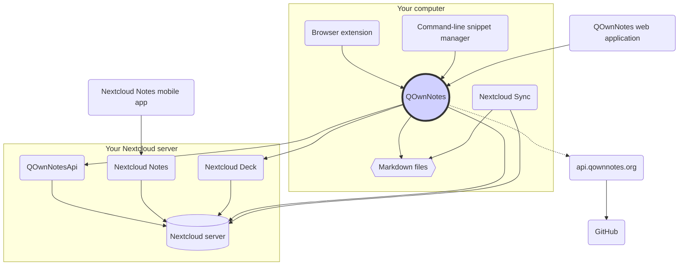

# Konzept

## QOwnNotes

- QOwnNotes **speichert Notizen** in Ihren **Notizordner als Markdown-Dateien**
- Es kann mit Ihrem Nextcloud / ownCloud-Server **kommunizieren, um Notizen** öffentlich mit anderen Personen zu teilen
- Sie können auch auf Ihrem Nextcloud / ownCloud-Server über die [QOwnNotesApi Nextcloud-App](#qownnotesapi-nextcloud-app) auf Ihren **Notizverlauf und Papierkorb** zugreifen
- Auf To-do-Listen auf Ihrem Nextcloud / ownCloud-Server kann über QOwnNotes zugegriffen werden
- Medien- / Anhangsdateien werden **nicht von QOwnNotes synchronisiert**!
  - Die Dateisynchronisierung ist ein komplexes Unterfangen. Es gibt bereits großartige Dateisynchronisierungslösungen (siehe [Nextcloud Desktop Sync Client](#nextcloud-desktop-sync-client)).

## Markdown-Notizdateien

- Sie **besitzen** alle Ihre Notizen und Medien- / Anhangsdateien!
- Ihre Notizen werden als **Klartext Markdowndateien** auf Ihrem Desktop-PC gespeichert
- Sie können einen beliebigen Texteditor neben QOwnNotes verwenden, um Ihre Notizdateien anzuzeigen oder zu bearbeiten
- **Synchronisieren Sie Ihre Notizen** auf anderen Geräten (Desktop & Mobile) mit Ihrem [Nextcloud](https://nextcloud.com/) oder [ownCloud](https://owncloud.org/)-Client auf Ihrem Server

## QOwnNotes-Browsererweiterung

Sie können Ihre **Browser-Lesezeichen** mit QOwnNotes verwalten oder sie als **Webclipper** verwenden.

::: tip
Die Browsererweiterungen funktionieren **offline**, es ist keine Internetverbindung erforderlich. Weitere Informationen finden Sie unter [QOwnNotes Web Companion-Browsererweiterung](browser-extension.md).
:::

## QOwnNotes command-line snippet manager

Sie können Ihre **Befehlsschnipsel** mit QOwnNotes verwalten und auf der Befehlszeile ausführen.

::: tip
Weitere Informationen finden Sie unter [QOwnNotes-Befehlszeilen-Snippet-Manager](command-line-snippet-manager.md).
:::

## Nextcloud Desktop Sync Client

**Synchronisieren Sie Ihre Notizen** mit anderen Geräten (desktop & mobile) mit Ihrem [Nextcloud](https://nextcloud.com/)- oder [ownCloud](https://owncloud.org/)-Sync-Client mit Ihrem Server.

::: tip
Natürlich können auch andere Lösungen wie **Dropbox**, **Syncthing**, **Seafile** oder BitTorrent Sync verwendet werden, um Ihre Notizen und andere Dateien zu synchronisieren.

Sie können auch **git** verwenden, um mit Tools wie [gitomatic](https://github.com/muesli/gitomatic/) zu synchronisieren.
:::

## Nextcloud Server

Um online mit Ihren Notizen zu arbeiten, können Sie Server wie [Nextcloud](https://nextcloud.com/) oder [ownCloud](https://owncloud.org/) verwenden.

Sie können Ihren eigenen Server hosten oder gehostete Lösungen verwenden.

Es gibt eine [von der Community gepflegte Liste der Nextcloud-Anbieter](https://github.com/nextcloud/providers#providers) sowie eine [Liste der Geräte mit Nextcloud](https://nextcloud.com/devices/).

[Portknox](https://portknox.net) hat gemeldet, dass [QOwnNotesAPI installiert ist](https://portknox.net/en/app_listing).

::: tip
Natürlich können auch andere Lösungen wie **Dropbox**, **Syncthing**, **Seafile** oder BitTorrent Sync verwendet werden, um Ihre Notizen und andere Dateien zu hosten.
:::

## QOwnNotesAPI Nextcloud-App

Mit der [**QOwnNotesAPI**](https://github.com/pbek/qownnotesapi) können Sie auf Ihre serverseitigen **verworfenen Notizen** und **Notizenversionen** zugreifen.

::: tip
Bitte besuchen Sie [QOwnNotesAPI Nextcloud App](qownnotesapi.md) für weitere Informationen.
:::

## Nextcloud Notes Server App

Verwenden Sie [**Nextcloud Notes**](https://github.com/nextcloud/notes), um Ihre Notizen im **Web** zu bearbeiten.

::: warning
Beachten Sie, dass Nextcloud Notes derzeit nur bis zu einer Ebene von Unterordnern unterstützt.
:::

## Nextcloud Deck Server App

Sie können QOwnNotes verwenden, um **Karten** schnell in [**Nextcloud Deck**](https://github.com/nextcloud/deck) zu erstellen.

## Nextcloud Notes Mobile App

Um auf Ihre Nextcloud / ownCloud Notizen von Ihrem **mobilen Endgerät** aus zuzugreifen, können Sie verschiedene Apps verwenden.

### Android

- [Nextcloud Notes für Android](https://play.google.com/store/apps/details?id=it.niedermann.owncloud.notes) (Drittanbieter)

::: tip
You could also use any sync-tool like _Synchronize Ultimate_ or _FolderSync_ to sync your note files and use software like _neutriNotes_ or [**Markor**](https://f-droid.org/packages/net.gsantner.markor/) to edit your notes.
:::

### iOS

- [CloudNotes für iOS](https://itunes.apple.com/de/app/cloudnotes-owncloud-notes/id813973264?mt=8) (Drittanbieter)

::: tip
Sie können auch [Notebooks](https://itunes.apple.com/us/app/notebooks-write-and-organize/id780438662) verwenden und Ihre Notizen via WebDAV synchronisieren. Es gibt ein gutes Tutorial auf [Taking Notes with Nextcloud, QOwnNotes, and Notebooks](https://lifemeetscode.com/blog/taking-notes-with-nextcloud-qownnotes-and-notebooks)
:::

## api.qownnotes.org

Dies ist ein Onlinedienst von QOwnNotes, mit dem überprüft werden kann, ob eine neue Version der Anwendung verfügbar ist.

Er kommuniziert mit GitHub und schaut nach dem letzten Update, erhält eine passende Download-URL und kompiliert die Änderungen aus dem Changelog, verglichen mit der QOwnNotes-Version, die sie gerade als HTML nutzen, um den Update-Dialog anzuzeigen.

Zusätzlich stellt er einen [Versionen RSS Feed](http://api.qownnotes.org/rss/app-releases) und eine Implementierung der Legacy update checking API für ältere QOwnNotes-Versionen bereit.

::: tip
Auf den Quellcode von [api.qownnotes.org](https://api.qownnotes.org) können Sie über [GitHub](https://github.com/qownnotes/api) zugreifen.
:::

## QOwnNotes Web-App

Sie können Fotos von Ihrem mobilen Endgerät in die aktuelle Notiz in QOwnNotes auf Ihrem Desktop einfügen, indem Sie die **Web-App** auf [app.qownnotes.org](https://app.qownnotes.org/) verwenden.

::: tip
Bitte besuchen Sie [QOwnNotes Web-App](web-app.md) für mehr Informationen.
:::
