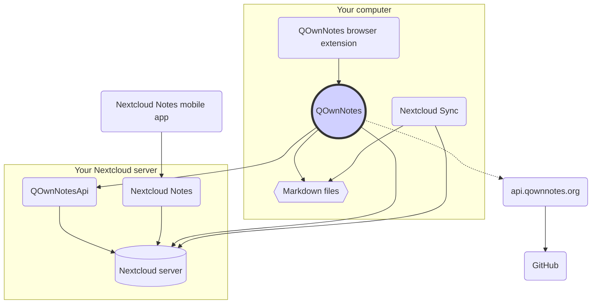

# Konzept

## QOwnNotes

- QOwnNotes **speichert Notizen** in Ihren **Notizordner als Markdown-Dateien**
- Es kann mit Ihrem Nextcloud / ownCloud-Server **kommunizieren, um Notizen** öffentlich mit anderen Personen zu teilen
- Sie können auch **über die [QOwnNotesApi Nextcloud-App](#qownnotesapi-nextcloud-app) auf Ihren Notizverlauf und Papierkorb** auf Ihrem Nextcloud / ownCloud-Server zugreifen
- Auf Todo-Listen auf Ihrem Nextcloud / ownCloud-Server kann über QOwnNotes zugegriffen werden
- **QOwnNotes synchronisiert Ihre Notizen** und Medien- / Anhangsdateien nicht!
    - Die Dateisynchronisierung ist ein komplexes Unterfangen. Es gibt bereits großartige Dateisynchronisierungslösungen (siehe [Nextcloud Desktop Sync Client](#nextcloud-desktop-sync-client)).

## Markdown-Notizdateien

- Sie **besitzen** alle Ihre Notizen und Medien- / Anhangsdateien!
- Ihre Notizen werden als **Nur-Text-Markdown-Dateien** auf Ihrem Desktop-Computer gespeichert
- Sie können einen beliebigen Texteditor neben QOwnNotes verwenden, um Ihre Notizdateien anzuzeigen oder zu bearbeiten
- **Synchronisieren Sie Ihre Notizen** mit anderen Geräten (Desktop & Mobile) mit Ihrer [Nextcloud](https://nextcloud.com/) oder [ownCloud](https://owncloud.org/) Client mit Ihrem Server synchronisieren

## QOwnNotes-Browsererweiterung

Sie können Ihre **Browser-Lesezeichen** mit QOwnNotes verwalten oder als **Webclipper** verwenden.

::: tip
Weitere Informationen finden Sie unter [QOwnNotes Web Companion-Browsererweiterung](browser-extension.md).
:::

## Nextcloud Desktop Sync Client

**Synchronisieren Sie Ihre Notizen** mit anderen Geräten (Desktop & Mobile) mittels Ihres [Nextcloud](https://nextcloud.com/) oder [ownCloud](https://owncloud.org/) Sync-Clients für Ihren Server.

::: tip
Natürlich können auch andere Lösungen wie **Dropbox**, **Syncthing**, **Seafile** oder BitTorrent Sync verwendet werden, um Ihre Notizen und andere Dateien zu synchronisieren.

Sie können auch **git** verwenden, um mit Tools wie [gitomatic](https://github.com/muesli/gitomatic/) zu synchronisieren.
:::

## Nextcloud Server

Um online mit Ihren Notizen zu arbeiten, können Sie Server wie [Nextcloud](https://nextcloud.com/) oder [ownCloud](https://owncloud.org/) verwenden.

Sie können Ihren eigenen Server hosten oder gehostete Lösungen verwenden.

Es gibt eine [von der Community gepflegte Liste der Nextcloud-Anbieter](https://github.com/nextcloud/providers#providers) sowie eine [Liste der Geräte mit Nextcloud](https://nextcloud.com/devices/).

[Portknox](https://portknox.net) hat gemeldet, dass [QOwnNotesAPI installiert ist](https://portknox.net/en/app_listing).

::: tip
Natürlich können auch andere Lösungen wie **Dropbox**, **Syncthing**, **Seafile** oder BitTorrent Sync verwendet werden, um Ihre Notizen und andere Dateien zu hosten.
:::

## QOwnNotesAPI Nextcloud app

Mit [**QOwnNotesAPI**](https://github.com/pbek/qownnotesapi) können Sie auf Ihre zugreifen serverseitige **verworfene Notizen** und **Notizenversionen**.

::: tip
Bitte besuchen Sie [QOwnNotesAPI Nextcloud App](qownnotesapi.md) für weitere Informationen.
:::

## Nextcloud Notes Server App

Verwenden Sie [**Nextcloud Notes**](https://github.com/nextcloud/notes), um Ihre Notizen im **Web** zu bearbeiten.

::: warning
Beachten Sie, dass Nextcloud Notes derzeit nur bis zu einer Ebene von Unterordnern unterstützt.
:::

## Mobile App von Nextcloud Notes

Um von Ihrem **Mobilgerät** aus auf Ihre Nextcloud / ownCloud-Notizen zuzugreifen, können Sie verschiedene Apps verwenden.

### Android

- [Nextcloud Notes for Android](https://play.google.com/store/apps/details?id=it.niedermann.owncloud.notes) (3rd party)

::: tip
Sie können auch ein beliebiges Synchronisierungstool wie *Synchronize Ultimate* oder *FolderSync* verwenden, um Ihre Notizdateien zu synchronisieren und verwenden Sie Software wie *neutriNotes*, um Ihre Notizen zu bearbeiten.
:::

### iOS

- [CloudNotes für iOS](https://itunes.apple.com/de/app/cloudnotes-owncloud-notes/id813973264?mt=8) (Drittanbieter)

::: tip
Sie können auch [Notebooks](https://itunes.apple.com/us/app/notebooks-write-and-organize/id780438662) verwenden Wenn Sie Ihre Notizen über WebDAV synchronisieren möchten, finden Sie unter [Notizen mit Nextcloud, QOwnNotes und Notebooks](https://lifemeetscode.com/blog/taking-notes-with-nextcloud-qownnotes-and-notebooks)
:::

## api.qownnotes.org

Dies ist ein Onlinedienst von QOwnNotes, mit dem überprüft werden kann, ob eine neue Version der Anwendung verfügbar ist.

Es spricht mit GitHub und sucht nach der neuesten Version, erhält eine geeignete Download-URL und kompiliert die Änderungen aus dem Änderungsprotokoll im Vergleich zu der Version von QOwnNotes, die Sie derzeit als HTML verwenden, um sie im Aktualisierungsdialog anzuzeigen.

Darüber hinaus bietet es den [Release RSS Feed](http://api.qownnotes.org/rss/app-releases) und eine Implementierung der API zur Überprüfung älterer Legacy-Updates für ältere Versionen von QOwnNotes.

::: tip
Sie können auf den Quellcode für [api.qownnotes.org](https://api.qownnotes.org) auf [GitHub](https://github.com/qownnotes/api) zugreifen.
:::
