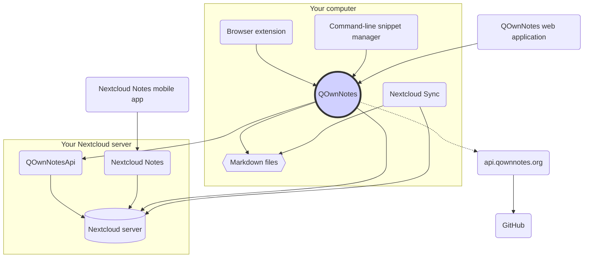

# Concepto

## QOwnNotes

- QOwnNotes **almacena notas** en su carpeta de notas **como archivos de rebajas**
- Puede hablar con su servidor Nextcloud / ownCloud **para compartir notas** públicamente con otras personas
- También puede **acceder a su historial de notas y a la papelera** en su servidor Nextcloud / ownCloud a través de la [aplicación QOwnNotesApi Nextcloud](#qownnotesapi-nextcloud-app)
- Se puede acceder a las listas de tareas en su servidor Nextcloud / ownCloud desde QOwnNotes
- **¡QOwnNotes no sincroniza sus notas** y archivos multimedia / adjuntos!
    - La sincronización de archivos es una tarea compleja, ya existen excelentes soluciones de sincronización de archivos (consulte [Cliente de sincronización de escritorio de Nextcloud](#nextcloud-desktop-sync-client))

## Archivos de notas de rebajas

- ¡Tú eres **dueño** de todas tus notas y archivos multimedia / adjuntos!
- Sus notas se almacenan como **archivos de Markdown de texto sin formato** en su computadora de escritorio
- Puede utilizar cualquier editor de texto que desee junto a QOwnNotes para ver o editar sus archivos de notas
- **Sincroniza tus notas** con otros dispositivos (escritorio y móvil) con tu cliente de sincronización [Nextcloud](https://nextcloud.com/) o [ownCloud](https://owncloud.org/) con tu servidor

## Extensión del navegador QOwnNotes

Puede administrar los **marcadores de su navegador** con QOwnNotes o usarlo como **web clipper**.

::: tip
Las extensiones del navegador funcionan ** sin conexión **, no se necesita conexión a Internet. Visite [QOwnNotes Web Companion extensión del navegador](browser-extension.md) para obtener más información.
:::

## QOwnNotes command-line snippet manager

You can manage your **command snippets** with QOwnNotes and execute them on the command-line.

::: tip
Please visit [QOwnNotes command-line snippet manager](command-line-snippet-manager.md) for more information.
:::

## Nextcloud desktop sync client

**Sync your notes** with other devices (desktop & mobile) with your [Nextcloud](https://nextcloud.com/) or [ownCloud](https://owncloud.org/) sync client to your server.

::: tip
Of course other solutions, like **Dropbox**, **Syncthing**, **Seafile** or BitTorrent Sync can be used too to sync your notes and other files.

You can also use **git** to sync with tools like [gitomatic](https://github.com/muesli/gitomatic/).
:::

## Nextcloud server

To work with your notes online you can use servers like [Nextcloud](https://nextcloud.com/) or [ownCloud](https://owncloud.org/).

You can host your own server or use hosted solutions.

There is a [community-maintained list of Nextcloud providers](https://github.com/nextcloud/providers#providers), as well as a [list of devices with Nextcloud](https://nextcloud.com/devices/).

[Portknox](https://portknox.net) has reported they have [QOwnNotesAPI installed](https://portknox.net/en/app_listing).

::: tip
Of course other solutions, like **Dropbox**, **Syncthing**, **Seafile** or BitTorrent Sync can be used too to host your notes and other files.
:::

## QOwnNotesAPI Nextcloud app

[**QOwnNotesAPI**](https://github.com/pbek/qownnotesapi) lets you access your server-side **trashed notes** and **note versions**.

::: tip
Please visit [QOwnNotesAPI Nextcloud App](qownnotesapi.md) for more information.
:::

## Nextcloud Notes server app

Use [**Nextcloud Notes**](https://github.com/nextcloud/notes) to edit your notes in the **web**.

::: warning
Keep in mind that Nextcloud Notes currently only supports up to one level of subfolders.
:::

## Nextcloud Notes mobile app

To access your Nextcloud / ownCloud notes from your **mobile device** you can use different apps.

### Android

- [ Nextcloud Notes para Android ](https://play.google.com/store/apps/details?id=it.niedermann.owncloud.notes) (terceros)

::: tip
You could also use any sync-tool like *Synchronize Ultimate* or *FolderSync* to sync your note files and use software like *neutriNotes* to edit your notes.
:::

### iOS

- [CloudNotes para iOS](https://itunes.apple.com/de/app/cloudnotes-owncloud-notes/id813973264?mt=8) (tercero)

::: tip
You can also use [Notebooks](https://itunes.apple.com/us/app/notebooks-write-and-organize/id780438662) and sync your notes via WebDAV, there is a good tutorial at [Taking Notes with Nextcloud, QOwnNotes, and Notebooks](https://lifemeetscode.com/blog/taking-notes-with-nextcloud-qownnotes-and-notebooks)
:::

## api.qownnotes.org

This is an online service provided by QOwnNotes to check if there is a new release of the application available.

It is talking to GitHub and checks for the latest release, gets a suited download url and compiles the changes from the changelog compared to the version of QOwnNotes you are currently using as html to show in the update dialog.

In addition, it also provides the [Release RSS Feed](http://api.qownnotes.org/rss/app-releases) and an implementation of the legacy update checking api for older versions of QOwnNotes.

::: tip
You can access the source code for [api.qownnotes.org](https://api.qownnotes.org) on [GitHub](https://github.com/qownnotes/api).
:::

## QOwnNotes Web App

You can insert photos from your mobile phone into the current note in QOwnNotes on your desktop via the **web application** on [app.qownnotes.org](https://app.qownnotes.org/).

::: tip
Please visit [QOwnNotes Web App](web-app.md) for more information.
:::
