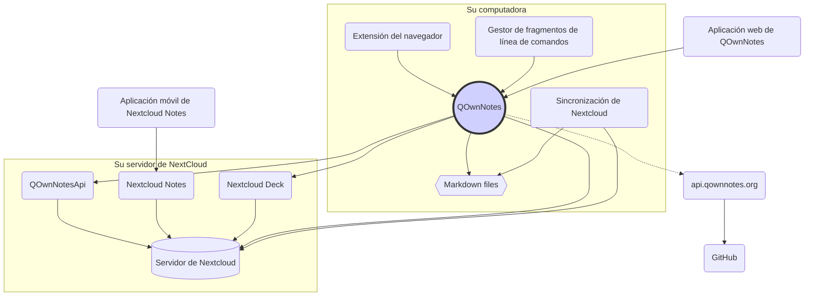

# Concepto

## QOwnNotes

- QOwnNotes **almacena notas** en su carpeta de notas **como archivos de Markdown**
- Puede hablar con su servidor Nextcloud / ownCloud **para compartir notas** públicamente con otras personas
- También puede **acceder a su historial de notas y a la papelera** en su servidor Nextcloud / ownCloud a través de la [aplicación QOwnNotesApi Nextcloud](#qownnotesapi-nextcloud-app)
- Se puede acceder a las listas de tareas en su servidor Nextcloud / ownCloud desde QOwnNotes
- **¡QOwnNotes no sincroniza sus notas** y archivos multimedia / adjuntos!
  - La sincronización de archivos es una tarea compleja, ya existen excelentes soluciones de sincronización de archivos (consulte [Cliente de sincronización de escritorio de Nextcloud](#nextcloud-desktop-sync-client))

## Archivos de notas de Markdown

- ¡Usted es **dueño** de todas sus notas y archivos multimedia/adjuntos!
- Sus notas se almacenan como **archivos Markdown de texto sin formato** en su computadora de escritorio
- Puede utilizar cualquier editor de texto que desee junto a QOwnNotes para ver o editar sus archivos de notas
- **Sincronice sus notas** con otros dispositivos (escritorio y móvil) con su cliente de sincronización [Nextcloud](https://nextcloud.com/) o [ownCloud](https://owncloud.org/) con su servidor

## Extensión del navegador QOwnNotes

Puede administrar los **marcadores de su navegador** con QOwnNotes o usarlo como **web clipper**.

::: tip
Las extensiones del navegador funcionan **fuera de línea**. No se requiere de una conexión a Internet. Por favor visite la [ extensión del navegador QOwnNotes Web Companion](browser-extension.md) para mayor información.
:::

## Gestor de fragmentos de órdenes de terminal de QOwnNotes

Puede administrar sus **fragmentos de órdenes** con QOwnNotes y ejecutarlos en las órdenes de terminal.

::: tip
Por favor visite el [gestor de fragmentos de órdenes de terminal de QOwnNotes](command-line-snippet-manager.md) para mayor información.
:::

## Cliente de sincronización de escritorio de Nextcloud

**Sincronice sus notas** con otros dispositivos (desktop & mobile) con su cliente de sincronización [Nextcloud](https://nextcloud.com/) o [ownCloud](https://owncloud.org/) con su servidor.

::: tip
Por supuesto, otras soluciones, como **Dropbox**, **Syncthing**, **Seafile** o BitTorrent Sync también se pueden utilizar para sincronizar sus notas y otros archivos.

También puede usar **git** para sincronizar con herramientas como [gitomatic](https://github.com/muesli/gitomatic/).
:::

## Servidor Nextcloud

Para trabajar con sus notas en línea, puede utilizar servidores como [Nextcloud](https://nextcloud.com/) o [ownCloud](https://owncloud.org/).

Puede alojar su propio servidor o utilizar soluciones alojadas.

Hay una [lista mantenida por la comunidad de proveedores de Nextcloud](https://github.com/nextcloud/providers#providers), así como una [lista de dispositivos con Nextcloud](https://nextcloud.com/devices/).

[Portknox](https://portknox.net) ha informado que tienen [QOwnNotesAPI instalado](https://portknox.net/en/app_listing).

::: tip
Por supuesto, otras soluciones, como **Dropbox**, **Syncthing**, **Seafile** o BitTorrent Sync también se pueden utilizar para alojar sus notas y otros archivos.
:::

## QOwnNotesAPI Nextcloud app

[**QOwnNotesAPI**](https://github.com/pbek/qownnotesapi) le permite acceder a su **notas enviadas a la papelera** y **versiones de notas** del lado del servidor.

::: tip
Por favor visite [Aplicación QOwnNotesAPI Nextcloud](qownnotesapi.md) para mayor información.
:::

## Aplicación de servidor de Nextcloud Notes

Utilice [**Nextcloud Notes**](https://github.com/nextcloud/notes) para editar sus notas en la **web**.

::: warning
Tenga en cuenta que Nextcloud Notes actualmente solo admite un nivel de subcarpetas.
:::

## Aplicación de Nextcloud Deck para servidores

Es posible utilizar QOwnNotes para crear con rapidez **tarjetas** en [**Nextcloud Deck**](https://github.com/nextcloud/deck).

## Aplicación móvil Nexcloud Notes

Para acceder a sus notas de Nextcloud / ownCloud desde su **dispositivo móvil**, puede utilizar diferentes aplicaciones.

### Android

- [ Nextcloud Notes para Android ](https://play.google.com/store/apps/details?id=it.niedermann.owncloud.notes) (terceros)

::: tip
También puede usar cualquier herramienta de sincronización, como _Synchronize Ultimate_ o _FolderSync_, para sincronizar sus archivos de notas, y usar software como _neutriNotes_ para editarlas.
:::

### iOS

- [CloudNotes para iOS](https://itunes.apple.com/de/app/cloudnotes-owncloud-notes/id813973264?mt=8) (terceros)

::: tip
También puede utilizar [Notebooks](https://itunes.apple.com/us/app/notebooks-write-and-organize/id780438662) y sincronizar sus notas por medio de WebDAV. Hay un buen tutorial en [Tomar notas con Nexcloud, QOwnNotes, y Notebooks](https://lifemeetscode.com/blog/taking-notes-with-nextcloud-qownnotes-and-notebooks)
:::

## api.qownnotes.org

Este es un servicio en línea proporcionado por QOwnNotes para verificar si hay una nueva versión de la aplicación disponible.

Se comunica con GitHub y comprueba si existe una versión más reciente, obtiene una URL de descarga adecuada y compila los cambios del registro de novedades comparado con la versión de QOwnNotes que está utilizando actualmente en formato HTML para su visualización en el cuadro de diálogo Actualización.

Además, también proporciona el [feed RSS de versiones](http://api.qownnotes.org/rss/app-releases) y una implementación de la API heredada de comprobación de actualizaciones para las versiones anteriores de QOwnNotes.

::: tip
Se puede acceder al código fuente de [api.qownnotes.org](https://api.qownnotes.org) en [GitHub](https://github.com/qownnotes/api).
:::

## Aplicación web de QOwnNotes

Es posible insertar fotografías de su teléfono móvil en la nota actual en QOwnNotes en su equipo de escritorio por medio de la **aplicación web** disponible en [app.qownnotes.org](https://app.qownnotes.org/).

::: tip
Por favor visite la [aplicación web de QOwnNotes](web-app.md) para mayor información.
:::
