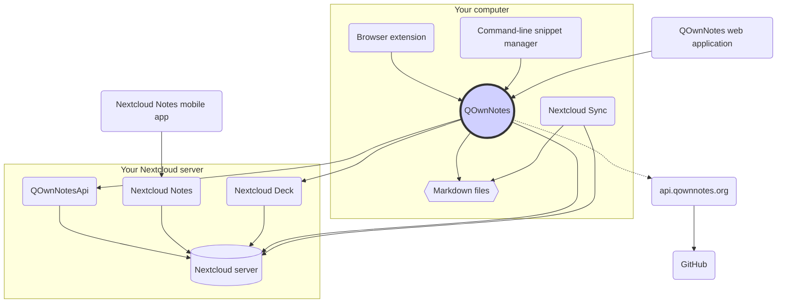

# Concepto

## QOwnNotes

- QOwnNotes **almacena notas** en su carpeta de notas **como archivos de rebajas**
- Puede hablar con su servidor Nextcloud / ownCloud **para compartir notas** públicamente con otras personas
- También puede **acceder a su historial de notas y a la papelera** en su servidor Nextcloud / ownCloud a través de la [aplicación QOwnNotesApi Nextcloud](#qownnotesapi-nextcloud-app)
- Se puede acceder a las listas de tareas en su servidor Nextcloud / ownCloud desde QOwnNotes
- **¡QOwnNotes no sincroniza sus notas** y archivos multimedia / adjuntos!
    - La sincronización de archivos es una tarea compleja, ya existen excelentes soluciones de sincronización de archivos (consulte [Cliente de sincronización de escritorio de Nextcloud](#nextcloud-desktop-sync-client))

## Archivos de notas de rebajas

- ¡Tú eres **dueño** de todas tus notas y archivos multimedia / adjuntos!
- Sus notas se almacenan como **archivos Markdown de texto sin formato** en su computadora de escritorio
- Puede utilizar cualquier editor de texto que desee junto a QOwnNotes para ver o editar sus archivos de notas
- **Sincroniza tus notas** con otros dispositivos (escritorio y móvil) con tu cliente de sincronización [Nextcloud](https://nextcloud.com/) o [ownCloud](https://owncloud.org/) con tu servidor

## Extensión del navegador QOwnNotes

Puede administrar los **marcadores de su navegador** con QOwnNotes o usarlo como **web clipper**.

::: tip
Las extensiones del navegador funcionan ** sin conexión **, no se necesita conexión a Internet. Visite [QOwnNotes Web Companion extensión del navegador](browser-extension.md) para obtener más información.
:::

## Administrador de fragmentos de la línea de comandos de QOwnNotes

Puede administrar sus **fragmentos de comando** con QOwnNotes y ejecutarlos en la línea de comandos.

::: tip
Visite el [administrador de fragmentos de la línea de comandos de QOwnNotes](command-line-snippet-manager.md) para obtener más información.
:::

## Cliente de sincronización de escritorio de Nextcloud

**Sincroniza tus notas** con otros dispositivos (desktop & mobile) con tu cliente de sincronización [Nextcloud](https://nextcloud.com/) o [ownCloud](https://owncloud.org/) con tu servidor.

::: tip
Por supuesto, otras soluciones, como **Dropbox**, **Syncthing**, **Seafile** o BitTorrent Sync también se pueden utilizar para sincronizar sus notas y otros archivos.

También puede usar **git** para sincronizar con herramientas como [gitomatic](https://github.com/muesli/gitomatic/).
:::

## Servidor Nextcloud

Para trabajar con sus notas en línea, puede utilizar servidores como [Nextcloud](https://nextcloud.com/) o [ownCloud](https://owncloud.org/).

Puede alojar su propio servidor o utilizar soluciones alojadas.

Hay una [lista mantenida por la comunidad de proveedores de Nextcloud](https://github.com/nextcloud/providers#providers), así como una [lista de dispositivos con Nextcloud](https://nextcloud.com/devices/).

[Portknox](https://portknox.net) ha informado que tienen [QOwnNotesAPI instalado](https://portknox.net/en/app_listing).

::: tip
Por supuesto, otras soluciones, como **Dropbox**, **Syncthing**, **Seafile** o BitTorrent Sync también se pueden utilizar para alojar sus notas y otros archivos.
:::

## QOwnNotesAPI Nextcloud app

[**QOwnNotesAPI**](https://github.com/pbek/qownnotesapi) le permite acceder a su **notas enviadas a la papelera** y **versiones de notas** del lado del servidor.

::: tip
Visite [Aplicación QOwnNotesAPI Nextcloud](qownnotesapi.md) para obtener más información.
:::

## Aplicación de servidor Nextcloud Notes

Utilice [**Nextcloud Notes**](https://github.com/nextcloud/notes) para editar sus notas en la **web**.

::: warning
Tenga en cuenta que Nextcloud Notes actualmente solo admite hasta un nivel de subcarpetas.
:::

## Aplicación de Nextcloud Deck para servidores

Es posible utilizar QOwnNotes para crear con rapidez **tarjetas** en [**Nextcloud Deck**](https://github.com/nextcloud/deck).

## Nextcloud Notes mobile app

To access your Nextcloud / ownCloud notes from your **mobile device** you can use different apps.

### Android

- [ Nextcloud Notes para Android ](https://play.google.com/store/apps/details?id=it.niedermann.owncloud.notes) (terceros)

::: tip
You could also use any sync-tool like *Synchronize Ultimate* or *FolderSync* to sync your note files and use software like *neutriNotes* to edit your notes.
:::

### iOS

- [CloudNotes para iOS](https://itunes.apple.com/de/app/cloudnotes-owncloud-notes/id813973264?mt=8) (tercero)

::: tip
You can also use [Notebooks](https://itunes.apple.com/us/app/notebooks-write-and-organize/id780438662) and sync your notes via WebDAV, there is a good tutorial at [Taking Notes with Nextcloud, QOwnNotes, and Notebooks](https://lifemeetscode.com/blog/taking-notes-with-nextcloud-qownnotes-and-notebooks)
:::

## api.qownnotes.org

Este es un servicio en línea provisto por QOwnNotes para comprobar, vía internet, si existe una versión nueva de la aplicación.

Se comunica con GitHub y comprueba si existe una versión más reciente, obtiene un URL de descarga adecuado y compila los cambios del registro de novedades comparado con la versión de QOwnNotes que está utilizando actualmente en formato HTML para su visualización en el cuadro de diálogo Actualización.

Además, brinda el [suministro RSS de versiones](http://api.qownnotes.org/rss/app-releases) y una implementación de la API heredada de comprobación de actualizaciones para las versiones anteriores de QOwnNotes.

::: tip
Se puede acceder al código fuente de [api.qownnotes.org](https://api.qownnotes.org) en [GitHub](https://github.com/qownnotes/api).
:::

## Aplicación web de QOwnNotes

Es posible insertar fotografías de su teléfono móvil en la nota actual en QOwnNotes en su equipo de escritorio por medio de la **aplicación web** disponible en [app.qownnotes.org](https://app.qownnotes.org/).

::: tip
Visite la [aplicación web de QOwnNotes](web-app.md) para conocer más.
:::
