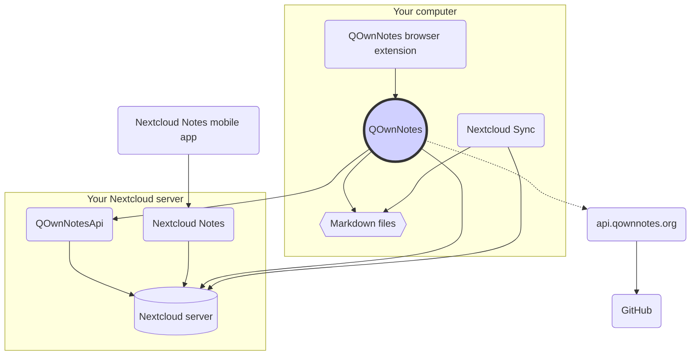

# Concepto

## QOwnNotes

- QOwnNotes **almacena notas** en su carpeta de notas **como archivos de rebajas**
- Puede hablar con su servidor Nextcloud / ownCloud **para compartir notas** públicamente con otras personas
- También puede **acceder a su historial de notas y a la papelera** en su servidor Nextcloud / ownCloud a través de la [aplicación QOwnNotesApi Nextcloud](#qownnotesapi-nextcloud-app)
- Se puede acceder a las listas de tareas en su servidor Nextcloud / ownCloud desde QOwnNotes
- **¡QOwnNotes no sincroniza sus notas** y archivos multimedia / adjuntos!
    - La sincronización de archivos es una tarea compleja, ya existen excelentes soluciones de sincronización de archivos (consulte [Cliente de sincronización de escritorio de Nextcloud](#nextcloud-desktop-sync-client))

## Archivos de notas de rebajas

- ¡Tú eres **dueño** de todas tus notas y archivos multimedia / adjuntos!
- Sus notas se almacenan como **archivos de Markdown de texto sin formato** en su computadora de escritorio
- Puede utilizar cualquier editor de texto que desee junto a QOwnNotes para ver o editar sus archivos de notas
- **Sync your notes** with other devices (desktop & mobile) with your [Nextcloud](https://nextcloud.com/) or [ownCloud](https://owncloud.org/) sync client to your server

## Extensión del navegador QOwnNotes

Puede administrar los **marcadores de su navegador** con QOwnNotes o usarlo como **web clipper**.

::: tip
Por favor, visita [la extensión para navegadores QOwnNotes Web Companion](browser-extension.md) para más información.
:::

## Cliente de sincronización de escritorio de Nextcloud

**Sincroniza tus notas** con otros dispositivos (escritorio y móvil) con tu cliente de sincronización [Nextcloud](https://nextcloud.com/) o [ownCloud](https://owncloud.org/) con tu servidor.

::: tip
Por supuesto, otras soluciones, como **Dropbox**, **Syncthing**, **Seafile** o BitTorrent Sync también se pueden utilizar para sincronizar sus notas y otros archivos.

También puede usar **git** para sincronizar con herramientas como [gitomatic](https://github.com/muesli/gitomatic/).
:::

## Servidor Nextcloud

Para trabajar con sus notas en línea, puede utilizar servidores como [Nextcloud](https://nextcloud.com/) o [ownCloud](https://owncloud.org/).

Puede alojar su propio servidor o utilizar soluciones alojadas.

There is a [community-maintained list of Nextcloud providers](https://github.com/nextcloud/providers#providers), as well as a [list of devices with Nextcloud](https://nextcloud.com/devices/).

[Portknox](https://portknox.net) has reported they have [QOwnNotesAPI installed](https://portknox.net/en/app_listing).

::: tip
Of course other solutions, like **Dropbox**, **Syncthing**, **Seafile** or BitTorrent Sync can be used too to host your notes and other files.
:::

## QOwnNotesAPI Nextcloud app

[**QOwnNotesAPI**](https://github.com/pbek/qownnotesapi) le permite acceder a su **notas enviadas a la papelera** y **versiones de notas** del lado del servidor.

::: tip
Visite [Aplicación QOwnNotesAPI Nextcloud](qownnotesapi.md) para obtener más información.
:::

## Aplicación de servidor Nextcloud Notes

Utilice [**Nextcloud Notes**](https://github.com/nextcloud/notes) para editar sus notas en la **web**.

::: warning
Tenga en cuenta que Nextcloud Notes actualmente solo admite hasta un nivel de subcarpetas.
:::

## Nextcloud Notes mobile app

Para acceder a sus notas de Nextcloud / ownCloud desde su **dispositivo móvil**, puede utilizar diferentes aplicaciones.

### Android

- [ Nextcloud Notes para Android ](https://play.google.com/store/apps/details?id=it.niedermann.owncloud.notes) (terceros)

::: tip
También puedes usar una herramienta como *Synchronize Ultimate* o *FolderSync* para sincronizar tus archivos de notas, y usar software como *neutriNotes* para editarlas.
:::

### iOS

- [CloudNotes para iOS](https://itunes.apple.com/de/app/cloudnotes-owncloud-notes/id813973264?mt=8) (tercero)

::: tip
También puede utilizar [Notebooks](https://itunes.apple.com/us/app/notebooks-write-and-organize/id780438662) y sincronice sus notas a través de WebDAV, hay un buen tutorial en [Cómo tomar notas con Nextcloud, QOwnNotes y Notebooks](https://lifemeetscode.com/blog/taking-notes-with-nextcloud-qownnotes-and-notebooks)
:::

## api.qownnotes.org

Este es un servicio en línea proporcionado por QOwnNotes para verificar si hay una nueva versión de la aplicación disponible.

Está hablando con GitHub y busca la última versión, obtiene una URL de descarga adecuada y compila los cambios del registro de cambios en comparación con la versión de QOwnNotes que está usando actualmente como html para mostrar en el cuadro de diálogo de actualización.

Además, también proporciona [Release RSS Fee](http://api.qownnotes.org/rss/app-releases) y una implementación de la API de comprobación de actualizaciones heredada para versiones anteriores de QOwnNotes.

::: tip
Puede acceder al código fuente de [api.qownnotes.org](https://api.qownnotes.org) en [GitHub](https://github.com/qownnotes/api).
:::
