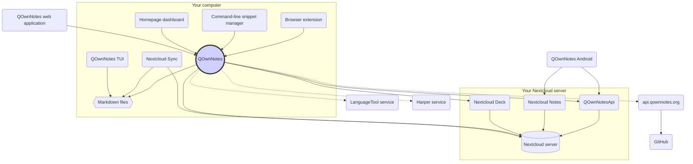

# Concepto

<style>
  /* Remove max-width for content so there is enough space for the Mermaid diagram */
  /* This targets the VuePress content container on this page only using :has() */
  body:has(.concept-page-marker) main.vp-page > div {
    max-width: none !important;
  }
</style>

<div class="concept-page-marker" style="display: none;"></div>


```mermaid
graph TB
    subgraph Your computer
        qon((QOwnNotes))-->md{{"Markdown files"}}
        sync("Nextcloud Sync")-->md
        qon-comp("Browser extension")-->qon
        qc("Command-line snippet manager")-->qon
        tui("QOwnNotes TUI")-->md
        homepage("Homepage dashboard")-->qon
    end
    subgraph Your Nextcloud server
        qon-api("QOwnNotesApi")-->ncs[("Nextcloud server")]
        nc-notes-app("Nextcloud Notes")-->ncs
        nc-deck-app("Nextcloud Deck")-->ncs
    end

    qon-mob("QOwnNotes Android")-->nc-notes-app
    qon-mob-->qon-api
    qon-web-app("QOwnNotes web application")-->qon
    qon-->qon-api
    qon-->ncs
    qon-->nc-deck-app
    sync-->ncs
    qon-.->lt("LanguageTool service")
    qon-.->harper("Harper service")
    qon-.->qon-web-api("api.qownnotes.org")
    qon-web-api-->github("GitHub")

    style qon fill:#d0d0ff,stroke:#333,stroke-width:4px
    click qon "/getting-started/concept.html#qownnotes" "QOwnNotes Desktop Application for managing your notes on your desktop computer"
    click md "/getting-started/concept.html#markdown-note-files" "Markdown, media and attachment files in your note folder"
    click qon-comp "/getting-started/concept.html#qownnotes-browser-extension" "QOwnNotes browser extension for managing bookmarks in markdown files and as web clipper"
    click qc "/getting-started/concept.html#qownnotes-command-line-snippet-manager" "QOwnNotes command-line snippet manager"
    click tui "/getting-started/concept.html#qownnotes-tui" "QOwnNotes TUI, a keyboard-first terminal browser and editor for your Markdown note folders"
    click homepage "/getting-started/concept.html#homepage-dashboard" "Homepage dashboard using QOwnNotes bookmark suggestions"
    click sync "/getting-started/concept.html#nextcloud-desktop-sync-client" "Nextcloud desktop sync client to sync your notes to your server"
    click ncs "/getting-started/concept.html#nextcloud-server" "Nextcloud server to host your notes and other files"
    click qon-api "/getting-started/concept.html#qownnotesapi-nextcloud-app" "QOwnNotesAPI Nextcloud app to access your server-side trash and note versions"
    click nc-notes-app "/getting-started/concept.html#nextcloud-notes-server-app" "Nextcloud Notes server app to manage your notes in the web"
    click qon-mob "/getting-started/concept.html#qownnotes-android" "QOwnNotes Android, an offline-capable Markdown notes app for Android"
    click nc-deck-app "/getting-started/concept.html#nextcloud-deck-server-app" "Nextcloud Deck server app to manage reminders and todo lists in the web"
    click qon-web-app "/getting-started/concept.html#qownnotes-web-app" "QOwnNotes Web App to send photos from your mobile phone"
    click lt "/editor/languagetool.html" "Optional LanguageTool server for grammar and style checking"
    click harper "/editor/harper.html" "Optional Harper service for offline grammar and style checking"
    click qon-web-api "/getting-started/concept.html#api-qownnotes-org"
```

## QOwnNotes

- QOwnNotes **almacena notas** en su carpeta de notas **como archivos de Markdown**
- Puede hablar con su servidor Nextcloud / ownCloud **para compartir notas** públicamente con otras personas
- También puede **acceder a su historial de notas y a la papelera** en su servidor Nextcloud / ownCloud a través de la [aplicación QOwnNotesApi Nextcloud](#qownnotesapi-nextcloud-app)
- Se puede acceder a las listas de tareas en su servidor Nextcloud / ownCloud desde QOwnNotes
- **¡QOwnNotes no sincroniza sus notas** y archivos multimedia / adjuntos!
  - La sincronización de archivos es una tarea compleja, ya existen excelentes soluciones de sincronización de archivos (consulte [Cliente de sincronización de escritorio de Nextcloud](#nextcloud-desktop-sync-client))

## Archivos de notas de Markdown

- ¡Usted es **dueño** de todas sus notas y archivos multimedia/adjuntos!
- Sus notas se almacenan como **archivos Markdown de texto sin formato** en su computadora de escritorio
- Puede utilizar cualquier editor de texto que desee junto a QOwnNotes para ver o editar sus archivos de notas
- **Sincronice sus notas** con otros dispositivos (escritorio y móvil) con su cliente de sincronización [Nextcloud](https://nextcloud.com/) o [ownCloud](https://owncloud.org/) con su servidor

## Extensión del navegador QOwnNotes

Puede administrar los **marcadores de su navegador** con QOwnNotes o usarlo como **web clipper**.

El mismo análisis e indexación de marcadores también puede alimentar una API de sugerencias local para [Homepage](https://github.com/gethomepage/homepage).

::: tip
Las extensiones del navegador funcionan **fuera de línea**. No se requiere de una conexión a Internet. Por favor visite la [ extensión del navegador QOwnNotes Web Companion](browser-extension.md) para mayor información.
:::

## Panel de control de Homepage

QOwnNotes puede exponer un endpoint HTTP local para la compatibilidad con [Homepage](https://github.com/gethomepage/homepage) y `suggestionUrl`, respaldado por el mismo análisis e indexación de marcadores que utiliza la fuente de datos de Web Companion.

- Habilítelo en `Configuración -> Extensión del navegador/fragmentos de comandos`
- Habilite `Habilitar servidor de sockets`
- En `API de sugerencias de marcadores`, habilite `Activar API de sugerencias de marcadores compatible con Homepage`
- Establece un puerto para el endpoint local
- Opcionalmente, configure un token de seguridad si desea que las solicitudes a Homepage requieran autenticación
- El servicio solo se conecta a `127.0.0.1`

El endpoint está disponible como `GET /suggest?q=home` y admite un parámetro opcional `limit` (valor predeterminado `10`, máximo `50`) y un parámetro opcional `token`.

Si utiliza los recursos personalizados de Homepage de `docs/homepage/custom.js`, establezca `QON_TOKEN` con el mismo token de seguridad configurado en QOwnNotes.

Configuración de ejemplo de Homepage:

```yaml
search:
  provider: custom
  url: https://ejemplo.com/search?q=
  suggestionUrl: http://127.0.0.1:22224/suggest?q=
  showSearchSuggestions: true
```

::: tip
Visite la [API de sugerencias de Homepage](homepage-suggestion-api.md) para obtener más información, incluyendo qué archivo de configuración de la página de inicio editar y cómo usar los recursos personalizados de `docs/homepage`.
:::

## Gestor de fragmentos de comandos de terminal de QOwnNotes

Puede administrar sus **fragmentos de comandos** con QOwnNotes y ejecutarlos en las órdenes de terminal.

::: tip
Por favor visite el [gestor de fragmentos de comandos de terminal de QOwnNotes](command-line-snippet-manager.md) para mayor información.
:::

## QOwnNotes TUI

You can **browse and edit your notes in the terminal** with the keyboard-first [QOwnNotes TUI](https://github.com/qownnotes/qownnotes-tui). It works directly on your local Markdown note files and **uses the note folders configured in QOwnNotes**, following its note sorting settings.

::: tip
Please visit [QOwnNotes TUI](qownnotes-tui.md) for more information.
:::

## Servicio de LanguageTool

QOwnNotes puede usar un servidor de [LanguageTool](https://languagetool.org/) local o remoto para la **comprobación de gramática y estilo** en el editor.

- Es **opcional** y funciona en conjunto con el soporte actual de correctores ortográficos
- Actívelo en `Ajustes -> Editor`, luego configure su **URL del servidor**, **idioma**, **clave de API opcional** y las categorías que desea consultar
- También puede activarlo rápidamente desde el menú **Ortografía** con `Verificar gramática con LanguageTool`
- En el menú contextual del editor se ofrecen sugerencias y acciones para los problemas detectados

::: tip
Por favor visite [LanguageTool](../editor/languagetool.md) para más información.
:::

## Servicio de Harper

QOwnNotes puede usar un servicio local de [Harper](https://writewithharper.com/) para **la revisión gramatical y de estilo sin conexión** en el editor.

- Es **opcional** y funciona en conjunto con el soporte actual de correctores ortográficos
- Enable it in `Settings -> Editor -> Harper`, then configure the **transport**, `harper-ls` command or TCP target, **dialect**, and the linters you want to use
- También puedes activarlo rápidamente desde el menú **Editar** con `Verificar gramática con Harper`
- En el menú contextual del editor se ofrecen sugerencias y acciones de ignorar para los problemas detectados

::: tip
Por favor visite [Harper](../editor/harper.md) para más información.
:::

## Cliente de sincronización de escritorio de Nextcloud

**Sincronice sus notas** con otros dispositivos (desktop & mobile) con su cliente de sincronización [Nextcloud](https://nextcloud.com/) o [ownCloud](https://owncloud.org/) con su servidor.

::: tip
Por supuesto, otras soluciones, como **Dropbox**, **Syncthing**, **Seafile** o BitTorrent Sync también se pueden utilizar para sincronizar sus notas y otros archivos.

También puede usar **git** para sincronizar con herramientas como [gitomatic](https://github.com/muesli/gitomatic/).
:::

## Servidor Nextcloud

Para trabajar con sus notas en línea, puede utilizar servidores como [Nextcloud](https://nextcloud.com/) o [ownCloud](https://owncloud.org/).

Puede alojar su propio servidor o utilizar soluciones alojadas.

Hay una [lista mantenida por la comunidad de proveedores de Nextcloud](https://github.com/nextcloud/providers#providers), así como una [lista de dispositivos con Nextcloud](https://nextcloud.com/devices/).

[Portknox](https://portknox.net) ha informado que tienen [QOwnNotesAPI instalado](https://portknox.net/en/app_listing).

::: tip
Por supuesto, otras soluciones, como **Dropbox**, **Syncthing**, **Seafile** o BitTorrent Sync también se pueden utilizar para alojar sus notas y otros archivos.
:::

## QOwnNotesAPI Nextcloud app

[**QOwnNotesAPI**](https://github.com/pbek/qownnotesapi) le permite acceder a su **notas enviadas a la papelera** y **versiones de notas** del lado del servidor.

::: tip
Por favor visite [Aplicación QOwnNotesAPI Nextcloud](qownnotesapi.md) para mayor información.
:::

## Aplicación de servidor de Nextcloud Notes

Utilice [**Nextcloud Notes**](https://github.com/nextcloud/notes) para editar sus notas en la **web**.

::: warning
Tenga en cuenta que Nextcloud Notes actualmente solo admite un nivel de subcarpetas.
:::

## Aplicación de Nextcloud Deck para servidores

Es posible utilizar QOwnNotes para crear con rapidez **tarjetas** en [**Nextcloud Deck**](https://github.com/nextcloud/deck).

## QOwnNotes Android

[QOwnNotes for Android](https://github.com/qownnotes/qownnotes-android) is the recommended app to access your Nextcloud / ownCloud notes from your **mobile device**.

It is an **offline-capable Markdown notes app** for Android that synchronizes with your Nextcloud server through the **Nextcloud Notes API** and the **QOwnNotesAPI** app.

- It uses **Room** as the local source of truth, with edits cached immediately and synchronized when the server is reachable
- It talks to **Nextcloud Notes** and **QOwnNotesAPI** on your server, giving you access to **note version history** and the **server-side trash bin**
- Supports **Single Sign-On** import from the Nextcloud Files Android app
- Renders **CommonMark and GitHub Flavored Markdown**, checkbox lists with three states (open, done, partial), wiki links, tables, fenced code, and remote images
- Provides a **Markdown editor** with formatting actions, undo/redo, cursor preservation, and local draft persistence
- Lets you **favorite notes** with offline toggling and favorites-first ordering
- Create notes from **text shared by other Android apps**
- Offers **light and dark themes** on Android 9+

::: tip
Please visit [QOwnNotes Android](qownnotes-android.md) for more information.
:::

### Other Android apps

- [ Nextcloud Notes para Android ](https://play.google.com/store/apps/details?id=it.niedermann.owncloud.notes) (terceros)
- You could also use any sync-tool like _Synchronize Ultimate_ or _FolderSync_ to sync your note files and use software like _neutriNotes_ or [**Markor**](https://f-droid.org/packages/net.gsantner.markor/) to edit your notes

### iOS

- [CloudNotes para iOS](https://itunes.apple.com/de/app/cloudnotes-owncloud-notes/id813973264?mt=8) (terceros)

::: tip
También puede utilizar [Notebooks](https://itunes.apple.com/us/app/notebooks-write-and-organize/id780438662) y sincronizar sus notas por medio de WebDAV. Hay un buen tutorial en [Tomar notas con Nexcloud, QOwnNotes, y Notebooks](https://lifemeetscode.com/blog/taking-notes-with-nextcloud-qownnotes-and-notebooks)
:::

## api.qownnotes.org

Este es un servicio en línea proporcionado por QOwnNotes para verificar si hay una nueva versión de la aplicación disponible.

Se comunica con GitHub y comprueba si existe una versión más reciente, obtiene una URL de descarga adecuada y compila los cambios del registro de novedades comparado con la versión de QOwnNotes que está utilizando actualmente en formato HTML para su visualización en el cuadro de diálogo Actualización.

Además, también proporciona el [feed RSS de versiones](http://api.qownnotes.org/rss/app-releases) y una implementación de la API heredada de comprobación de actualizaciones para las versiones anteriores de QOwnNotes.

::: tip
Se puede acceder al código fuente de [api.qownnotes.org](https://api.qownnotes.org) en [GitHub](https://github.com/qownnotes/api).
:::

## Aplicación web de QOwnNotes

Es posible insertar fotografías de su teléfono móvil en la nota actual en QOwnNotes en su equipo de escritorio por medio de la **aplicación web** disponible en [app.qownnotes.org](https://app.qownnotes.org/).

::: tip
Por favor visite la [aplicación web de QOwnNotes](web-app.md) para mayor información.
:::
