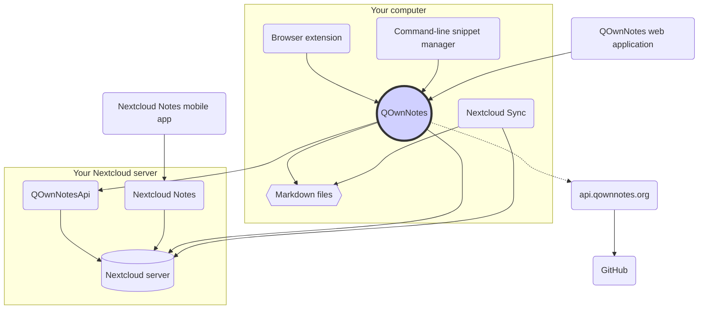

# مفاهیم

## QOwnNotes

- QOwnNotes **یادداشت ها** را **به صورت پرونده های مارک داون در پوشه یادداشت** شما ذخیره می کند
- به منظور اشتراک گذاری عمومی یادداشت ها با دیگران می تواند با سرور نکست کلود یا اون کلود گفتگو کند
- علاوه بر این، می توانید به **تاریخچه یادداشت و سطل زباله خود** در سرور نکست کلود یا اون کلود تان از طریق [برنامه QOwnNotesApi Nextcloud](#qownnotesapi-nextcloud-app) دسترسی داشته باشید
- لیست های انجام دادنی در سرور نکست کلود یا اون کلود تان از QOwnNotes قابل دسترسی هستند
- **QOwnNotes یادداشت های شما** و پرونده های رسانه یا پیوست را همگام سازی نمی کند!
    - همگام سازی پرونده یک فعل پیچیده است و در حال حاضر به غیر از آن راه حل های همگام سازی پرونده بهتری در دسترس قرار دارند ([مشتری همگام سازی دسکتاپ نکست کلود](#nextcloud-desktop-sync-client) را ملاحظه کنید)

## پرونده های یادداشت مارک داون

- شما همه یادداشت‌ها و پرونده‌های واسطه یا پیوست خود را **در اختیار** دارید!
- یادداشت های شما به صورت **پرونده های مارک داون با متن ساده** در کامپیوتر رومیزی تان ذخیره می شوند
- برای مشاهده یا ویرایش پرونده‌های یادداشت تان، می توانید از هر ویرایشگر متنی که دوست دارید در کنار QOwnNotes استفاده کنید
- **یادداشت های** خود را با سایر ابزارها (رومیزی و تلفن همراه) و با مشتری همگام سازی ن[نکست کلود ](https://nextcloud.com/)یا [اون کلود](https://owncloud.org/) به سرورتان همگام سازی کنید

## افزونه مرورگر QOwnNotes

می‌توانید **نشانک های مرورگر** خود را با QOwnNotes مدیریت کرده یا از آن به صورت یک **وب کلیپر** استفاده کنید.

::: tip
افزونه های مرورگر به صورت **آفلاین** و بدون نیاز به اتصال اینترنت اجرا می شوند. برای اطلاعات بیشتر لطفاً نگاهی به [افزونه مرورگر همراه وب QOwnNotes](browser-extension.md) بیندازید.
:::

## QOwnNotes command-line snippet manager

You can manage your **command snippets** with QOwnNotes and execute them on the command-line.

::: tip
Please visit [QOwnNotes command-line snippet manager](command-line-snippet-manager.md) for more information.
:::

## Nextcloud desktop sync client

**Sync your notes** with other devices (desktop & mobile) with your [Nextcloud](https://nextcloud.com/) or [ownCloud](https://owncloud.org/) sync client to your server.

::: tip
Of course other solutions, like **Dropbox**, **Syncthing**, **Seafile** or BitTorrent Sync can be used too to sync your notes and other files.

You can also use **git** to sync with tools like [gitomatic](https://github.com/muesli/gitomatic/).
:::

## Nextcloud server

To work with your notes online you can use servers like [Nextcloud](https://nextcloud.com/) or [ownCloud](https://owncloud.org/).

You can host your own server or use hosted solutions.

There is a [community-maintained list of Nextcloud providers](https://github.com/nextcloud/providers#providers), as well as a [list of devices with Nextcloud](https://nextcloud.com/devices/).

[Portknox](https://portknox.net) has reported they have [QOwnNotesAPI installed](https://portknox.net/en/app_listing).

::: tip
Of course other solutions, like **Dropbox**, **Syncthing**, **Seafile** or BitTorrent Sync can be used too to host your notes and other files.
:::

## QOwnNotesAPI Nextcloud app

[**QOwnNotesAPI**](https://github.com/pbek/qownnotesapi) lets you access your server-side **trashed notes** and **note versions**.

::: tip
Please visit [QOwnNotesAPI Nextcloud App](qownnotesapi.md) for more information.
:::

## Nextcloud Notes server app

Use [**Nextcloud Notes**](https://github.com/nextcloud/notes) to edit your notes in the **web**.

::: warning
Keep in mind that Nextcloud Notes currently only supports up to one level of subfolders.
:::

## Nextcloud Notes mobile app

To access your Nextcloud / ownCloud notes from your **mobile device** you can use different apps.

### اندروید

- [Nextcloud Notes برای اندروید](https://play.google.com/store/apps/details?id=it.niedermann.owncloud.notes) (شخص ثالث)

::: tip
You could also use any sync-tool like *Synchronize Ultimate* or *FolderSync* to sync your note files and use software like *neutriNotes* to edit your notes.
:::

### iOS

- [ CloudNotes برای iOS ](https://itunes.apple.com/de/app/cloudnotes-owncloud-notes/id813973264?mt=8) (شخص ثالث)

::: tip
You can also use [Notebooks](https://itunes.apple.com/us/app/notebooks-write-and-organize/id780438662) and sync your notes via WebDAV, there is a good tutorial at [Taking Notes with Nextcloud, QOwnNotes, and Notebooks](https://lifemeetscode.com/blog/taking-notes-with-nextcloud-qownnotes-and-notebooks)
:::

## api.qownnotes.org

This is an online service provided by QOwnNotes to check if there is a new release of the application available.

It is talking to GitHub and checks for the latest release, gets a suited download url and compiles the changes from the changelog compared to the version of QOwnNotes you are currently using as html to show in the update dialog.

In addition, it also provides the [Release RSS Feed](http://api.qownnotes.org/rss/app-releases) and an implementation of the legacy update checking api for older versions of QOwnNotes.

::: tip
You can access the source code for [api.qownnotes.org](https://api.qownnotes.org) on [GitHub](https://github.com/qownnotes/api).
:::

## QOwnNotes Web App

You can insert photos from your mobile phone into the current note in QOwnNotes on your desktop via the **web application** on [app.qownnotes.org](https://app.qownnotes.org/).

::: tip
Please visit [QOwnNotes Web App](web-app.md) for more information.
:::
