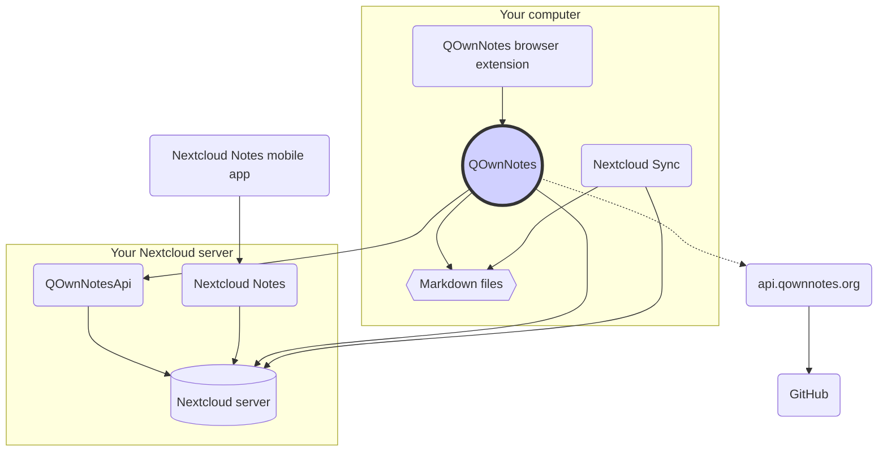

# مفاهیم

## QOwnNotes

- QOwnNotes **یادداشت ها** را **به صورت پرونده های مارک داون در پوشه یادداشت** شما ذخیره می کند
- به منظور اشتراک گذاری عمومی یادداشت ها با دیگران می تواند با سرور نکست کلود یا اون کلود گفتگو کند
- علاوه بر این، می توانید به **تاریخچه یادداشت و سطل زباله خود** در سرور نکست کلود یا اون کلود تان از طریق [برنامه QOwnNotesApi Nextcloud](#qownnotesapi-nextcloud-app) دسترسی داشته باشید
- لیست های انجام دادنی در سرور نکست کلود یا اون کلود تان از QOwnNotes قابل دسترسی هستند
- **QOwnNotes یادداشت های شما** و پرونده های رسانه یا پیوست را همگام سازی نمی کند!
    - همگام سازی پرونده یک فعل پیچیده است و در حال حاضر به غیر از آن راه حل های همگام سازی پرونده بهتری در دسترس قرار دارند ([مشتری همگام سازی دسکتاپ نکست کلود](#nextcloud-desktop-sync-client) را ملاحظه کنید)

## پرونده های یادداشت مارک داون

- شما همه یادداشت‌ها و پرونده‌های واسطه یا پیوست خود را **در اختیار** دارید!
- یادداشت های شما به صورت **پرونده های مارک داون با متن ساده** در کامپیوتر رومیزی تان ذخیره می شوند
- برای مشاهده یا ویرایش پرونده‌های یادداشت تان، می توانید از هر ویرایشگر متنی که دوست دارید در کنار QOwnNotes استفاده کنید
- **یادداشت های** خود را با سایر ابزارها (رومیزی و تلفن همراه) و با مشتری همگام سازی ن[نکست کلود ](https://nextcloud.com/)یا [اون کلود](https://owncloud.org/) به سرورتان همگام سازی کنید

## افزونه مرورگر QOwnNotes

می‌توانید **نشانک های مرورگر** خود را با QOwnNotes مدیریت کرده یا از آن به صورت یک **وب کلیپر** استفاده کنید.

::: tip
برای اطلاعات بیشتر لطفاً نگاهی به [افزونه مرورگر همراه وب QOwnNotes](browser-extension.md) بیندازید.
:::

## مشتری همگام سازی رومیزی نکست کلود

**یادداشت های** خود را با سایر ابزارها (رومیزی و تلفن همراه) و با مشتری همگام سازی [نکست کلود](https://nextcloud.com/) یا [اون کلود](https://owncloud.org/) به سرورتان همگام سازی کنید.

::: tip
البته راهکارهای دیگری مانند **Dropbox**، **Syncthing**، **Seafile**، یا BitTorrent Sync را نیز می توان برای همگام سازی یادداشت ها و سایر پرونده های شما ما بکار برد.

همچنین می توانید برای همگام سازی با ابزارهایی از قبیل [گینوماتیک](https://github.com/muesli/gitomatic/) از **گیت** استفاده کنید.
:::

## سرور نکست کلود

جهت کار با یادداشت های خود به صورت برخط می توانید از سرور هایی نظیر [نکست کلود](https://nextcloud.com/) یا [اون کلود](https://owncloud.org/) بهره گیرید.

می‌توانید سرور خود را میزبانی کرده یا از راهکارهای میزبانی شده استفاده کنید.

[لیست نگهداری شده جمعی از طرف ارائه‌دهندگان نکست کلود](https://github.com/nextcloud/providers#providers) و نیز [لیست ابزارهای همراه نکست کلود](https://nextcloud.com/devices/) در دسترس قرار دارند.

[Portknox](https://portknox.net) گزارش کرده است که آنها [QOwnNotesAPI را نصب کرده اند](https://portknox.net/en/app_listing).

::: tip
البته راهکارهای دیگری مانند **Dropbox**، **Syncthing**، **Seafile**، یا BitTorrent Sync را نیز می توان برای میزبانی یادداشت ها و سایر پرونده های شما بکار برد.
:::

## برنامه QOwnNotesAPI Nextcloud

[**QOwnNotesAPI**](https://github.com/pbek/qownnotesapi) اجازه دسترسی به شما برای **نسخه ‌های یادداشت** و **یادداشت های حذف شده** سمت سرورتان را می دهد.

::: tip
برای اطلاعات بیشتر لطفاً نگاهی به [برنامه QOwnNotesAPI Nextcloud](qownnotesapi.md) بیندازید.
:::

## برنامه سرور Nextcloud Notes

به منظور ویرایش یادداشت هایتان در **وب** از [**Nextcloud Notes**](https://github.com/nextcloud/notes) استفاده کنید.

::: warning
به خاطر داشته باشید که در حال حاضر Nextcloud Notes تنها یک سطح از زیر پوشه ها را پشتیبانی می کند.
:::

## برنامه تلفن همراه Nextcloud Notes

برای دسترسی به یادداشت های نکست کلود یا اون کلود تان از **تلفن همراه** خود می توانید برنامه های مختلفی را به کار ببندید.

### اندروید

- [Nextcloud Notes برای اندروید](https://play.google.com/store/apps/details?id=it.niedermann.owncloud.notes) (شخص ثالث)

::: tip
همچنین می توانید برای همگام سازی پرونده‌های یادداشت تان از هر ابزار همگام سازی مانند *Synchronize Ultimate* یا *FolderSync* استفاده کنید و برای ویرایش یادداشت هایتان نرم افزاری مانند *neutriNotes* را بکار گیرید.
:::

### iOS

- [ CloudNotes برای iOS ](https://itunes.apple.com/de/app/cloudnotes-owncloud-notes/id813973264?mt=8) (شخص ثالث)

::: tip
علاوه بر این، می توانید از [Notebooks](https://itunes.apple.com/us/app/notebooks-write-and-organize/id780438662) استفاده کرده و یادداشت های خود را از طریق WebDAV همگام سازی کنید. در [یادداشت برداری با نکست کلود، QOwnNotes و Notebooks](https://lifemeetscode.com/blog/taking-notes-with-nextcloud-qownnotes-and-notebooks) آموزش مناسبی در نظر گرفته شده است.
:::

## api.qownnotes.org

یک سرویس برخط توسط QOwnNotes در نظر گرفته شده ‌است تا در دسترس قرار گرفتن نسخه جدیدی از برنامه را بررسی کند.

در مقایسه با نسخه QOwnNote که شما در حال حاضر از آن به صورت html استفاده می کنید تا در کادر گفتگوی بروز به نمایش در آید، آن با گیت هاب تعامل کرده، آخرین نسخه را بررسی کرده، URL مناسب برای بارگیری را دریافت کرده و تغییرات را از گزارش تغییرات گردآوری می کند.

بعلاوه، [پخش خبرنامه](http://api.qownnotes.org/rss/app-releases) و یک پیاده سازی از API بررسی بروز رسانی ارث برای نسخه های قدیمی تر QOwnNotes را هم فراهم می کند.

::: tip
شما می توانید به کد منبع مربوط به [api.qownnotes.org](https://api.qownnotes.org) در [گیت هاب](https://github.com/qownnotes/api) دسترسی داشته باشید.
:::
