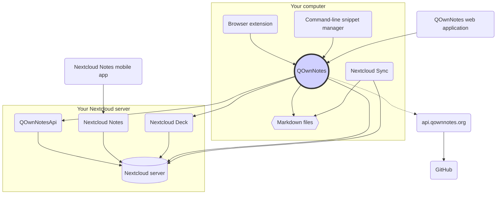

# مفاهیم

## QOwnNotes

- QOwnNotes **یادداشت ها** را **به صورت پرونده های مارک داون در پوشه یادداشت** شما ذخیره می کند
- به منظور اشتراک گذاری عمومی یادداشت ها با دیگران می تواند با سرور نکست کلود یا اون کلود گفتگو کند
- علاوه بر این، می توانید به **تاریخچه یادداشت و سطل زباله خود** در سرور نکست کلود یا اون کلود تان از طریق [برنامه QOwnNotesApi Nextcloud](#qownnotesapi-nextcloud-app) دسترسی داشته باشید
- لیست های انجام دادنی در سرور نکست کلود یا اون کلود تان از QOwnNotes قابل دسترسی هستند
- **QOwnNotes یادداشت های شما** و پرونده های رسانه یا پیوست را همگام سازی نمی کند!
  - همگام سازی پرونده یک فعل پیچیده است و در حال حاضر به غیر از آن راه حل های همگام سازی پرونده بهتری در دسترس قرار دارند ([مشتری همگام سازی دسکتاپ نکست کلود](#nextcloud-desktop-sync-client) را ملاحظه کنید)

## پرونده های یادداشت مارک داون

- شما همه یادداشت‌ها و پرونده‌های واسطه یا پیوست خود را **در اختیار** دارید!
- یادداشت های شما به صورت **پرونده های مارک داون با متن ساده** در کامپیوتر رومیزی تان ذخیره می شوند
- برای مشاهده یا ویرایش پرونده‌های یادداشت تان، می توانید از هر ویرایشگر متنی که دوست دارید در کنار QOwnNotes استفاده کنید
- **یادداشت های** خود را با سایر ابزارها (رومیزی و تلفن همراه) و با مشتری همگام سازی ن[نکست کلود ](https://nextcloud.com/)یا [اون کلود](https://owncloud.org/) به سرورتان همگام سازی کنید

## افزونه مرورگر QOwnNotes

می‌توانید **نشانک های مرورگر** خود را با QOwnNotes مدیریت کرده یا از آن به صورت یک **وب کلیپر** استفاده کنید.

::: tip
افزونه های مرورگر به صورت **آفلاین** و بدون نیاز به اتصال اینترنت اجرا می شوند. برای اطلاعات بیشتر لطفاً نگاهی به [افزونه مرورگر همراه وب QOwnNotes](browser-extension.md) بیندازید.
:::

## مدیر تکه کد خط فرمان QOwnNotes

**تکه کدهای دستوری** را می توانید با QOwnNotes مدیریت کرده و در خط فرمان اجرا کنید.

::: tip
لطفاً برای اطلاعات بیشتر [مدیر تکه کد خط فرمان QOwnNotes](command-line-snippet-manager.md) را ملاحظه کنید.
:::

## مشتری همگام سازی رومیزی نکست کلود

**یادداشت های** خود را با کمک سایر ابزارها (رومیزی و تلفن همراه) و به وسیله سرویس گیرنده همگام سازی [نکست کلود](https://nextcloud.com/) یا [اون کلود](https://owncloud.org/) با سرورتان همگام سازی کنید.

::: tip
البته راهکارهای دیگری مانند **Dropbox**، **Syncthing**، **Seafile**، یا BitTorrent Sync را نیز می توان برای همگام سازی یادداشت ها و سایر پرونده ها بکار برد.

همچنین می توانید برای همگام سازی با ابزارهایی از قبیل [گینوماتیک](https://github.com/muesli/gitomatic/) از **گیت** استفاده کنید.
:::

## سرور نکست کلود

جهت کار با یادداشت های خود به صورت آنلاین می توانید از سرور هایی نظیر [نکست کلود](https://nextcloud.com/) یا [اون کلود](https://owncloud.org/) بهره گیرید.

می‌توانید سرور خود را میزبانی کرده یا از راهکارهای میزبانی شده استفاده کنید.

[لیست نگهداری شده جمعی از طرف ارائه‌دهندگان نکست کلود](https://github.com/nextcloud/providers#providers) و نیز [لیست ابزارهای همراه نکست کلود](https://nextcloud.com/devices/) در دسترس قرار دارند.

[Portknox](https://portknox.net) گزارش کرده است که آنها [QOwnNotesAPI را نصب کرده اند](https://portknox.net/en/app_listing).

::: tip
البته راهکارهای دیگری مانند **Dropbox**، **Syncthing**، **Seafile**، یا BitTorrent Sync را نیز می توان برای میزبانی یادداشت ها و سایر پرونده ها بکار برد.
:::

## برنامه QOwnNotesAPI Nextcloud

[**QOwnNotesAPI**](https://github.com/pbek/qownnotesapi) اجازه دسترسی به شما برای **نسخه ‌های یادداشت** و **یادداشت های حذف شده** سمت سرورتان را می دهد.

::: tip
برای اطلاعات بیشتر لطفاً نگاهی به [برنامه QOwnNotesAPI Nextcloud](qownnotesapi.md) بیندازید.
:::

## برنامه سرور Nextcloud Notes

به منظور ویرایش یادداشت هایتان در **وب** از [**Nextcloud Notes**](https://github.com/nextcloud/notes) استفاده کنید.

::: warning
به خاطر داشته باشید که در حال حاضر Nextcloud Notes تنها یک سطح از زیر پوشه ها را پشتیبانی می کند.
:::

## Nextcloud Deck server app

You can use QOwnNotes to quickly create **cards** in [**Nextcloud Deck**](https://github.com/nextcloud/deck).

## Nextcloud Notes mobile app

To access your Nextcloud / ownCloud notes from your **mobile device** you can use different apps.

### اندروید

- [Nextcloud Notes برای اندروید](https://play.google.com/store/apps/details?id=it.niedermann.owncloud.notes) (شخص ثالث)

::: tip
You could also use any sync-tool like _Synchronize Ultimate_ or _FolderSync_ to sync your note files and use software like _neutriNotes_ or [**Markor**](https://f-droid.org/packages/net.gsantner.markor/) to edit your notes.
:::

### iOS

- [ CloudNotes برای iOS ](https://itunes.apple.com/de/app/cloudnotes-owncloud-notes/id813973264?mt=8) (شخص ثالث)

::: tip
You can also use [Notebooks](https://itunes.apple.com/us/app/notebooks-write-and-organize/id780438662) and sync your notes via WebDAV, there is a good tutorial at [Taking Notes with Nextcloud, QOwnNotes, and Notebooks](https://lifemeetscode.com/blog/taking-notes-with-nextcloud-qownnotes-and-notebooks)
:::

## api.qownnotes.org

This is an online service provided by QOwnNotes to check if there is a new release of the application available.

It is talking to GitHub and checks for the latest release, gets a suited download url and compiles the changes from the changelog compared to the version of QOwnNotes you are currently using as html to show in the update dialog.

In addition, it also provides the [Release RSS Feed](http://api.qownnotes.org/rss/app-releases) and an implementation of the legacy update checking api for older versions of QOwnNotes.

::: tip
You can access the source code for [api.qownnotes.org](https://api.qownnotes.org) on [GitHub](https://github.com/qownnotes/api).
:::

## QOwnNotes Web App

You can insert photos from your mobile phone into the current note in QOwnNotes on your desktop via the **web application** on [app.qownnotes.org](https://app.qownnotes.org/).

::: tip
Please visit [QOwnNotes Web App](web-app.md) for more information.
:::
