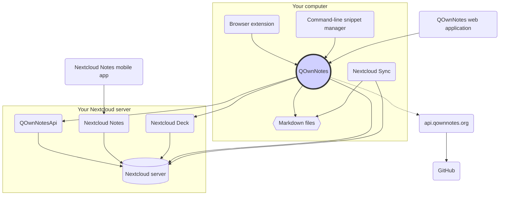

# Concept

## QOwnNotes

- QOwnNotes **stocke les note** dans votre dossier de notes **sous forme de fichiers Markdown**
- Il peut parler à votre serveur Nextcloud / ownCloud **pour partager publiquement des notes** avec d'autres personnes
- Vous pouvez également **accéder à l'historique de vos notes et à la corbeille** sur votre serveur Nextcloud / ownCloud via l'application [QOwnNotesApi Nextcloud](#qownnotesapi-nextcloud-app)
- Les listes Todo sur votre serveur Nextcloud / ownCloud sont accessibles depuis QOwnNotes
- **QOwnNotes ne synchronise pas vos notes** et vos fichiers multimédias / pièces jointes!
  - La synchronisation de fichiers est une entreprise complexe, il existe déjà d'excellentes solutions de synchronisation de fichiers (voir [Client de synchronisation de bureau Nextcloud](#nextcloud-desktop-sync-client))

## Fichiers de notes en Markdown

- Vous **possédez** toutes vos notes et fichiers multimédias / pièces jointes!
- Vos notes sont stockées sous forme de **fichiers Markdown en texte brut** sur votre ordinateur de bureau
- Vous pouvez utiliser n'importe quel éditeur de texte que vous aimez à côté de QOwnNotes pour afficher ou modifier vos fichiers de notes
- **Synchronisez vos notes** avec d'autres appareils (bureau et mobile) avec votre client de synchronisation [Nextcloud](https://nextcloud.com/) ou [ownCloud](https://owncloud.org/) sur votre serveur

## Extension de navigateur QOwnNotes

Vous pouvez gérer vos **signets de navigateur** avec QOwnNotes ou l'utiliser comme **web clipper**.

::: tip
Les extensions de navigateur fonctionnent **hors ligne**, aucune connexion Internet n'est nécessaire. Veuillez visiter [l'extension de navigateur QOwnNotes Web Companion](browser-extension.md) pour plus d'informations.
:::

## Gestionnaire d'extraits de commandes en ligne de commande de QOwnNotes

Vous pouvez gérer les **extraits de commandes** avec QOwnNotes et les exécuter depuis la ligne de commande.

::: tip
Veuillez visiter [Gestionnaire d’extraits de commandes en ligne de commande QOwnNotes](command-line-snippet-manager.md) pour plus d'informations.
:::

## Client de synchronisation Nextcloud pour ordinateur de bureau

**Synchronisez vos notes** avec d'autres appareils (ordinateur de bureau & mobile), vers votre serveur grâce aux clients [Nextcloud](https://nextcloud.com/) ou [ownCloud](https://owncloud.org/).

::: tip
Bien sûr, d'autres solutions comme **Dropbox**, **Syncthing**, **Seafile** ou BitTorrent Sync peuvent également être utilisées pour synchroniser vos notes ou d'autres fichiers.

Vous pouvez également utiliser **git** pour synchroniser, par exemple avec [gitomatic](https://github.com/muesli/gitomatic/).
:::

## Serveur Nextcloud

Pour travailler en ligne avec vos notes vous pouvez utiliser des serveurs, tels que [Nextcloud](https://nextcloud.com/) ou [ownCloud](https://owncloud.org/).

Vous pouvez héberger votre propre serveur ou faire appel à une solution hébergée.

Il existe une [liste de fournisseurs Nextcloud gérée par la communauté](https://github.com/nextcloud/providers#providers), ainsi qu'une [liste d'appareils fonctionnant avec Nextcloud](https://nextcloud.com/devices/).

[Portknox](https://portknox.net) a signalé qu'ils ont [QOwnNotesAPI installé](https://portknox.net/en/app_listing).

::: tip
Bien sûr, d'autres solutions comme **Dropbox**, **Syncthing**, **Seafile** ou BitTorrent Sync peuvent également être utilisées pour héberger vos notes ou d'autres fichiers.
:::

## App QOwnNotesAPI pour Nextcloud

[**QOwnNotesAPI**](https://github.com/pbek/qownnotesapi) vous permet d'accéder à vos **notes mises à la corbeille** et **versions de notes** côté serveur.

::: tip
Veuillez visiter [App QOwnNotesAPI Nextcloud](qownnotesapi.md) pour plus d'informations.
:::

## App serveur Nextcloud Notes

Utilisez [**Nextcloud Notes**](https://github.com/nextcloud/notes) pour modifier vos notes sur le **Web**.

::: warning
Gardez à l'esprit que Nextcloud Notes ne prend actuellement en charge qu'un seul niveau de sous-dossiers.
:::

## Nextcloud Deck server app

You can use QOwnNotes to quickly create **cards** in [**Nextcloud Deck**](https://github.com/nextcloud/deck).

## Nextcloud Notes mobile app

To access your Nextcloud / ownCloud notes from your **mobile device** you can use different apps.

### Android

- [Notes Nextcloud pour Android ](https://play.google.com/store/apps/details?id=it.niedermann.owncloud.notes)(tiers)

::: tip
You could also use any sync-tool like _Synchronize Ultimate_ or _FolderSync_ to sync your note files and use software like _neutriNotes_ or [**Markor**](https://f-droid.org/packages/net.gsantner.markor/) to edit your notes.
:::

### iOS

- [CloudNotes pour iOS](https://itunes.apple.com/de/app/cloudnotes-owncloud-notes/id813973264?mt=8) (tierce partie)

::: tip
You can also use [Notebooks](https://itunes.apple.com/us/app/notebooks-write-and-organize/id780438662) and sync your notes via WebDAV, there is a good tutorial at [Taking Notes with Nextcloud, QOwnNotes, and Notebooks](https://lifemeetscode.com/blog/taking-notes-with-nextcloud-qownnotes-and-notebooks)
:::

## api.qownnotes.org

This is an online service provided by QOwnNotes to check if there is a new release of the application available.

It is talking to GitHub and checks for the latest release, gets a suited download url and compiles the changes from the changelog compared to the version of QOwnNotes you are currently using as html to show in the update dialog.

In addition, it also provides the [Release RSS Feed](http://api.qownnotes.org/rss/app-releases) and an implementation of the legacy update checking api for older versions of QOwnNotes.

::: tip
You can access the source code for [api.qownnotes.org](https://api.qownnotes.org) on [GitHub](https://github.com/qownnotes/api).
:::

## QOwnNotes Web App

You can insert photos from your mobile phone into the current note in QOwnNotes on your desktop via the **web application** on [app.qownnotes.org](https://app.qownnotes.org/).

::: tip
Please visit [QOwnNotes Web App](web-app.md) for more information.
:::
