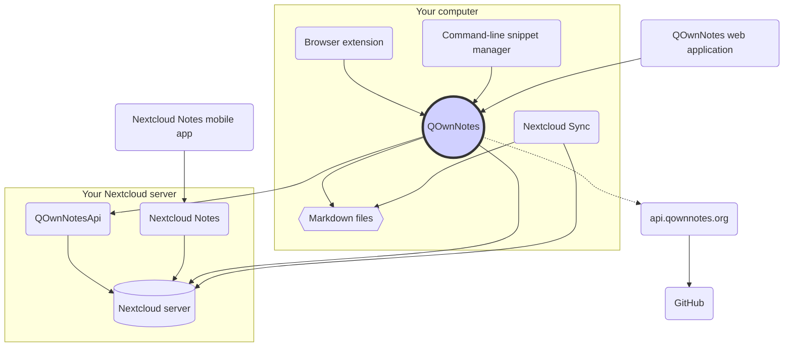

# Concept

## QOwnNotes

- QOwnNotes **stocke les note** dans votre dossier de notes **sous forme de fichiers Markdown**
- Il peut parler à votre serveur Nextcloud / ownCloud **pour partager publiquement des notes** avec d'autres personnes
- Vous pouvez également **accéder à l'historique de vos notes et à la corbeille** sur votre serveur Nextcloud / ownCloud via l'application [QOwnNotesApi Nextcloud](#qownnotesapi-nextcloud-app)
- Les listes Todo sur votre serveur Nextcloud / ownCloud sont accessibles depuis QOwnNotes
- **QOwnNotes ne synchronise pas vos notes** et vos fichiers multimédias / pièces jointes!
    - La synchronisation de fichiers est une entreprise complexe, il existe déjà d'excellentes solutions de synchronisation de fichiers (voir [Client de synchronisation de bureau Nextcloud](#nextcloud-desktop-sync-client))

## Fichiers de notes en Markdown

- Vous **possédez** toutes vos notes et fichiers multimédias / pièces jointes!
- Vos notes sont stockées sous forme de **fichiers Markdown en texte brut** sur votre ordinateur de bureau
- Vous pouvez utiliser n'importe quel éditeur de texte que vous aimez à côté de QOwnNotes pour afficher ou modifier vos fichiers de notes
- **Synchronisez vos notes** avec d'autres appareils (bureau et mobile) avec votre client de synchronisation [Nextcloud](https://nextcloud.com/) ou [ownCloud](https://owncloud.org/) sur votre serveur

## Extension de navigateur QOwnNotes

Vous pouvez gérer vos **signets de navigateur** avec QOwnNotes ou l'utiliser comme **web clipper**.

::: tip
Les extensions de navigateur fonctionnent **hors ligne**, aucune connexion Internet n'est nécessaire. Veuillez visiter [l'extension de navigateur QOwnNotes Web Companion](browser-extension.md) pour plus d'informations.
:::

## Gestionnaire d'extraits de commandes en ligne de commande de QOwnNotes

Vous pouvez gérer les **extraits de commandes** avec QOwnNotes et les exécuter depuis la ligne de commande.

::: tip
Veuillez visiter [Gestionnaire d’extraits de commandes en ligne de commande QOwnNotes](command-line-snippet-manager.md) pour plus d'informations.
:::

## Client de synchronisation Nextcloud pour ordinateur de bureau

**Synchronisez vos notes** avec d'autres appareils (ordinateur de bureau & mobile), ou avec votre client [Nextcloud](https://nextcloud.com/) ou [ownCloud](https://owncloud.org/) vers votre serveur.

::: tip
Bien sûr, d'autres solutions comme **Dropbox**, **Syncthing**, **Seafile** ou BitTorrent Sync peuvent également être utilisées pour synchroniser vos notes ou d'autres fichiers.

Vous pouvez également utiliser **git** pour synchroniser, par exemple avec [gitomatic](https://github.com/muesli/gitomatic/).
:::

## Serveur Nextcloud

Pour travailler en ligne avec vos notes vous pouvez utiliser des serveurs, tels que [Nextcloud](https://nextcloud.com/) ou [ownCloud](https://owncloud.org/).

Vous pouvez héberger votre propre serveur ou faire appel à une solution hébergée.

Il existe une [liste de fournisseurs Nextcloud gérée par la communauté](https://github.com/nextcloud/providers#providers), ainsi qu'une [liste d'appareils fonctionnant avec Nextcloud](https://nextcloud.com/devices/).

[Portknox](https://portknox.net) a signalé qu'ils ont [QOwnNotesAPI installé](https://portknox.net/en/app_listing).

::: tip
Bien sûr, d'autres solutions comme **Dropbox**, **Syncthing**, **Seafile** ou BitTorrent Sync peuvent également être utilisées pour héberger vos notes ou d'autres fichiers.
:::

## App QOwnNotesAPI pour Nextcloud

[**QOwnNotesAPI**](https://github.com/pbek/qownnotesapi) vous permet d'accéder à vos **notes mises à la corbeille** et **versions de notes** côté serveur.

::: tip
Veuillez visiter [App QOwnNotesAPI Nextcloud](qownnotesapi.md) pour plus d'informations.
:::

## App serveur Nextcloud Notes

Utilisez [**Nextcloud Notes**](https://github.com/nextcloud/notes) pour modifier vos notes sur le **Web**.

::: warning
Gardez à l'esprit que Nextcloud Notes ne prend actuellement en charge qu'un seul niveau de sous-dossiers.
:::

## App mobile Nextcloud Notes

Vous pouvez utiliser différentes applications pour accéder à vos notes Nextcloud / ownCloud depuis votre **appareil mobile**.

### Android

- [Notes Nextcloud pour Android ](https://play.google.com/store/apps/details?id=it.niedermann.owncloud.notes)(tiers)

::: tip
Vous pouvez également utiliser n'importe quel outil de synchronisation comme *Synchronize Ultimate* ou *FolderSync* pour synchroniser vos fichiers de notes et utiliser un logiciel comme *neutriNotes* pour éditer vos notes.
:::

### iOS

- [CloudNotes pour iOS](https://itunes.apple.com/de/app/cloudnotes-owncloud-notes/id813973264?mt=8) (tierce partie)

::: tip
Vous pouvez également utiliser [Notebooks](https://itunes.apple.com/us/app/notebooks-write-and-organize/id780438662) et synchroniser vos notes via WebDAV. Il existe un bon tutoriel nommé [Prendre des notes avec Nextcloud, OwnNotes et Notebooks](https://lifemeetscode.com/blog/taking-notes-with-nextcloud-qownnotes-and-notebooks)
:::

## api.qownnotes.org

Il s'agit d'un service en ligne fourni par QOwnNotes pour vérifier si une nouvelle version de l'application est disponible.

Il communique avec GitHub et s'enquiert de la dernière version, récupère l'URL de téléchargement appropriée et compile - en HTML - les modifications du journal des modifications par rapport à la version de QOwnNotes que vous utilisez actuellement. Il les affiche ensuite dans la boîte de dialogue de mise à jour.

il fournit également le [Release RSS Feed](http://api.qownnotes.org/rss/app-releases) et une implémentation de l'ancienne API de vérification des mises à jour pour les anciennes versions de QOwnNotes.

::: tip
Vous pouvez accéder au code source de [api.qownnotes.org](https://api.qownnotes.org) sur [GitHub](https://github.com/qownnotes/api).
:::

## QOwnNotes Web App

Vous pouvez insérer des photos depuis votre téléphone mobile vers la note courante dans QOwnNotes sur votre ordinateur de bureau via l'**application Web** disponible sur [app.qownnotes.org](https://app.qownnotes.org/).

::: tip
Veuillez visiter [Web App QOwnNotes](web-app.md) pour plus d'informations.
:::
