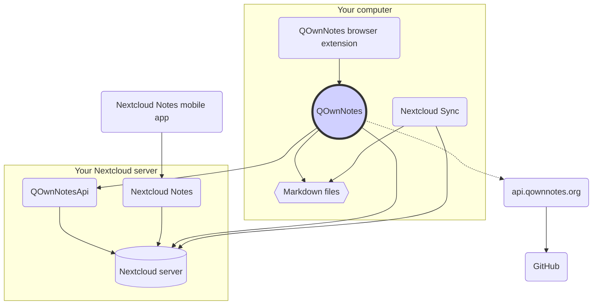

# Concept

## QOwnNotes

- QOwnNotes **stocke les note** dans votre dossier de notes **sous forme de fichiers de démarque**
- Il peut parler à votre serveur Nextcloud / ownCloud **pour partager publiquement des notes** avec d'autres personnes
- Vous pouvez également **accéder à l'historique de vos notes et à la corbeille** sur votre serveur Nextcloud / ownCloud via l'application [QOwnNotesApi Nextcloud](#qownnotesapi-nextcloud-app)
- Les listes Todo sur votre serveur Nextcloud / ownCloud sont accessibles depuis QOwnNotes
- **QOwnNotes ne synchronise pas vos notes** et vos fichiers multimédias / pièces jointes!
    - La synchronisation de fichiers est une entreprise complexe, il existe déjà d'excellentes solutions de synchronisation de fichiers (voir [Client de synchronisation de bureau Nextcloud](#nextcloud-desktop-sync-client))

## Fichiers de notes de démarque

- Vous **possédez** toutes vos notes et fichiers multimédias / pièces jointes!
- Vos notes sont stockées sous forme de **fichiers Markdown en texte brut** sur votre ordinateur de bureau
- Vous pouvez utiliser n'importe quel éditeur de texte que vous aimez à côté de QOwnNotes pour afficher ou modifier vos fichiers de notes
- **Synchronisez vos notes** avec d'autres appareils (bureau et mobile) avec votre client de synchronisation [Nextcloud](https://nextcloud.com/) ou [ownCloud](https://owncloud.org/) sur votre serveur

## Extension de navigateur QOwnNotes

Vous pouvez gérer vos **signets de navigateur** avec QOwnNotes ou l'utiliser comme **web clipper**.

::: tip
Veuillez visiter [l'extension de navigateur QOwnNotes Web Companion](browser-extension.md) pour plus d'informations.
:::

## Client de synchronisation de bureau Nextcloud

**Synchronisez vos notes** avec d'autres appareils (bureau et mobile) avec votre client de synchronisation [Nextcloud](https://nextcloud.com/) ou [ownCloud](https://owncloud.org/) sur votre serveur.

::: tip
Bien sûr, d'autres solutions, comme **Dropbox**, **Syncthing**, **Seafile** ou BitTorrent Sync peuvent également être utilisées pour synchroniser vos notes et autres fichiers.

Vous pouvez également utiliser **git** pour synchroniser avec des outils comme [gitomatic](https://github.com/muesli/gitomatic/).
:::

## Serveur Nextcloud

Pour travailler avec vos notes en ligne, vous pouvez utiliser des serveurs tels que [Nextcloud](https://nextcloud.com/) ou [ownCloud](https://owncloud.org/).

Vous pouvez héberger votre propre serveur ou utiliser des solutions hébergées.

Il existe une [liste de fournisseurs Nextcloud gérée par la communauté](https://github.com/nextcloud/providers#providers), ainsi qu'une [liste d'appareils avec Nextcloud](https://nextcloud.com/devices/).

[Portknox](https://portknox.net) a signalé que [QOwnNotesAPI est installé](https://portknox.net/en/app_listing).

::: tip
Bien sûr, d'autres solutions, comme **Dropbox**, **Syncthing**, **Seafile** ou BitTorrent Sync peuvent également être utilisées pour héberger vos notes et autres fichiers.
:::

## QOwnNotesAPI Nextcloud app

[**QOwnNotesAPI**](https://github.com/pbek/qownnotesapi) vous permet d'accéder à vos **notes mises à la corbeille** et **versions de notes** côté serveur.

::: tip
Veuillez visiter [Application QOwnNotesAPI Nextcloud](qownnotesapi.md) pour plus d'informations.
:::

## Application serveur Nextcloud Notes

Utilisez [**Nextcloud Notes**](https://github.com/nextcloud/notes) pour modifier vos notes sur **Web**.

::: warning
Gardez à l'esprit que Nextcloud Notes ne prend actuellement en charge que jusqu'à un niveau de sous-dossiers.
:::

## Nextcloud Notes mobile app

Pour accéder à vos notes Nextcloud / ownCloud à partir de votre **appareil mobile**, vous pouvez utiliser différentes applications.

### Android

- [Notes Nextcloud pour Android ](https://play.google.com/store/apps/details?id=it.niedermann.owncloud.notes)(tiers)

::: tip
Vous pouvez également utiliser n'importe quel outil de synchronisation comme *Synchronize Ultimate* ou *FolderSync* pour synchroniser vos fichiers de notes et utiliser un logiciel comme *neutriNotes* pour éditer vos notes.
:::

### iOS

- [CloudNotes for iOS](https://itunes.apple.com/de/app/cloudnotes-owncloud-notes/id813973264?mt=8) (3rd party)

::: tip
Vous pouvez également utiliser [Notebooks](https://itunes.apple.com/us/app/notebooks-write-and-organize/id780438662) et synchroniser vos notes via WebDAV, il existe un bon tutoriel sur [Prendre des notes avec Nextcloud, OwnNotes et Notebooks](https://lifemeetscode.com/blog/taking-notes-with-nextcloud-qownnotes-and-notebooks)
:::

## api.qownnotes.org

Il s'agit d'un service en ligne fourni par QOwnNotes pour vérifier si une nouvelle version de l'application est disponible.

Il parle à GitHub et vérifie la dernière version, obtient une URL de téléchargement adaptée et compile les modifications du journal des modifications par rapport à la version de QOwnNotes que vous utilisez actuellement en html à afficher dans la boîte de dialogue de mise à jour.

En outre, il fournit également le [Release RSS Feed](http://api.qownnotes.org/rss/app-releases) et une implémentation de l'ancienne API de vérification des mises à jour pour les anciennes versions de QOwnNotes.

::: tip
Vous pouvez accéder au code source de [api.qownnotes.org](https://api.qownnotes.org) sur [GitHub](https://github.com/qownnotes/api).
:::
