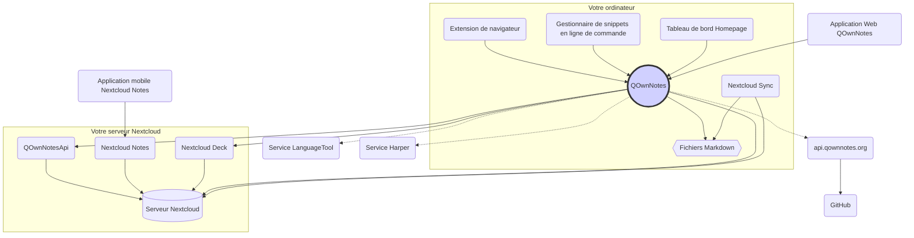

# Concept

<style>
  /* Remove max-width for content so there is enough space for the Mermaid diagram */
  /* This targets the VuePress content container on this page only using :has() */
  body:has(.concept-page-marker) main.vp-page > div {
    max-width: none !important;
  }
</style>

<div class="concept-page-marker" style="display: none;"></div>


```mermaid
graph TB
    subgraph Votre ordinateur
        qon((QOwnNotes))-->md{{"Fichiers Markdown"}}
        sync("Nextcloud Sync")-->md
        qon-comp("Extension de navigateur")-->qon
        qc("Gestionnaire de snippets en ligne de commande")-->qon
        homepage("Tableau de bord Homepage")-->qon
    end
    subgraph Votre serveur Nextcloud
        qon-api("QOwnNotesApi")-->ncs[("Serveur Nextcloud")]
        nc-notes-app("Nextcloud Notes")-->ncs
        nc-deck-app("Nextcloud Deck")-->ncs
    end

    nc-notes-mob("Application mobile Nextcloud Notes")-->nc-notes-app
    qon-web-app("Application Web QOwnNotes")-->qon
    qon-->qon-api
    qon-->ncs
    qon-->nc-deck-app
    sync-->ncs
    qon-.->lt("Service LanguageTool")
    qon-.->harper("Service Harper")
    qon-.->qon-web-api("api.qownnotes.org")
    qon-web-api-->github("GitHub")

    style qon fill:#d0d0ff,stroke:#333,stroke-width:4px
    click qon "/getting-started/concept.html#qownnotes" "Application de bureau QOwnNotes pour gérer vos notes sur votre ordinateur"
    click md "/getting-started/concept.html#markdown-note-files" "Markdown, médias et picès jointes dans votre dossier de notes"
    click qon-comp "/getting-started/concept.html#qownnotes-browser-extension" "Extension de navigateur QOwnNotes pour gérer vos signets dans des fichiers Markdown et qui sert aussi de clipper web"
    click qc "/getting-started/concept.html#qownnotes-command-line-snippet-manager" "Gestionnaire de snippets en ligne de commande QOwnNotes"
    click homepage "/getting-started/concept.html#homepage-dashboard" "Tableau de bord Homepage utilisant les suggestions de signets QOwnNotes"
    click sync "/getting-started/concept.html#nextcloud-desktop-sync-client" "Client de bureau de synchronisation Nextcloud pour synchroniser vos notes avec votre serveur"
    click ncs "/getting-started/concept.html#nextcloud-server" "Serveur Nextcloud pour stocker vos notes et vos fichiers"
    click qon-api "/getting-started/concept.html#qownnotesapi-nextcloud-app" "Application Nextcloud QOwnNotesAPI pour accéder votre corbeille du serveur et vos versions de notes"
    click nc-notes-app "/getting-started/concept.html#nextcloud-notes-server-app" "Application serveur Nextcloud Notes pour gérer vos notes via une interface web"
    click nc-notes-mob "/getting-started/concept.html#nextcloud-notes-mobile-app" "Application mobile Nextcloud Notes pour gérer vos notes sur votre téléphone portable"
    click nc-deck-app "/getting-started/concept.html#nextcloud-deck-server-app" "Application serveur Nextcloud Deck pour gérer vos rappels et listes de tâches via une interface web"
    click qon-web-app "/getting-started/concept.html#qownnotes-web-app" "Application Web QOwnNotes pour envoyer des photos depuis votre téléphone portable"
    click lt "/editor/languagetool.html" "Serveur optionnel LanguageTool pour des vérifications de grammaire et de style"
    click harper "/editor/harper.html" "Service optionnel Harper pour des vérifications hors-ligne de grammaire et de style"
    click qon-web-api "/getting-started/concept.html#api-qownnotes-org"
```

## QOwnNotes

- QOwnNotes **stocke les notes** dans votre dossier de notes **sous forme de fichiers Markdown**
- Il peut parler à votre serveur Nextcloud / ownCloud **pour partager publiquement des notes** avec d'autres personnes
- Vous pouvez également **accéder à l'historique de vos notes et à la corbeille** sur votre serveur Nextcloud / ownCloud via l'application [QOwnNotesApi Nextcloud](#qownnotesapi-nextcloud-app)
- Les listes de tâches sur votre serveur Nextcloud / ownCloud sont accessibles depuis QOwnNotes
- **QOwnNotes ne synchronise pas vos notes** et vos fichiers multimédias / pièces jointes !
  - La synchronisation de fichiers est une entreprise complexe, il existe déjà d'excellentes solutions de synchronisation de fichiers (voir [Client de synchronisation de bureau Nextcloud](#nextcloud-desktop-sync-client))

## Fichiers de notes en Markdown

- Vous **possédez** toutes vos notes et fichiers multimédias / pièces jointes !
- Vos notes sont stockées sous forme de **fichiers Markdown en texte brut** sur votre ordinateur de bureau
- Vous pouvez utiliser n'importe quel éditeur de texte que vous aimez à côté de QOwnNotes pour afficher ou modifier vos fichiers de notes
- **Synchronisez vos notes** avec d'autres appareils (bureau et mobile) avec votre client de synchronisation [Nextcloud](https://nextcloud.com/) ou [ownCloud](https://owncloud.org/) sur votre serveur

## Extension de navigateur QOwnNotes

Vous pouvez gérer vos **signets de navigateur** avec QOwnNotes ou l'utiliser comme **web clipper**.

Le même système d’analyse et d’indexage des signets peut également être utilisé dans une API locale de suggestion pour [Homepage](https://github.com/gethomepage/homepage).

::: tip
Les extensions de navigateur fonctionnent **hors ligne**, aucune connexion Internet n'est nécessaire. Voir [extension de navigateur QOwnNotes Web Companion](browser-extension.md) pour plus d'informations.
:::

## Tableau de bord Homepage

QOwnNotes peut ouvrir un point d’accès local HTTP pour le support du `suggestionUrl` de [Homepage](https://github.com/gethomepage/homepage), utilisant le même système d’analyse et d’indexage des signets utilisé par le Web Companion.

- Activez-le dans les `Préférences -> Extension de navigateur / snippets de commandes`
- Cochez `Activer le serveur de socket`
- Dans `API de suggestion de signets`, cochez `Activer l’API de suggestion de signets compatible avec Homepage`
- Choisissez un port pour le point d’accès local
- Configurez optionnellement un jeton de sécurité si vous souhaitez que les requêtes Homepage soient authentifiées
- Le service est lié uniquement à `127.0.0.1`

Le point d’accès est disponible avec `GET /suggest?q=home` et supporte un paramètre optionnel `limit` (par défaut : `10`, maximum : `50`) et un paramètre optionnel `token`.

Si vous utilisez les ressources personnalisées de Homepage de `docs/homepage/custom.js`, `QON_TOKEN` doit être le même jeton de sécurité que celui que vous avez configuré dans QOwnNotes.

Exemple de configuration Homepage :

```yaml
search:
  provider: custom
  url: https://example.com/search?q=
  suggestionUrl: http://127.0.0.1:22224/suggest?q=
  showSearchSuggestions: true
```

::: tip
Visitez [API de suggestion Homepage](homepage-suggestion-api.md) pour plus d’informations, dont les fichiers de configuration à modifier et comment utiliser les ressources de `docs/homepage`.
:::

## Gestionnaire de snippets en ligne de commande de QOwnNotes

Vous pouvez gérer vos **snippets** avec QOwnNotes et les exécuter depuis la ligne de commande.

::: tip
Visitez [Gestionnaire de snippets en ligne de commande QOwnNotes](command-line-snippet-manager.md) pour plus d'informations.
:::

## Service LanguageTool

QOwnNotes peut utiliser un service [LanguageTool](https://languagetool.org/) local ou distant pour une **vérification de la grammaire et du style** dans l’éditeur de notes.

- Il est **optionnel** et fonctionne avec le système de vérification orthographique existant
- Activez-le dans les `Préférences -> Éditeur`, puis configurez l’**URL du serveur**, la **langue**, une **clé d’API** optionnelle, et les catégories que vous souhaitez vérifier
- Vous pouvez aussi l’activer ou les désactiver rapidement avec l’option dans le menu **Orthographe** avec l’option `Vérifier la grammaire avec LanguageTool`
- Des suggestions et actions sont disponibles dans le menu contextuel de l’éditeur pour les problèmes détectés

::: tip
Voir [LanguageTool](../editor/languagetool.md) pour plus d’informations.
:::

## Service Harper

QOwnNotes peut utiliser un service local [Harper](https://writewithharper.com/) pour une **vérification de la grammaire et du style** dans l’éditeur de notes.

- Il est **optionnel** et fonctionne avec le système de vérification orthographique existant
- Activez-le dans les `Préférences -> Éditeur -> Harper`, puis configurez la **couche de transport**, la commande `harper-ls` ou la cible TCP, le **dialecte** et les règles que vous souhaitez utiliser
- Vous pouvez aussi l’activer ou les désactiver rapidement avec l’option dans le menu **Édition** avec l’option `Vérifier la grammaire avec Harper`
- Des suggestions et actions pour ignorer sont disponibles dans le menu contextuel de l’éditeur pour les problèmes détectés

::: tip
Visitez [Harper](../editor/harper.md) pour plus d’informations.
:::

## Client de synchronisation Nextcloud pour ordinateur de bureau

**Synchronisez vos notes** avec d'autres appareils (ordinateur de bureau & mobile), vers votre serveur grâce aux clients [Nextcloud](https://nextcloud.com/) ou [ownCloud](https://owncloud.org/).

::: tip
Bien sûr, d'autres solutions comme **Dropbox**, **Syncthing**, **Seafile** ou BitTorrent Sync peuvent également être utilisées pour synchroniser vos notes ou d'autres fichiers.

Vous pouvez également utiliser **git** pour synchroniser, par exemple avec [gitomatic](https://github.com/muesli/gitomatic/).
:::

## Serveur Nextcloud

Pour travailler en ligne avec vos notes vous pouvez utiliser des serveurs, tels que [Nextcloud](https://nextcloud.com/) ou [ownCloud](https://owncloud.org/).

Vous pouvez héberger votre propre serveur ou faire appel à une solution hébergée.

Il existe une [liste de fournisseurs Nextcloud gérée par la communauté](https://github.com/nextcloud/providers#providers), ainsi qu'une [liste d'appareils fonctionnant avec Nextcloud](https://nextcloud.com/devices/).

[Portknox](https://portknox.net) a signalé qu'ils ont [QOwnNotesAPI installé](https://portknox.net/en/app_listing).

::: tip
Bien sûr, d'autres solutions comme **Dropbox**, **Syncthing**, **Seafile** ou BitTorrent Sync peuvent également être utilisées pour héberger vos notes ou d'autres fichiers.
:::

## Application QOwnNotesAPI pour Nextcloud

[**QOwnNotesAPI**](https://github.com/pbek/qownnotesapi) vous permet d'accéder à vos **notes mises à la corbeille** et **versions de notes** côté serveur.

::: tip
Visitez [App QOwnNotesAPI Nextcloud](qownnotesapi.md) pour plus d'informations.
:::

## Application serveur Nextcloud Notes

Utilisez [**Nextcloud Notes**](https://github.com/nextcloud/notes) pour modifier vos notes sur le **Web**.

::: warning
Gardez à l'esprit que Nextcloud Notes ne prend actuellement en charge qu'un seul niveau de sous-dossiers.
:::

## Application serveur Nextcloud Deck

Vous pouvez utiliser QOwnNotes pour rapidement créer des **cartes** dans [**Nextcloud Deck**](https://github.com/nextcloud/deck).

## Application mobile Nextcloud Notes

Vous pouvez utiliser différentes applications pour accéder à vos notes Nextcloud / ownCloud depuis votre **appareil mobile**.

### Android

- [Nextcloud Notes for Android](https://play.google.com/store/apps/details?id=it.niedermann.owncloud.notes) (tiers)

::: tip
Vous pouvez également utiliser n'importe quel outil de synchronisation comme _Synchronize Ultimate_ ou _FolderSync_ pour synchroniser vos fichiers de notes et utiliser un logiciel comme _neutriNotes_ ou [**Markor**](https://f-droid.org/packages/net.gsantner.markor/) pour éditer vos notes.
:::

### iOS

- [CloudNotes for iOS](https://itunes.apple.com/de/app/cloudnotes-owncloud-notes/id813973264?mt=8) (tiers)

::: tip
Vous pouvez aussi utiliser [Notebooks](https://itunes.apple.com/us/app/notebooks-write-and-organize/id780438662) et synchroniser vos notes via WebDAV, il y a un bon tutoriel sur [Taking Notes with Nextcloud, QOwnNotes, and Notebooks](https://lifemeetscode.com/blog/taking-notes-with-nextcloud-qownnotes-and-notebooks)
:::

## api.qownnotes.org

Il s'agit d'un service en ligne fourni par QOwnNotes pour vérifier si une nouvelle version de l'application est disponible.

Il communique avec GitHub et s'enquiert de la dernière version, récupère l'URL de téléchargement appropriée et compile – en HTML – le journal des modifications (changelog) par rapport à la version de QOwnNotes que vous utilisez actuellement. Il les affiche ensuite dans la boîte de dialogue de mise à jour.

Il fournit également le [Flux RSS « Release »](http://api.qownnotes.org/rss/app-releases) et une implémentation de l'ancienne API de vérification des mises à jour pour les anciennes versions de QOwnNotes.

::: tip
Vous pouvez voir le code source de [api.qownnotes.org](https://api.qownnotes.org) sur [GitHub](https://github.com/qownnotes/api).
:::

## Application Web QOwnNotes

Vous pouvez insérer des photos depuis votre téléphone mobile vers la note courante dans QOwnNotes sur l'application de bureau via l'**application Web** disponible sur [app.qownnotes.org](https://app.qownnotes.org/).

::: tip
Visitez [Application Web QOwnNotes](web-app.md) pour plus d’informations.
:::
