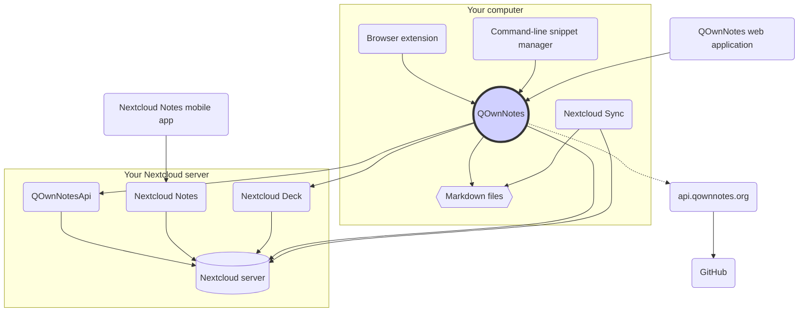

# Concept

## QOwnNotes

- QOwnNotes **stores notes** to your **note folder as markdown files**
- It can talk to your Nextcloud / ownCloud server **to publicly share notes** with other people
- You can also **access your note history and trash** on your Nextcloud / ownCloud server
  via the [QOwnNotesApi Nextcloud app](#qownnotesapi-nextcloud-app)
- Todo lists on your Nextcloud / ownCloud server can be accessed from within QOwnNotes
- **QOwnNotes does not sync your notes** and media / attachment files!
  - File syncing is a complex endeavor, there are already great file syncing solutions
    out there (see [Nextcloud desktop sync client](#nextcloud-desktop-sync-client))

## Markdown note files

- You **own** all your notes and media / attachment files!
- Your notes are stored as **plain-text Markdown files** on your desktop computer
- You can use any text editor you like beside QOwnNotes to view or edit your note files
- **Sync your notes** with other devices (desktop & mobile) with your [Nextcloud](https://nextcloud.com/)
  or [ownCloud](https://owncloud.org/) sync client to your server

## QOwnNotes browser extension

You can manage your **browser bookmarks** with QOwnNotes or use it as a **web clipper**.

::: tip
The browser extensions works **offline**, no internet connection needed.
Please visit [QOwnNotes Web Companion browser extension](browser-extension.md) for more information.
:::

## QOwnNotes command-line snippet manager

You can manage your **command snippets** with QOwnNotes and execute them on the command-line.

::: tip
Please visit [QOwnNotes command-line snippet manager](command-line-snippet-manager.md) for more information.
:::

## Nextcloud desktop sync client

**Sync your notes** with other devices (desktop & mobile) with your [Nextcloud](https://nextcloud.com/)
or [ownCloud](https://owncloud.org/) sync client to your server.

::: tip
Of course other solutions, like **Dropbox**, **Syncthing**, **Seafile** or BitTorrent Sync can be used
too to sync your notes and other files.

You can also use **git** to sync with tools like [gitomatic](https://github.com/muesli/gitomatic/).
:::

## Nextcloud server

To work with your notes online you can use servers like [Nextcloud](https://nextcloud.com/)
or [ownCloud](https://owncloud.org/).

You can host your own server or use hosted solutions.

There is a [community-maintained list of Nextcloud providers](https://github.com/nextcloud/providers#providers),
as well as a [list of devices with Nextcloud](https://nextcloud.com/devices/).

[Portknox](https://portknox.net) has reported they have [QOwnNotesAPI installed](https://portknox.net/en/app_listing).

::: tip
Of course other solutions, like **Dropbox**, **Syncthing**, **Seafile** or BitTorrent Sync can be used
too to host your notes and other files.
:::

## QOwnNotesAPI Nextcloud app

[**QOwnNotesAPI**](https://github.com/pbek/qownnotesapi) lets you access your
server-side **trashed notes** and **note versions**.

::: tip
Please visit [QOwnNotesAPI Nextcloud App](qownnotesapi.md) for more information.
:::

## Nextcloud Notes server app

Use [**Nextcloud Notes**](https://github.com/nextcloud/notes) to edit your notes in the **web**.

::: warning
Keep in mind that Nextcloud Notes currently only supports up to one level of subfolders.
:::

## Nextcloud Deck server app

You can use QOwnNotes to quickly create **cards** in [**Nextcloud Deck**](https://github.com/nextcloud/deck).

## Nextcloud Notes mobile app

To access your Nextcloud / ownCloud notes from your **mobile device** you can use different apps.

### Android

- [Nextcloud Notes for Android](https://play.google.com/store/apps/details?id=it.niedermann.owncloud.notes) (3rd party)

::: tip
You could also use any sync-tool like _Synchronize Ultimate_ or _FolderSync_ to sync your note files
and use software like _neutriNotes_ or [**Markor**](https://f-droid.org/packages/net.gsantner.markor/)
to edit your notes.
:::

### iOS

- [CloudNotes for iOS](https://itunes.apple.com/de/app/cloudnotes-owncloud-notes/id813973264?mt=8) (3rd party)

::: tip
You can also use [Notebooks](https://itunes.apple.com/us/app/notebooks-write-and-organize/id780438662)
and sync your notes via WebDAV, there is a good tutorial at [Taking Notes with Nextcloud, QOwnNotes, and Notebooks](https://lifemeetscode.com/blog/taking-notes-with-nextcloud-qownnotes-and-notebooks)
:::

## api.qownnotes.org

This is an online service provided by QOwnNotes to check if there is a new release of the application available.

It is talking to GitHub and checks for the latest release, gets a suited download url and compiles the changes
from the changelog compared to the version of QOwnNotes you are currently using as html to show in the update dialog.

In addition, it also provides the [Release RSS Feed](http://api.qownnotes.org/rss/app-releases) and an implementation
of the legacy update checking api for older versions of QOwnNotes.

::: tip
You can access the source code for [api.qownnotes.org](https://api.qownnotes.org) on [GitHub](https://github.com/qownnotes/api).
:::

## QOwnNotes Web App

You can insert photos from your mobile phone into the current note in QOwnNotes
on your desktop via the **web application** on [app.qownnotes.org](https://app.qownnotes.org/).

::: tip
Please visit [QOwnNotes Web App](web-app.md) for more information.
:::
