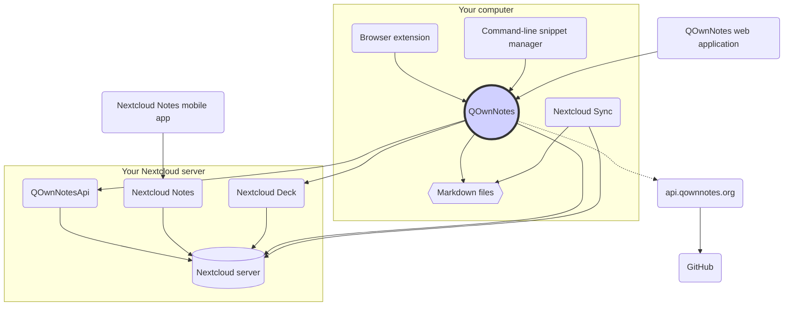

# Koncepció

## QOwnNotes

- A QOwnNotes **jegyzeteket** tárol a **jegyzetek mappájában markdown fájlként**
- Kommunikál a Nextcloud / ownCloud szerverével, **hogy nyilvánosan oszhassa meg a jegyzeteket** másokkal
- A **jegyzetelőzményeket és a kukákat is elérheti** a Nextcloud / ownCloud szerveren a [QOwnNotesApi Nextcloud alkalmazáson keresztül](#qownnotesapi-nextcloud-app)
- A Nextcloud / ownCloud szerveren szereplő Todo listák a QOwnNotes szolgáltatásból érhetők el
- **A QOwnNotes nem szinkronizálja a jegyzeteit** és a média / melléklet fájlokat!
  - A fájlszinkronizálás összetett erőfeszítés, máris vannak nagyszerű fájlszinkronizálási megoldások (lásd: [Nextcloud asztali szinkronizálási kliens](#nextcloud-desktop-sync-client))

## Markdown jegyzetfájlok

- Az összes jegyzeted és média- / mellékletfájlod **a te tulajdonodban** van!
- Jegyzeteit **egyszerű szöveges Markdown-fájlokként** tárolja az asztali számítógépe
- A QOwnNotes mellett tetszőleges szövegszerkesztőt használhat a jegyzetfájlok megtekintésére vagy szerkesztésére
- **A jegyzetek szinkronizálása** más eszközökkel (asztali és mobil) a [Nextcloud](https://nextcloud.com/) vagy a [ownCloud](https://owncloud.org/) szinkronizálási klienssel a szerverhez

## QOwnNotes böngészőbővítmény

Kezelheti a **böngésző könyvjelzőit** a QOwnNotes szolgáltatással, vagy használhatja **webleíró eszközként**.

::: tip
A böngészőbővítmények **offline** működnek, nincs szükség internetkapcsolatra. További információért keresse fel a [QOwnNotes Web Companion böngészőbővítményt](browser-extension.md).
:::

## QOwnNotes command-line snippet manager

A QOwnNotes segítségével kezelheti **parancsrészleteit**, és végrehajthatja őket a parancssorban.

::: tip
További információért keresse fel a [QOwnNotes parancssori kódrészletkezelőt](command-line-snippet-manager.md).
:::

## Nextcloud asztali szinkronizáló kliens

**A jegyzetek szinkronizálása** más eszközökkel (asztali & mobil) a [Nextcloud](https://nextcloud.com/) vagy a [ownCloud](https://owncloud.org/) szinkronizálási klienssel a szerverhez.

::: tip
Természetesen más megoldások, például a **Dropbox**, a **szinkronizálás**, a **Seafile** vagy a BitTorrent Sync is használhatók a jegyzetek és más fájlok szinkronizálására.

A **git** használatával szinkronizálhat olyan eszközökkel is, mint a [gitomatic](https://github.com/muesli/gitomatic/).
:::

## Nextcloud szerver

A jegyzetek online kezeléséhez használhat olyan szervereket, mint a [Nextcloud](https://nextcloud.com/) vagy a [ownCloud](https://owncloud.org/).

Hosztolhatja saját szerverét, vagy használhat hosztolt megoldásokat.

Van egy [közösség által karbantartott Nextcloud szolgáltatók listája](https://github.com/nextcloud/providers#providers), valamint egy [Nextcloudot használó eszközök listája](https://nextcloud.com/devices/).

[A Portknox](https://portknox.net) jelentése szerint [a QOwnNotesAPI telepítve van](https://portknox.net/en/app_listing).

::: tip
Természetesen más megoldások, például a **Dropbox**, a **szinkronizálás**, a **Seafile** vagy a BitTorrent Sync is használhatók a jegyzetek és más fájlok tárolására.
:::

## QOwnNotesAPI Nextcloud app

A [**QOwnNotesAPI**](https://github.com/pbek/qownnotesapi) segítségével hozzáférhet a kiszolgálóoldali **kukába helyezett jegyzetek** és **jegyzetek verzióihoz**.

::: tip
További információkért keresse fel a [QOwnNotesAPI Nextcloud alkalmazást](qownnotesapi.md).
:::

## Nextcloud Notes szerver alkalmazás

A [**Nextcloud Notes**](https://github.com/nextcloud/notes) használatával szerkesztheti a jegyzeteit az **interneten**.

::: warning
Ne feledje, hogy a Nextcloud Notes jelenleg csak egy szintű almappákat támogat.
:::

## Nextcloud Deck server app

You can use QOwnNotes to quickly create **cards** in [**Nextcloud Deck**](https://github.com/nextcloud/deck).

## Nextcloud Notes mobile app

To access your Nextcloud / ownCloud notes from your **mobile device** you can use different apps.

### Android

- [Nextcloud Notes for Android](https://play.google.com/store/apps/details?id=it.niedermann.owncloud.notes) (harmadik fél)

::: tip
You could also use any sync-tool like _Synchronize Ultimate_ or _FolderSync_ to sync your note files and use software like _neutriNotes_ or [**Markor**](https://f-droid.org/packages/net.gsantner.markor/) to edit your notes.
:::

### iOS

- [CloudNotes iOS rendszerhez](https://itunes.apple.com/de/app/cloudnotes-owncloud-notes/id813973264?mt=8) (harmadik fél)

::: tip
You can also use [Notebooks](https://itunes.apple.com/us/app/notebooks-write-and-organize/id780438662) and sync your notes via WebDAV, there is a good tutorial at [Taking Notes with Nextcloud, QOwnNotes, and Notebooks](https://lifemeetscode.com/blog/taking-notes-with-nextcloud-qownnotes-and-notebooks)
:::

## api.qownnotes.org

This is an online service provided by QOwnNotes to check if there is a new release of the application available.

It is talking to GitHub and checks for the latest release, gets a suited download url and compiles the changes from the changelog compared to the version of QOwnNotes you are currently using as html to show in the update dialog.

In addition, it also provides the [Release RSS Feed](http://api.qownnotes.org/rss/app-releases) and an implementation of the legacy update checking api for older versions of QOwnNotes.

::: tip
You can access the source code for [api.qownnotes.org](https://api.qownnotes.org) on [GitHub](https://github.com/qownnotes/api).
:::

## QOwnNotes Web App

You can insert photos from your mobile phone into the current note in QOwnNotes on your desktop via the **web application** on [app.qownnotes.org](https://app.qownnotes.org/).

::: tip
Please visit [QOwnNotes Web App](web-app.md) for more information.
:::
