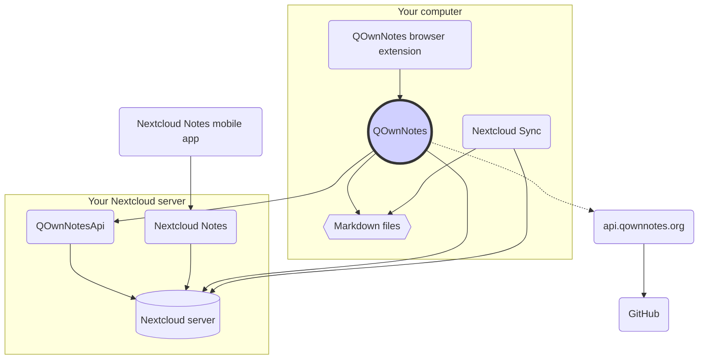

# Koncepció

## QOwnNotes

- A QOwnNotes **jegyzeteket** tárol a **jegyzetek mappájában markdown fájlként**
- Kommunikál a Nextcloud / ownCloud szerverével, **hogy nyilvánosan osztassa meg a jegyzeteket** másokkal
- A **jegyzetelőzményeket és a kukákat is elérheti **a Nextcloud / ownCloud szerveren a [QOwnNotesApi Nextcloud alkalmazáson keresztül](#qownnotesapi-nextcloud-app)
- A Nextcloud / ownCloud szerveren szereplő Todo listák a QOwnNotes szolgáltatásból érhetők el
- **A QOwnNotes nem szinkronizálja a jegyzeteit** és a média / melléklet fájlokat!
    - A fájlszinkronizálás összetett erőfeszítés, máris vannak nagyszerű fájlszinkronizálási megoldások (lásd: [Nextcloud asztali szinkronizálási kliens](#nextcloud-desktop-sync-client))

## Markdown jegyzetfájlok

- Az összes jegyzeted és média- / mellékletfájlod **a te tulajdonodban** van!
- Az Ön jegyzeteit **egyszerű szöveges Markdown fájlokként** tárolják az asztali számítógépen
- A QOwnNotes mellett tetszőleges szövegszerkesztőt használhat a jegyzetfájlok megtekintésére vagy szerkesztésére
- **A jegyzetek szinkronizálása** más eszközökkel (asztali és mobil) a [Nextcloud](https://nextcloud.com/) vagy a [ownCloud](https://owncloud.org/) szinkronizálási klienssel a szerverhez

## QOwnNotes böngészőbővítmény

Kezelheti a **böngésző könyvjelzőit** a QOwnNotes szolgáltatással, vagy használhatja **webleíró eszközként**.

::: tip További információkért keresse fel a [QOwnNotes Web Companion böngészőbővítményt](browser-extension.md). :::

## Nextcloud asztali szinkronizáló kliens

**A jegyzetek szinkronizálása** más eszközökkel (asztali és mobil) a [Nextcloud](https://nextcloud.com/) vagy a [ownCloud](https://owncloud.org/) szinkronizálási klienssel a szerverhez.

::: tip Természetesen más megoldások, például a **Dropbox**, a **szinkronizálás**, a **Seafile** vagy a BitTorrent Sync is használhatók a jegyzetek és más fájlok szinkronizálására.

A **git** használatával szinkronizálhat olyan eszközökkel is, mint a [gitomatic](https://github.com/muesli/gitomatic/). :::

## Nextcloud szerver

A jegyzetek online kezeléséhez használhat olyan szervereket, mint a [Nextcloud](https://nextcloud.com/) vagy a [ownCloud](https://owncloud.org/).

Hosztolhatja saját szerverét, vagy használhat hosztolt megoldásokat.

Van egy [közösség által karbantartott Nextcloud szolgáltatók listája](https://github.com/nextcloud/providers#providers), valamint egy [Nextcloudot használó eszközök listája](https://nextcloud.com/devices/).

[A Portknox](https://portknox.net) jelentése szerint [a QOwnNotesAPI telepítve van](https://portknox.net/en/app_listing).

::: tip Természetesen más megoldások, például a **Dropbox**, a **szinkronizálás**, a **Seafile** vagy a BitTorrent Sync is használhatók a jegyzetek és más fájlok tárolására. :::

## QOwnNotesAPI Nextcloud app

A [**QOwnNotesAPI**](https://github.com/pbek/qownnotesapi) segítségével hozzáférhet a kiszolgálóoldali **kukába helyezett jegyzetek** és **jegyzetek verzióihoz**.

::: tip További információkért keresse fel a [QOwnNotesAPI Nextcloud alkalmazást](qownnotesapi.md). :::

## Nextcloud Notes szerver alkalmazás

A [**Nextcloud Notes**](https://github.com/nextcloud/notes) használatával szerkesztheti a jegyzeteit az **interneten**.

::: warning Ne feledje, hogy a Nextcloud Notes jelenleg csak egy szintű almappákat támogat. :::

## Nextcloud Notes mobilalkalmazás

Különböző alkalmazásokat használhat a Nextcloud / ownCloud jegyzetek eléréséhez **mobileszközéről**.

### Android

- [Nextcloud Notes for Android](https://play.google.com/store/apps/details?id=it.niedermann.owncloud.notes) (harmadik fél)

Használhat bármilyen szinkronizáló eszközt is, például a *Ultimate Synchronize* vagy a *FolderSync* eszközt a jegyzetfájlok szinkronizálásához, és a jegyzetek szerkesztéséhez használhat olyan szoftvereket, mint a *neutriNotes*. :::

### iOS

- [CloudNotes iOS rendszerhez](https://itunes.apple.com/de/app/cloudnotes-owncloud-notes/id813973264?mt=8) (harmadik fél)

Használhatja a [Jegyzetfüzet](https://itunes.apple.com/us/app/notebooks-write-and-organize/id780438662)et is, és szinkronizálhatja a jegyzeteit a WebDAV-on keresztül. Van egy jó útmutató a [Jegyzetek készítése a Nextcloud, a QOwnNotes és a Jegyzetfüzetek témához](https://lifemeetscode.com/blog/taking-notes-with-nextcloud-qownnotes-and-notebooks)

## api.qownnotes.org

Ez egy online szolgáltatás, amelyet a QOwnNotes nyújt annak ellenőrzésére, hogy elérhető-e az alkalmazás új kiadása.

Beszél a GitHub-tal, és megvizsgálja a legújabb kiadást, beszerez egy megfelelő letöltési URL-t, és összeállítja a változásnapló változásait a QOwnNotes verziójához képest, amelyet jelenleg html-ként használ a frissítési párbeszédpanelen való megjelenítéshez.

Ezenkívül biztosítja a [RSS-kiadás kiadását](http://api.qownnotes.org/rss/app-releases) és a QOwnNotes régebbi verzióinak örökölt frissítési ellenőrző api megvalósítását is.

::: tip Az [api.qownnotes.org](https://api.qownnotes.org) forráskódját a [GitHub](https://github.com/qownnotes/api) oldalon érheti el. :::
