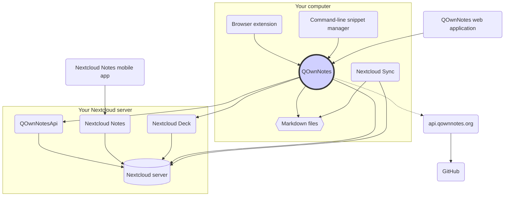

# Idea

## QOwnNotes

- QOwnNotes **memorizza le note** nella cartella **note come file markdown**
- Può collegarsi al tuo server Nextcloud / ownCloud **per condividere pubblicamente le note** con altre persone
- Puoi anche **accedere alla cronologia delle note e al cestino** sul tuo server Nextcloud / ownCloud tramite l '[app QOwnNotesApi Nextcloud](#qownnotesapi-nextcloud-app)
- Da QOwnNotes puoi accedere agli elenchi di cose da fare sul tuo server Nextcloud / ownCloud
- **QOwnNotes non sincronizza le tue note** e i file multimediali / allegati!
    - La sincronizzazione dei file è un'attività complessa, esistono già ottime soluzioni per la sincronizzazione dei file (vedi [Client di sincronizzazione desktop Nextcloud](#nextcloud-desktop-sync-client))

## File di note Markdown

- Tutte le tue note e file multimediali / allegati **sono tue**!
- Le tue note vengono archiviate come **file di testo Markdown** sul tuo computer
- Puoi usare qualsiasi tuo editor di testo preferito insieme a QOwnNotes per visualizzare o modificare i file delle note
- **Sincronizza le tue note** con altri dispositivi (desktop e mobili) con il tuo client di sincronizzazione [Nextcloud](https://nextcloud.com/) o [ownCloud](https://owncloud.org/) sul tuo server

## Estensione del browser QOwnNotes

Puoi gestire i **segnalibri del tuo browser** con QOwnNotes o usarlo come **web clipper**.

::: tip
L'estensione del browser funziona **offline**, senza alcuna connessione internet. ::: tip
Per ulteriori informazioni, visita l'[estensione del browser QOwnNotes Web Companion](browser-extension.md).
:::

## Gestore dei frammenti di comandi QOwnNotes

Puoi gestire i tuoi **frammenti di comandi** con QOwnNotes ed eseguirli sulla linea di comando.

::: tip
Per favore, visita [Gestore dei frammenti di comandi QOwnNotes](command-line-snippet-manager.md) per ulteriori informazioni.
:::

## Client di sincronizzazione desktop Nextcloud

**Sincronizza le tue note** con altri dispositivi (desktop e mobili) con il tuo client di sincronizzazione [Nextcloud](https://nextcloud.com/) o [ownCloud](https://owncloud.org/) sul tuo server.

::: tip
Ovviamente, puoi usare anche altre soluzioni, come **Dropbox**, **Syncthing**, **Seafile** o BitTorrent Sync per sincronizzare le tue note e altri file.

Puoi anche usare **git** per eseguire la sincronizzazione con strumenti come [gitomatic](https://github.com/muesli/gitomatic/).
:::

## Server Nextcloud

Per lavorare con le tue note online puoi usare server come [Nextcloud](https://nextcloud.com/) o [ownCloud](https://owncloud.org/).

Puoi ospitare il tuo server o utilizzare soluzioni ospitate.

Esiste un [elenco di provider Nextcloud gestito dalla community](https://github.com/nextcloud/providers#providers), nonché un [elenco di dispositivi con Nextcloud](https://nextcloud.com/devices/).

[Portknox](https://portknox.net) ha segnalato di avere [QOwnNotesAPI installato](https://portknox.net/en/app_listing).

::: tip
Ovviamente puoi usare altre soluzioni, come **Dropbox**, **Syncthing**, **Seafile** o BitTorrent Sync anche per ospitare le tue note e altri file.
:::

## App QOwnNotesAPI Nextcloud

[**QOwnNotesAPI**](https://github.com/pbek/qownnotesapi) ti consente di accedere alle **note spostate nel cestino** e alle **versioni delle note** lato server.

::: tip
Per ulteriori informazioni, visita l'[app QOwnNotesAPI Nextcloud](qownnotesapi.md).
:::

## Applicazione server Nextcloud Notes

Usa [**Nextcloud Notes**](https://github.com/nextcloud/notes) per modificare le tue note nel **web**.

::: warning
Tieni presente che Nextcloud Notes attualmente supporta solo fino a un livello di sottocartelle.
:::

## Nextcloud Deck server app

You can use QOwnNotes to quickly create **cards** in [**Nextcloud Deck**](https://github.com/nextcloud/deck).

## Nextcloud Notes mobile app

To access your Nextcloud / ownCloud notes from your **mobile device** you can use different apps.

### Android

- [Nextcloud Notes for Android](https://play.google.com/store/apps/details?id=it.niedermann.owncloud.notes) (terze parti)

::: tip
You could also use any sync-tool like *Synchronize Ultimate* or *FolderSync* to sync your note files and use software like *neutriNotes* to edit your notes.
:::

### iOS

- [CloudNotes for iOS](https://itunes.apple.com/de/app/cloudnotes-owncloud-notes/id813973264?mt=8) (terze parti)

::: tip
You can also use [Notebooks](https://itunes.apple.com/us/app/notebooks-write-and-organize/id780438662) and sync your notes via WebDAV, there is a good tutorial at [Taking Notes with Nextcloud, QOwnNotes, and Notebooks](https://lifemeetscode.com/blog/taking-notes-with-nextcloud-qownnotes-and-notebooks)
:::

## api.qownnotes.org

This is an online service provided by QOwnNotes to check if there is a new release of the application available.

It is talking to GitHub and checks for the latest release, gets a suited download url and compiles the changes from the changelog compared to the version of QOwnNotes you are currently using as html to show in the update dialog.

In addition, it also provides the [Release RSS Feed](http://api.qownnotes.org/rss/app-releases) and an implementation of the legacy update checking api for older versions of QOwnNotes.

::: tip
You can access the source code for [api.qownnotes.org](https://api.qownnotes.org) on [GitHub](https://github.com/qownnotes/api).
:::

## QOwnNotes Web App

You can insert photos from your mobile phone into the current note in QOwnNotes on your desktop via the **web application** on [app.qownnotes.org](https://app.qownnotes.org/).

::: tip
Please visit [QOwnNotes Web App](web-app.md) for more information.
:::
