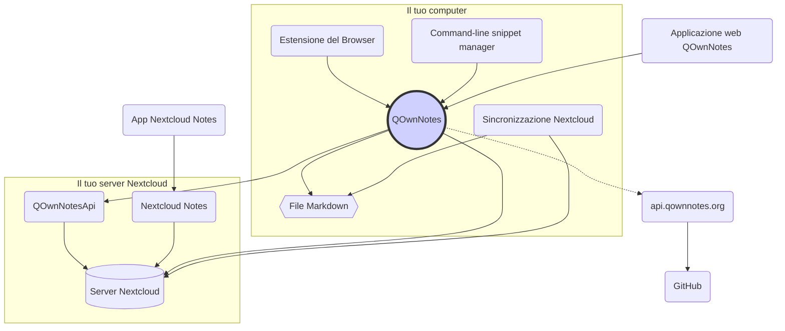

# Idea

## QOwnNotes

- QOwnNotes **memorizza le note** nella cartella **note come file markdown**
- Può collegarsi al tuo server Nextcloud / ownCloud **per condividere pubblicamente le note** con altre persone
- Puoi anche **accedere alla cronologia delle note e al cestino** sul tuo server Nextcloud / ownCloud tramite l '[app QOwnNotesApi Nextcloud](#qownnotesapi-nextcloud-app)
- Da QOwnNotes puoi accedere agli elenchi di cose da fare sul tuo server Nextcloud / ownCloud
- **QOwnNotes non sincronizza le tue note** e i file multimediali / allegati!
    - La sincronizzazione dei file è un'attività complessa, esistono già ottime soluzioni per la sincronizzazione dei file (vedi [Client di sincronizzazione desktop Nextcloud](#nextcloud-desktop-sync-client))

## File di note Markdown

- Tutte le tue note e file multimediali / allegati **sono tue**!
- Le tue note vengono archiviate come **file di testo Markdown** sul tuo computer
- Puoi usare qualsiasi tuo editor di testo preferito insieme a QOwnNotes per visualizzare o modificare i file delle note
- **Sincronizza le tue note** con altri dispositivi (desktop e mobili) con il tuo client di sincronizzazione [Nextcloud](https://nextcloud.com/) o [ownCloud](https://owncloud.org/) sul tuo server

## Estensione del browser QOwnNotes

Puoi gestire i **segnalibri del tuo browser** con QOwnNotes o usarlo come **web clipper**.

::: tip
L'estensione del browser funziona **offline**, senza alcuna connessione internet. ::: tip
Per ulteriori informazioni, visita l'[estensione del browser QOwnNotes Web Companion](browser-extension.md).
:::

## Gestore dei frammenti di comandi QOwnNotes

Puoi gestire i tuoi **frammenti di comandi** con QOwnNotes ed eseguirli sulla linea di comando.

::: tip
Per favore, visita [Gestore dei frammenti di comandi QOwnNotes](command-line-snippet-manager.md) per ulteriori informazioni.
:::

## Client di sincronizzazione desktop Nextcloud

**Sincronizza le tue note** con altri dispositivi (desktop e mobili) con il tuo client di sincronizzazione [Nextcloud](https://nextcloud.com/) o [ownCloud](https://owncloud.org/) sul tuo server.

::: tip
Ovviamente, puoi usare anche altre soluzioni, come **Dropbox**, **Syncthing**, **Seafile** o BitTorrent Sync per sincronizzare le tue note e altri file.

Puoi anche usare **git** per eseguire la sincronizzazione con strumenti come [gitomatic](https://github.com/muesli/gitomatic/).
:::

## Server Nextcloud

Per lavorare con le tue note online puoi usare server come [Nextcloud](https://nextcloud.com/) o [ownCloud](https://owncloud.org/).

Puoi ospitare il tuo server o utilizzare soluzioni ospitate.

Esiste un [elenco di provider Nextcloud gestito dalla community](https://github.com/nextcloud/providers#providers), nonché un [elenco di dispositivi con Nextcloud](https://nextcloud.com/devices/).

[Portknox](https://portknox.net) ha segnalato di avere [QOwnNotesAPI installato](https://portknox.net/en/app_listing).

::: tip
Ovviamente puoi usare altre soluzioni, come **Dropbox**, **Syncthing**, **Seafile** o BitTorrent Sync anche per ospitare le tue note e altri file.
:::

## App QOwnNotesAPI Nextcloud

[**QOwnNotesAPI**](https://github.com/pbek/qownnotesapi) ti consente di accedere alle **note spostate nel cestino** e alle **versioni delle note** lato server.

::: tip
Per ulteriori informazioni, visita l'[app QOwnNotesAPI Nextcloud](qownnotesapi.md).
:::

## Applicazione server Nextcloud Notes

Usa [**Nextcloud Notes**](https://github.com/nextcloud/notes) per modificare le tue note nel **web**.

::: warning
Tieni presente che Nextcloud Notes attualmente supporta solo fino a un livello di sottocartelle.
:::

## App mobile Nextcloud Notes

Per accedere alle tue note Nextcloud / ownCloud dal tuo **dispositivo mobile** puoi usare diverse app.

### Android

- [Nextcloud Notes for Android](https://play.google.com/store/apps/details?id=it.niedermann.owncloud.notes) (terze parti)

::: tip
Puoi anche usare qualsiasi strumento di sincronizzazione come *Synchronize Ultimate* o *FolderSync* per sincronizzare i file delle note e usare software come *neutriNotes* per modificare le tue note.
:::

### iOS

- [CloudNotes for iOS](https://itunes.apple.com/de/app/cloudnotes-owncloud-notes/id813973264?mt=8) (terze parti)

::: tip
Puoi anche usare [Notebooks](https://itunes.apple.com/us/app/notebooks-write-and-organize/id780438662) e sincronizzare le tue note tramite WebDAV; c'è un buon tutorial su [Prendere appunti con Nextcloud, QOwnNotes e Notebooks](https://lifemeetscode.com/blog/taking-notes-with-nextcloud-qownnotes-and-notebooks)
:::

## api.qownnotes.org

Si tratta di un servizio online fornito da QOwnNotes per verificare se è disponibile una nuova versione dell'applicazione.

Si collega con GitHub e controlla l'ultima versione, ottiene un URL di download adatto e compila le modifiche dal changelog rispetto alla versione di QOwnNotes che stai utilizzando, come HTML da mostrare nella finestra di dialogo di aggiornamento.

Inoltre, fornisce anche il [Feed RSS di rilascio](http://api.qownnotes.org/rss/app-releases) e un'implementazione dell'API di controllo degli aggiornamenti legacy per le versioni precedenti di QOwnNotes.

::: tip
Puoi accedere al codice sorgente di [api.qownnotes.org](https://api.qownnotes.org) su [GitHub](https://github.com/qownnotes/api).
:::

## Applicazione web QOwnNotes

Puoi inserire foto dal tuo cellulare nella nota corrente in QOwnNotes sul desktop tramite l'**applicazione web** su [app.qownnotes.org](https://app.qownnotes.org/).

::: tip
Visita [Applicazione web QOwnNotes](web-app.md) per ulteriori informazioni.
:::
