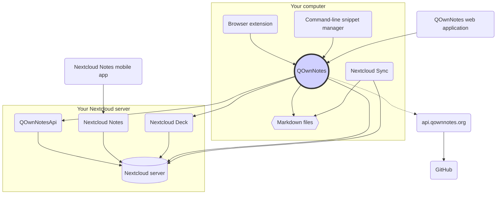

# 개념

## QOwnNotes

- QOwnNotes는 **노트 폴더에 마크다운 파일**로 **노트를 저장**합니다
- Nextcloud / ownCloud 서버와 대화하여 다른 사람과 **공개적으로 노트를 공유 **할 수 있습니다
- 또한 [QOwnNotesApi Nextcloud 앱](#qownnotesapi-nextcloud-app)을 통해 Nextcloud / ownCloud 서버의 **노트 기록 및 휴지통에 액세스**할 수 있습니다
- QOwnNotes 내에서 Nextcloud / ownCloud 서버의 작업관리 목록에 액세스할 수 있습니다
- **QOwnNotes**QOwnNotes 는 노트와 미디어/첨부 파일을 <0>동기화하지 않습니다</0>!
  - 파일 동기화는 복잡한 작업입니다. 이미 우수한 파일 동기화 솔루션이 있습니다 ([Nextcloud 데스크탑 동기화 클라이언트](#nextcloud-desktop-sync-client) 참조)

## 마크다운 노트 파일

- 모든 노트와 미디어/첨부 파일을 **소유**하고 있습니다!
- 노트는 데스크톱 컴퓨터에 **일반 텍스트 마크다운 파일**로 저장됩니다
- QOwnNotes 옆에서 원하는 텍스트 편집기를 사용하여 노트 파일을 보거나 편집할 수 있습니다
- [Nextcloud](https://nextcloud.com/) 또는 [ownCloud](https://owncloud.org/) 동기화 클라이언트를 사용하여 다른 장치( 데스크톱 및 모바일)와 서버에 **노트를 동기화**

## QOwnNotes 브라우저 확장

QOwnNotes를 사용하여 **브라우저 북마크를 관리**하거나 **웹 클리퍼**로 사용할 수 있습니다.

::: 팁 브라우저 확장 기능은 **오프라인**에서 작동하며 인터넷에 연결할 필요가 없습니다. 자세한 내용은

QOwnNotes 웹 지원 브라우저 확장<0/>을 참조하십시오. :::
 

## QOwnNotes 명령줄 스니펫 관리자

QOwnNotes를 사용하여 **명령 스니펫**을 관리하고 명령줄에서 실행할 수 있습니다.

::: 팁 자세한 내용은 [QOwnNotes 명령줄 스니펫 관리자](command-line-snippet-manager.md)를 참조하십시오. :::

## Nextcloud 데스크톱 동기화 클라이언트

[Nextcloud](https://nextcloud.com/)또는 [ownCloud](https://owncloud.org/) 동기화 클라이언트를 사용해 다른 장치 (데스크톱 및 모바일)와 서버에 **노트를 동기화**합니다.

::: 팁 물론 **Dropbox**, **Syncthing**, **Seafile** 또는 BitTorrent Sync와 같은 다른 솔루션도 노트와 다른 파일을 동기화하는 데 사용할 수 있습니다.

**git**을 사용하여 [gitomatic](https://github.com/muesli/gitomatic/)과 같은 도구와 동기화할 수도 있습니다. :::

## Nextcloud 서버

노트를 온라인으로 작업하려면 [Nextcloud](https://nextcloud.com/)또는 [ownCloud](https://owncloud.org/)와 같은 서버를 사용할 수 있습니다.

사용자 자신의 서버를 호스팅하거나 호스팅된 솔루션을 사용할 수 있습니다.

[커뮤니티에서 관리하는 Nextcloud 공급자 목록](https://github.com/nextcloud/providers#providers)과 [Nextcloud를 사용하는 장치 목록](https://nextcloud.com/devices/)이 있습니다.

[Portknox](https://portknox.net)에서는 [QOwnNotesAPI가 설치되어 있다고](https://portknox.net/en/app_listing) 보고했습니다.

::: 팁 물론 **Dropbox**, **Syncthing**, **Seafile** 또는 BitTorrent Sync와 같은 다른 솔루션도 노트 및 기타 파일을 호스팅하는 데 사용할 수 있습니다. :::

## QOwnNotesAPI Nextcloud 앱

[**QOwnNotesAPI**](https://github.com/pbek/qownnotesapi)를 사용하여 서버 측의 **휴지통 노트** 및 **노트 버전**에 액세스할 수 있습니다.

::: 팁 자세한 내용은 [QOwnNotesAPI Nextcloud 앱](qownnotesapi.md)을 참조하세요 :::

## Nextcloud 노트 서버 앱

**웹</1/>에서 노트를 편집하려면 [**Nextcloud 노트**](https://github.com/nextcloud/notes)를 사용합니다.
 

::: 경고의
Nextcloud 노트는 현재 최대 한 수준의 하위 폴더만 지원합니다.
:::

## Nextcloud 노트 서버 앱

QOwnNotes를 사용하여 [**Nextcloud Deck**](https://github.com/nextcloud/deck)에서 **카드**를 빠르게 만들 수 있습니다.

## Nextcloud 노트 모바일 앱

**모바일 장치**에서 Nextcloud / ownCloud 노트에 액세스하기 위해 다른 앱을 사용할 수 있습니다.

### Android

- [Android용 Nextcloud 노트](https://play.google.com/store/apps/details?id=it.niedermann.owncloud.notes) (타사 제품)

::: 팁 또한 _ynchronize Ultimate_ 또는 _FolderSync_과 같은 동기화 도구를 사용하여 노트 파일을 동기화하고 _neutriNotes_ 또는 [**Markor**](https://f-droid.org/packages/net.gsantner.markor/)과 같은 소프트웨어를 사용하여 노트를 편집할 수도 있습니다. :::

### iOS

- [iOS용 클라우드 노트](https://itunes.apple.com/de/app/cloudnotes-owncloud-notes/id813973264?mt=8) (타사 제품)

::: 팁 WebDAV를 통해 [Notebooks](https://itunes.apple.com/us/app/notebooks-write-and-organize/id780438662)을 사용하고 노트를 동기화할 수도 있습니다. [Nextcloud, QOwnNotes 및 Notebooks](https://lifemeetscode.com/blog/taking-notes-with-nextcloud-qownnotes-and-notebooks)으로 노트 필기에 대한 좋은 자습서가 있습니다

## api.qownnotes.org

사용 가능한 응용 프로그램의 새 버전이 있는지 확인하기 위해 QOwnNotes에서 제공하는 온라인 서비스입니다.

이것은 GitHub과 대화하고 최신 릴리스를 확인하며, 적합한 다운로드 URL을 얻고 현재 html로 사용 중인 QOwnNotes 버전과 비교하여 변경 로그의 변경 사항을 컴파일하여 업데이트 대화 상자에 표시합니다.

또한 이전 버전의 QOwnNotes에 대한 [릴리스 RSS 피드](http://api.qownnotes.org/rss/app-releases) 및 기존 업데이트 확인 API 구현도 제공합니다.

::: 팁 [api.qownnotes.org](https://api.qownnotes.org)의 소스 코드는 [GitHub](https://github.com/qownnotes/api)에서 액세스할 수 있습니다. :::

## QOwnNotes 웹 앱

[app.qownnotes.org](https://app.qownnotes.org/)의 **웹 응용 프로그램**을 통해 휴대 전화의 사진을 바탕 화면의 QOwnNotes에 있는 현재 노트에 삽입할 수 있습니다.

::: 팁 자세한 내용은 [QOwnNotes 웹 앱](web-app.md)을 참조하십시오. :::
