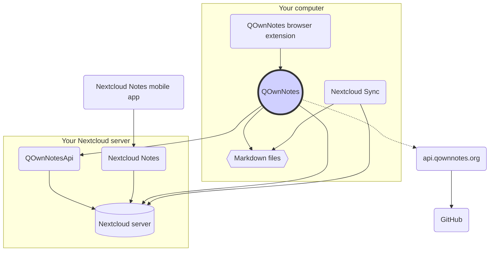

# Concept

## QOwnNotes

- QOwnNotes **slaat notities** op in uw **notitiemap als markdown-bestanden**
- Het kan met uw Nextcloud / ownCloud-server **praten om openbaar notities te delen** met andere mensen
- Je hebt ook **toegang tot je notitiegeschiedenis en prullenbak** op je Nextcloud / ownCloud-server via de [QOwnNotesApi Nextcloud-app](#qownnotesapi-nextcloud-app)
- Todo-lijsten op uw Nextcloud / ownCloud-server zijn toegankelijk vanuit QOwnNotes
- **QOwnNotes synchroniseert uw notities niet** en media- / bijlagebestanden!
    - Bestandssynchronisatie is een complexe onderneming, er zijn al geweldige oplossingen voor het synchroniseren van bestanden beschikbaar (zie [Nextcloud desktop-synchronisatieclient](#nextcloud-desktop-sync-client))

## Markdown-notitiebestanden

- Je **bezit** al je notities en media / bijlagen!
- Uw aantekeningen worden op uw desktopcomputer opgeslagen als **plain-text Markdown files**
- U kunt naast QOwnNotes elke gewenste teksteditor gebruiken om uw notitiebestanden te bekijken of te bewerken
- **Synchroniseer uw notities** met andere apparaten (desktop en mobiel) met uw [Nextcloud](https://nextcloud.com/) of [ownCloud](https://owncloud.org/) synchronisatieclient naar uw server

## QOwnNotes-browserextensie

U kunt uw **browserbladwijzers** beheren met QOwnNotes of deze gebruiken als **webclipper**.

::: tip
Bezoek de [QOwnNotes Web Companion-browserextension](browser-extension.md) voor meer informatie.
:::

## Nextcloud desktop-synchronisatieclient

**Synchroniseer uw notities** met andere apparaten (desktop en mobiel) met uw [Nextcloud](https://nextcloud.com/) of [ownCloud](https://owncloud.org/) synchronisatieclient naar uw server

::: tip
Natuurlijk kunnen andere oplossingen, zoals **Dropbox**, **Syncthing**, **Seafile** of BitTorrent Sync worden gebruikt om uw notities en andere bestanden te synchroniseren.

Je kunt ook **git** gebruiken om te synchroniseren met tools zoals [gitomatic](https://github.com/muesli/gitomatic/)
:::

## Nextcloud-server

Om online met uw notities te werken, kunt u servers zoals [Nextcloud](https://nextcloud.com/) gebruiken of [ownCloud](https://owncloud.org/).

U kunt uw eigen server hosten of gehoste oplossingen gebruiken.

There is a [community-maintained list of Nextcloud providers](https://github.com/nextcloud/providers#providers), as well as a [list of devices with Nextcloud](https://nextcloud.com/devices/).

[Portknox](https://portknox.net) has reported they have [QOwnNotesAPI installed](https://portknox.net/en/app_listing).

::: tip
Of course other solutions, like **Dropbox**, **Syncthing**, **Seafile** or BitTorrent Sync can be used too to host your notes and other files.
:::

## QOwnNotesAPI Nextcloud app

[**QOwnNotesAPI**](https://github.com/pbek/qownnotesapi) lets you access your server-side **trashed notes** and **note versions**.

::: tip
Please visit [QOwnNotesAPI Nextcloud App](qownnotesapi.md) for more information.
:::

## Nextcloud Notes-server-app

Use [**Nextcloud Notes**](https://github.com/nextcloud/notes) to edit your notes in the **web**.

::: warning
Keep in mind that Nextcloud Notes currently only supports up to one level of subfolders.
:::

## Nextcloud Notes mobiele app

To access your Nextcloud / ownCloud notes from your **mobile device** you can use different apps.

### Android

- [Nextcloud Notes voor Android](https://play.google.com/store/apps/details?id=it.niedermann.owncloud.notes) (derde partij)

::: tip
You could also use any sync-tool like *Synchronize Ultimate* or *FolderSync* to sync your note files and use software like *neutriNotes* to edit your notes.
:::

### iOS

- [CloudNotes for iOS](https://itunes.apple.com/de/app/cloudnotes-owncloud-notes/id813973264?mt=8) (3rd party)

::: tip
You can also use [Notebooks](https://itunes.apple.com/us/app/notebooks-write-and-organize/id780438662) and sync your notes via WebDAV, there is a good tutorial at [Taking Notes with Nextcloud, QOwnNotes, and Notebooks](https://lifemeetscode.com/blog/taking-notes-with-nextcloud-qownnotes-and-notebooks)
:::

## api.qownnotes.org

This is an online service provided by QOwnNotes to check if there is a new release of the application available.

It is talking to GitHub and checks for the latest release, gets a suited download url and compiles the changes from the changelog compared to the version of QOwnNotes you are currently using as html to show in the update dialog.

In addition, it also provides the [Release RSS Feed](http://api.qownnotes.org/rss/app-releases) and an implementation of the legacy update checking api for older versions of QOwnNotes.

::: tip
You can access the source code for [api.qownnotes.org](https://api.qownnotes.org) on [GitHub](https://github.com/qownnotes/api).
:::
