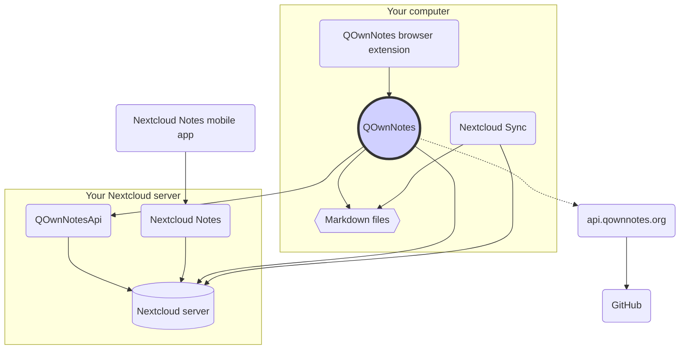

# Concept

## QOwnNotes

- QOwnNotes **slaat notities** rechtstreeks op in uw **notitiemap als markdown-bestanden**
- Het kan rechtstreeks met uw Nextcloud / ownCloud-server praten om notities te delen
- Je hebt ook toegang tot je notitiegeschiedenis en prullenbak op je Nextcloud / ownCloud-server via de [QOwnNotesApi Nextcloud-app](#qownnotesapi-nextcloud-app)
- Todo-lijsten op uw Nextcloud / ownCloud-server zijn toegankelijk vanuit QOwnNotes
- QOwnNotes **synchroniseert niet** uw notities en media / bijlagebestanden, het synchroniseren van bestanden is een moeilijke zaak, er zijn al goede oplossingen voor (zie [Nextcloud desktop sync client](#nextcloud-desktop-sync-client))

## Markdown-notitiebestanden

- Je **bezit** al je notities en media / bijlagen!
- Uw aantekeningen worden op uw desktopcomputer opgeslagen als **plain-text Markdown files**
- U kunt naast QOwnNotes elke gewenste teksteditor gebruiken om uw notitiebestanden te bekijken of te bewerken
- **Synchroniseer uw notities** met andere apparaten (desktop en mobiel) met uw [Nextcloud](https://nextcloud.com/) of [ownCloud](https://owncloud.org/) synchronisatieclient naar uw server

## QOwnNotes-browserextensie

U kunt uw **browserbladwijzers** beheren met QOwnNotes of deze gebruiken als **webclipper**.

::: tip
Bezoek de [QOwnNotes Web Companion-browserextension](browser-extension.md) voor meer informatie.
:::

## Nextcloud desktop-synchronisatieclient

**Synchroniseer uw notities** met andere apparaten (desktop en mobiel) met uw [Nextcloud](https://nextcloud.com/) of [ownCloud](https://owncloud.org/) synchronisatieclient naar uw server

::: tip
Natuurlijk kunnen andere oplossingen, zoals **Dropbox**, **Syncthing**, **Seafile** of BitTorrent Sync worden gebruikt om uw notities en andere bestanden te synchroniseren.

Je kunt ook **git** gebruiken om te synchroniseren met tools zoals [gitomatic](https://github.com/muesli/gitomatic/)
:::

## Nextcloud-server

Om online met uw notities te werken, kunt u servers zoals [Nextcloud](https://nextcloud.com/) gebruiken of [ownCloud](https://owncloud.org/).

U kunt uw eigen server hosten of gehoste oplossingen gebruiken.

::: tip
Natuurlijk kunnen ook andere oplossingen, zoals **Dropbox**, **Syncthing**, **Seafile** of BitTorrent Sync worden gebruikt om uw notities en andere bestanden te hosten

## QOwnNotesAPI Nextcloud app

[**QOwnNotesAPI**](https://github.com/pbek/qownnotesapi) geeft u toegang tot uw server-side **weggegooide notities** en **notitieversies**.

::: tip
Bezoek [QOwnNotesAPI Nextcloud App](qownnotesapi.md) voor meer informatie.
:::

## Nextcloud Notes-server-app

Gebruik [**Nextcloud Notes**](https://github.com/nextcloud/notes) om uw notities op het **web** te bewerken.

::: warning
Houd er rekening mee dat Nextcloud Notes momenteel slechts maximaal één niveau aan submappen ondersteunt.
:::

## Nextcloud Notes mobiele app

Om toegang te krijgen tot uw Nextcloud / ownCloud-notities vanaf uw **mobiele apparaat**, kunt u verschillende apps gebruiken.

### Android

- [Nextcloud Notes voor Android](https://play.google.com/store/apps/details?id=it.niedermann.owncloud.notes) (derde partij)

::: tip
U kunt ook een synchronisatietool zoals *Synchronize Ultimate* of *FolderSync* gebruiken om uw notitiebestanden te synchroniseren en gebruik software zoals *neutriNotes* om uw notities te bewerken.
:::

### iOS

- [CloudNotes for iOS](https://itunes.apple.com/de/app/cloudnotes-owncloud-notes/id813973264?mt=8) (3rd party)

::: tip
U kunt ook [Notebooks](https://itunes.apple.com/us/app/notebooks-write-and-organize/id780438662) gebruiken en uw notities synchroniseren via WebDAV, er is een goede tutorial op [Notities maken met Nextcloud, QOwnNotes, and Notebooks](https://lifemeetscode.com/blog/taking-notes-with-nextcloud-qownnotes-and-notebooks):::

## api.qownnotes.org

Dit is een online service die wordt aangeboden door QOwnNotes om te controleren of er een nieuwe release van de applicatie beschikbaar is.

Het praat met GitHub en controleert op de laatste uitgave, krijgt een geschikte download-url en compileert de veranderingen uit het changelog vergeleken met de versie van QOwnNotes die je momenteel gebruikt als html om te tonen in het update-dialoogvenster.

Daarnaast biedt het ook de [Release RSS Feed](http://api.qownnotes.org/rss/app-releases) en een implementatie van de legacy update-check api voor oudere versies van QOwnNotes.

:: tip Je hebt toegang tot de broncode voor [ api.qownnotes.org ](https://api.qownnotes.org)op[GitHub](https://github.com/qownnotes/api).
:::
