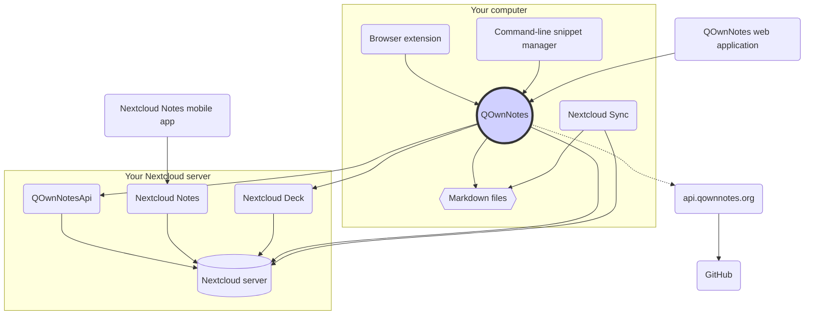

# Concept

## QOwnNotes

- QOwnNotes **slaat notities** op in uw **notitiemap als markdown-bestanden**
- Het kan met uw Nextcloud / ownCloud-server **praten om openbaar notities te delen** met andere mensen
- Je hebt ook **toegang tot je notitiegeschiedenis en prullenbak** op je Nextcloud / ownCloud-server via de [QOwnNotesApi Nextcloud-app](#qownnotesapi-nextcloud-app)
- Todo-lijsten op uw Nextcloud / ownCloud-server zijn toegankelijk vanuit QOwnNotes
- **QOwnNotes synchroniseert uw notities niet** en media- / bijlagebestanden!
  - Bestandssynchronisatie is een complexe onderneming, er zijn al geweldige oplossingen voor het synchroniseren van bestanden beschikbaar (zie [Nextcloud desktop-synchronisatieclient](#nextcloud-desktop-sync-client))

## Markdown-notitiebestanden

- Je **bezit** al je notities en media / bijlagen!
- Uw notities worden opgeslagen als **platte tekst Markdown-bestanden** op uw desktopcomputer
- U kunt naast QOwnNotes elke gewenste teksteditor gebruiken om uw notitiebestanden te bekijken of te bewerken
- **Synchroniseer uw notities** met andere apparaten (desktop en mobiel) met uw [Nextcloud](https://nextcloud.com/) of [ownCloud](https://owncloud.org/) synchronisatieclient naar uw server

## QOwnNotes-browserextensie

U kunt uw **browserbladwijzers** beheren met QOwnNotes of deze gebruiken als **webclipper**.

::: tip
De browserextensies werken **offline**, geen internetverbinding nodig. Bezoek de [QOwnNotes Web Companion browserextensie](browser-extension.md) voor meer informatie.
:::

## QOwnNotes-opdrachtregelfragmentbeheer

U kunt uw **opdrachtfragmenten** beheren met QOwnNotes en ze uitvoeren op de opdrachtregel.

::: tip
Ga naar [QOwnNotes command-line snippet manager](command-line-snippet-manager.md) voor meer informatie.
:::

## Nextcloud desktop-synchronisatieclient

**Synchroniseer uw notities** met andere apparaten (desktop & mobile) met uw [Nextcloud](https://nextcloud.com/) of [ownCloud](https://owncloud.org/) synchronisatieclient naar uw server.

::: tip
Natuurlijk kunnen andere oplossingen, zoals **Dropbox**, **Syncthing**, **Seafile** of BitTorrent Sync worden gebruikt om uw notities en andere bestanden te synchroniseren.

Je kunt ook **git** gebruiken om te synchroniseren met tools zoals [gitomatic](https://github.com/muesli/gitomatic/).
:::

## Nextcloud-server

Om online met uw notities te werken, kunt u servers zoals [Nextcloud](https://nextcloud.com/) gebruiken of [ownCloud](https://owncloud.org/).

U kunt uw eigen server hosten of gehoste oplossingen gebruiken.

Er is een [door de community onderhouden lijst met Nextcloud-providers](https://github.com/nextcloud/providers#providers), evenals een [lijst met apparaten met Nextcloud](https://nextcloud.com/devices/).

[Portknox](https://portknox.net) heeft gemeld dat ze [QOwnNotesAPI hebben geïnstalleerd](https://portknox.net/en/app_listing).

::: tip
Natuurlijk kunnen ook andere oplossingen, zoals **Dropbox**, **Syncthing**, **Seafile** of BitTorrent Sync worden gebruikt om uw notities en andere bestanden te hosten.
:::

## QOwnNotesAPI Nextcloud app

[**QOwnNotesAPI**](https://github.com/pbek/qownnotesapi) geeft u toegang tot uw server-side **weggegooide notities** en **notitieversies**.

::: tip
Bezoek [QOwnNotesAPI Nextcloud App](qownnotesapi.md) voor meer informatie.
:::

## Nextcloud Notes-server-app

Gebruik [**Nextcloud Notes**](https://github.com/nextcloud/notes) om uw notities op het **web** te bewerken.

::: warning
Houd er rekening mee dat Nextcloud Notes momenteel slechts maximaal één niveau aan submappen ondersteunt.
:::

## Nextcloud Deck server app

U kunt QOwnNotes gebruiken om snel **kaarten** aan te maken in [**Nextcloud Deck**](https://github.com/nextcloud/deck).

## Nextcloud Notes mobile app

Om toegang te krijgen tot uw Nextcloud / ownCloud-notities vanaf uw **mobiele apparaat** kunt u verschillende apps gebruiken.

### Android

- [Nextcloud Notes voor Android](https://play.google.com/store/apps/details?id=it.niedermann.owncloud.notes) (derde partij)

::: tip
You could also use any sync-tool like _Synchronize Ultimate_ or _FolderSync_ to sync your note files and use software like _neutriNotes_ or [**Markor**](https://f-droid.org/packages/net.gsantner.markor/) to edit your notes.
:::

### iOS

- [CloudNotes for iOS](https://itunes.apple.com/de/app/cloudnotes-owncloud-notes/id813973264?mt=8) (3rd party)

::: tip
U kunt ook [Notitieblokken](https://itunes.apple.com/us/app/notebooks-write-and-organize/id780438662) gebruiken en uw notities synchroniseren via WebDAV. E is een goede uitleg bij [Notities maken met Nextcloud, QOwnNotes en Notebooks](https://lifemeetscode.com/blog/taking-notes-with-nextcloud-qownnotes-and-notebooks)
:::

## api.qownnotes.org

Dit is een online service van QOwnNotes om te controleren of er een nieuwe release van de applicatie beschikbaar is.

Het praat met GitHub en controleert op de nieuwste release, verkrijgt een geschikte download-url en compileert de wijzigingen van de changelog in vergelijking met de versie van OwnNotes die u momenteel gebruikt tot html om weer te geven in het updatedialoogvenster.

Daarnaast biedt het ook de [Release RSS Feed](http://api.qownnotes.org/rss/app-releases) en een implementatie van de legacy update die api controleert voor oudere versies van QOwnNotes.

::: tip
U kunt toegang krijgen tot de broncode voor [api.qownnotes.org](https://api.qownnotes.org) op [GitHub](https://github.com/qownnotes/api).
:::

## QOwnNotes-webapp

U kunt foto's van uw mobiele telefoon in de huidige notitie in QOwnNotes op uw bureaublad invoegen via de **webapplicatie** op [app.qownnotes.org](https://app.qownnotes.org/).

::: tip
Bezoek [QOwnNotes Web App](web-app.md) voor meer informatie.
:::
