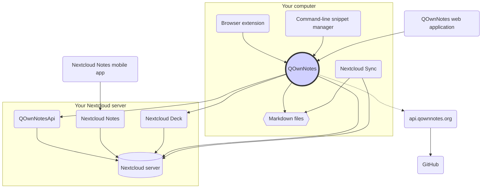

# Pojęcie

## QOwnNotes

- QOwnNotes **przechowuje notatki** w Twoim **folderze notatek jako pliki znaczników**
- Może komunikować się z serwerem Nextcloud / ownCloud, **aby publicznie udostępniać notatki** innym osobom
- Możesz także **uzyskać dostęp do historii notatek i kosza** na serwerze Nextcloud / ownCloud za pośrednictwem aplikacji [QOwnNotesApi Nextcloud](#qownnotesapi-nextcloud-app)
- Listy rzeczy do zrobienia na serwerze Nextcloud / ownCloud są dostępne z poziomu QOwnNotes
- **QOwnNotes nie synchronizuje twoich notatek** i plików multimedialnych / załączników!
  - Synchronizacja plików to złożone przedsięwzięcie, istnieją już świetne rozwiązania do synchronizacji plików (patrz [Klient synchronizacji pulpitu Nextcloud](#nextcloud-desktop-sync-client))

## Pliki notatek Markdown

- **jesteś właścicielem** wszystkich swoich notatek i plików multimedialnych / załączników!
- Notatki są przechowywane na komputerze jako **pliki zwykłego tekstu Markdown**
- Możesz użyć dowolnego edytora tekstu oprócz QOwnNotes do przeglądania lub edycji plików notatek
- **Synchronizuj swoje notatki** z innymi urządzeniami (stacjonarnymi i mobilnymi) za pomocą klienta synchronizacji [Nextcloud](https://nextcloud.com/) lub [ownCloud](https://owncloud.org/) z serwerem

## Rozszerzenie przeglądarki QOwnNotes

Możesz zarządzać swoimi **zakładkami przeglądarki** za pomocą QOwnNotes lub używać go jako **narzędzia do usuwania stron internetowych**.

::: tip
Rozszerzenia przeglądarki działają **offline**, nie jest potrzebne połączenie internetowe. Aby uzyskać więcej informacji, odwiedź [rozszerzenie QOwnNotes Web Companion do przeglądarki](browser-extension.md).
:::

## QOwnNotes command-line snippet manager

Możesz zarządzać **fragmentami poleceń** za pomocą QOwnNotes i wykonywać je w wierszu poleceń.

::: tip
Odwiedź stronę [menedżera fragmentów wiersza polecenia QOwnNotes](command-line-snippet-manager.md), aby uzyskać więcej informacji.
:::

## Klient synchronizacji pulpitu Nextcloud

**Synchronizuj swoje notatki** z innymi urządzeniami (stacjonarnymi i mobilnymi) za pomocą klienta synchronizacji [Nextcloud](https://nextcloud.com/) lub [ownCloud](https://owncloud.org/) z serwerem.

::: tip
Oczywiście inne rozwiązania, takie jak **Dropbox**, **Syncthing**, **Seafile** lub BitTorrent Sync mogą być również używane do synchronizacji notatek i innych plików.

Możesz także użyć **git** do synchronizacji z narzędziami takimi jak [gitomatic](https://github.com/muesli/gitomatic/).
:::

## Serwer Nextcloud

Aby pracować z notatkami online, możesz użyć serwerów takich jak [Nextcloud](https://nextcloud.com/) lub [ownCloud](https://owncloud.org/).

Możesz hostować własny serwer lub skorzystać z rozwiązań hostowanych.

Istnieje [lista obsługiwanych przez społeczność dostawców Nextcloud](https://github.com/nextcloud/providers#providers), a także [lista urządzeń z Nextcloud](https://nextcloud.com/devices/).

[Portknox](https://portknox.net) zgłosił, że ma [QOwnNotesAPI zainstalowane](https://portknox.net/en/app_listing).

::: tip
Oczywiście inne rozwiązania, takie jak **Dropbox**, **Syncthing**, **Seafile** lub BitTorrent Sync mogą być również używane do hostowania notatek i innych plików.
:::

## QOwnNotesAPI Nextcloud app

[**QOwnNotesAPI**](https://github.com/pbek/qownnotesapi) umożliwia dostęp do **notatek w koszu** i **wersji notatek** po stronie serwera.

::: tip
Aby uzyskać więcej informacji, odwiedź [QOwnNotesAPI Nextcloud App](qownnotesapi.md).
:::

## Aplikacja serwerowa Nextcloud Notes

Użyj [**Nextcloud Notes**](https://github.com/nextcloud/notes), aby edytować swoje notatki w **sieci**.

::: warning
Należy pamiętać, że program Nextcloud Notes obsługuje obecnie tylko jeden poziom podfolderów.
:::

## Nextcloud Deck server app

You can use QOwnNotes to quickly create **cards** in [**Nextcloud Deck**](https://github.com/nextcloud/deck).

## Nextcloud Notes mobile app

To access your Nextcloud / ownCloud notes from your **mobile device** you can use different apps.

### Android

- [Nextcloud Notes dla Androida](https://play.google.com/store/apps/details?id=it.niedermann.owncloud.notes) (inna firma)

::: tip
You could also use any sync-tool like _Synchronize Ultimate_ or _FolderSync_ to sync your note files and use software like _neutriNotes_ or [**Markor**](https://f-droid.org/packages/net.gsantner.markor/) to edit your notes.
:::

### iOS

- [CloudNotes na iOS](https://itunes.apple.com/de/app/cloudnotes-owncloud-notes/id813973264?mt=8) (inna firma)

::: tip
You can also use [Notebooks](https://itunes.apple.com/us/app/notebooks-write-and-organize/id780438662) and sync your notes via WebDAV, there is a good tutorial at [Taking Notes with Nextcloud, QOwnNotes, and Notebooks](https://lifemeetscode.com/blog/taking-notes-with-nextcloud-qownnotes-and-notebooks)
:::

## api.qownnotes.org

This is an online service provided by QOwnNotes to check if there is a new release of the application available.

It is talking to GitHub and checks for the latest release, gets a suited download url and compiles the changes from the changelog compared to the version of QOwnNotes you are currently using as html to show in the update dialog.

In addition, it also provides the [Release RSS Feed](http://api.qownnotes.org/rss/app-releases) and an implementation of the legacy update checking api for older versions of QOwnNotes.

::: tip
You can access the source code for [api.qownnotes.org](https://api.qownnotes.org) on [GitHub](https://github.com/qownnotes/api).
:::

## QOwnNotes Web App

You can insert photos from your mobile phone into the current note in QOwnNotes on your desktop via the **web application** on [app.qownnotes.org](https://app.qownnotes.org/).

::: tip
Please visit [QOwnNotes Web App](web-app.md) for more information.
:::
